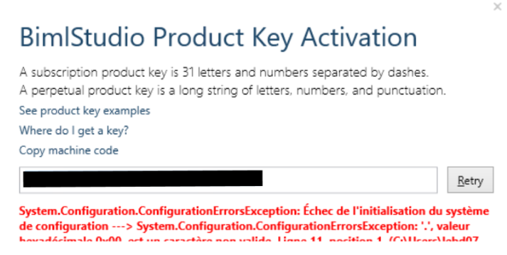

# Issue

When entering a product key in the BimlStudio Product Key Activation dialog box, users may encounter a System.Configuration.ConfigurationErrorsException error. 

# Cause

The System.Configuration.ConfigurationErrorsException will occur because of outdated or corrupted credential information cached in the BimlStudio AppData. These unintentionally bogus credentials may be sent to the license server when attempting to activate a product key, resulting in an unexpected error.  
 

# Resolution

Navigate to the BimlStudio AppData directory, typically located at C:\\Users\\%USERNAME%\\AppData\\Roaming\\Varigence\\BimlStudio\\. **Note:** AppData is a hidden folder within the User folder. 

Delete the contents of the BimlStudio folder.

Users are advised to exercise caution whenever deleting contents from the AppData folder. Be certain to only remove BimlStudio-related data. If there is any uncertainty, contact a system administrator prior to deleting any items.

# Conclusion

Clearing the AppData folder effectively eliminates any outdated or corrupted credential information, facilitating a clean connection to the license server with accurate credentials. This process serves to resolve the System.Configuration.ConfigurationErrorsException and allows for successful activation of the BimlStudio product key.