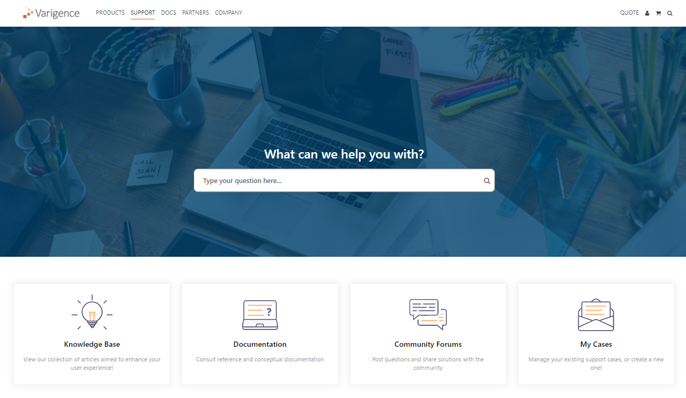
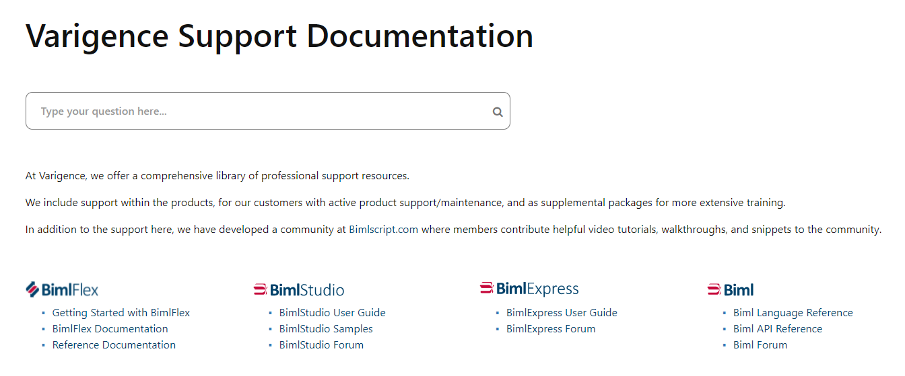
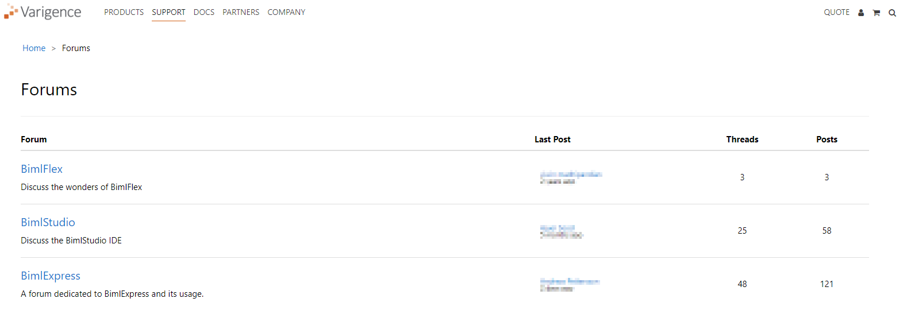
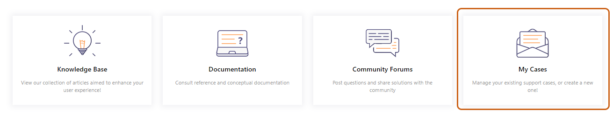

### Issue 

Regardless of the application being used, the user has encountered a bug, error, or requires assistance in arriving at the intended result of their solution.   
  
Users with an active subscription to BimlStudio or BimlFlex are entitled to customer support, and may always go the route of contacting [Varigence Support](mailto:support@varigence.com). However, for others, such as those using BimlExpress or those with expired Support, Maintenance, and Upgrade (SMU) contracts who are not entitled to customer support, utilizing the resources listed below will be the best way to troubleshoot any particular issue.  
 

### Resolution

Users have multiple resources at their disposal to help diagnose and resolve whatever difficulty they have encountered. These resources are hosted by Varigence and exist in the form of articles in the Knowledge Base, support documentation, and forum posts.

  
  
  
**Note:** The collection of resources available to users to self-resolve issues is constantly growing. The available support documentation and Knowledge Base grow as issues identified by users are confirmed to be prevalent within the community, recurring, or particularly unique.  
  
It is advised that users seek assistance from the available resources in the following order:   
  
**Varigence Knowledge Base Articles**  
  
The Varigence Knowledge Base can be accessed [here.](https://support.varigence.com/knowledgebase/)   
  
As mentioned within the Knowledge Base page itself, this resource contains articles created by our technical team members who have resolved similar issues for our users. The Knowledge Base is constantly updated, expanded, and refined to ensure that users have access to the best user experience.  
  
Users will find articles that address some of the most prevalent issues related to product installation and license keys, creating a project, recommended connection settings, and common known issues with our applications.   
  
**Varigence Support Documentation**  
  
Official Varigence Support Documentation can be accessed [here.](https://docs.varigence.com/)  
  
  
  
Unlike the Knowledge Base, which contains articles created for broad concepts related to application usage and issues unrelated to any one specific Varigence product, the support documentation is specifically organized by product. Support documentation features a tighter focus on proper application usage and best practices and preferred settings for specific applications.  
  
Users who are new to an application or having difficulty achieving their intended output should find these resources quite helpful. The support documentation offers "Getting Started" user guides to ensure proper settings and provide explanations for why those settings are set in such a way. BimlFlex documentation consists of an entire series of introductory videos that show an end-to-end walkthrough of a project. The documentation contains in-depth explanations of the many powerful metadata editors and application tools.  
  
Users can also find documentation regarding the usage of products in association with other powerful services, such as Snowflake, Synapse, Azure Data Factory, and others.  
  
Lastly, users can access the support documentation to find general tips and tricks, additional references generated outside of Varigence, and application release notes.  
  
**Varigence Community Forums**  
  
The Varigence Community Forums can be found [here](https://support.varigence.com/forums/), and like support documentation, are separated between applications.   
  
  
  
Data solutions are complex and many times an issue may not have been identified, or prevalent enough, to have had a Knowledge Base article or support documentation written about it (yet). For instances such as this, other Biml users are the best next-step to resolving an issue.   
  
The intent for the Community Forums is for users who are experiencing similar issues to collaborate on the origins of, and resolutions to, various issues. Varigence Support and our technical team is making every effort to monitor posts for issues that affect a large number of our users, while simultaneously providing support and feedback for those issues within the Forums.   
  
Varigence intends for the Community Forums to become a haven of collaboration for users and the Support team alike. The growth of this environment depends on our users determination to create posts for unresolved issues and help arrive at meaningful resolution for existing posts. We appreciate the support of all of our users who are taking the time to articulate their issues, and Varigence commits to monitoring and assisting in the Forums whenever possible.   
  
Please be mindful of sharing identifying information or confidential data in your Community posts!  
  
**Varigence Support**  
  
Ultimately, issues will persist that were not covered in any article, documentation, or forum.   
  
At that point, consulting Varigence Support will be the most efficient way to resolve an issue not yet resolved through the above resources.   
  
Varigence Support can be contacted through [email](mailto:support@varigence.com), or a Support Case may be created through the [Customer Support Self-Service Portal](http://support.varigence.com) by selecting "My Cases" from the Support homepage.   
  
   
  
For a walkthrough of creating and managing cases through the Support Portal, please reference to the Creating and Managing Support Cases Knowledge Base article.   
  
**Assisting Support**  
  
Providing relevant metadata for the project being worked on will _always_ be of benefit to the Varigence Support team. Please reference [Extracting Metadata to Provide to Support](xref:kb-extracting-metadata-to-provide-to-support) to ensure that we have everything we need to recreate your environment in order to more quickly provide the needed support.   
  
**Response Times**  
  
Resolution for issues could range from something as simple as correcting a syntax error, to something as complex as having to submit a bug request to be fix in a future patch for the application. Resolution is not always swift when it comes to processes as complex as data warehousing automation.   
  
**Support Availability**  
  
Please remember that support is prioritized for those users who have subscriptions where support is included, or for users who have actively maintained a contract for Support, Maintenance, and Upgrades (SMU). BimlExpress is a free offering, and as such, direct support cannot be offered or guaranteed for customers who only utilize BimlExpress or BimlStudio without an active SMU contract.