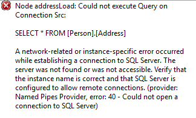
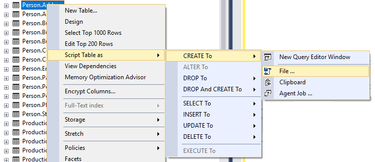

# Symptoms 

The situation may arise where users wish to use BimlExpress to create a package that builds against a database that cannot be connected to. This would not be an issue in BimlStudio, as it features "OfflineSchema," the ability to set up what a desired schema looks like, even without being able to connect to the data source. Unfortunately, this feature is not available in BimlExpress.  
 

# Cause

When building a package against a source that cannot be connected to in BimlExpress, the following error will occur: 

"Node addressLoad: Could not execute Query on Connection 'YourConnection.' 

  
This error is due to the fact that, under the hood, the Biml engine attempts to get the schema of the table from the database directly. This process fails due to the fact that there is no access to the table.  
 

# Resolution

To circumvent this error, users will need to mimic schema locally, edit the 'CreateInProject' property, and then edit the connection string.   
  
**Step 1: Mimic Schema Locally**  
  
First, users will need to replicate the _EXACT_ schema to build against, in a database on the development machine. On the machine with the source data, the DDL for the table(s) that need access will need to be obtained. To obtain the DDL in SQL Server Management Studio, right-click on the desired table, from the context menu select "_Script Table As"_ --> "_Create To"_ --> "_File ..._" and then save as an SQL file.   
  

  
On the development machine, the SQL file that was just saved can be deployed to create the asset(s) needed. The package is now able to be built.   
  
**Step 2: Edit the 'CreateInProject' Property**  
  
Next, set the 'CreateInProject' property to true within the Biml code being used. This will create a project-level connection manager for the connection, enabling the ability to edit the connection string in just one location, rather than in each individual package.    
  
**Step 3: Edit the Connection String**  
  
Now, users have created a package that builds, however, the connection refers to a development environment rather than the desired source. The project should now have a project level connection manager that points to the local database. Right-click on the connection manager and click "_View Code."_ 

This will display an XML representation of the connection manager, as such:   
  
<DTS:ConnectionManager DTS:refId="Package.ConnectionManagers\[Src\]" DTS:CreationName="OLEDB">  
     <DTS:ObjectData> <DTS:ConnectionManager xmlns:DTS="www.microsoft.com/SqlServer/Dts" DTS:ConnectionString="ConnectionString">  
          </DTS:ConnectionManager>  
     </DTS:ObjectData>  
</DTS:ConnectionManager>  
  
Update the connection string property of the ConnectionManager node to reflect the desired connection string, and save the project. 

Following the steps above should have now enabled projects in BimlExpress to build against a database that initially could not be connected to.