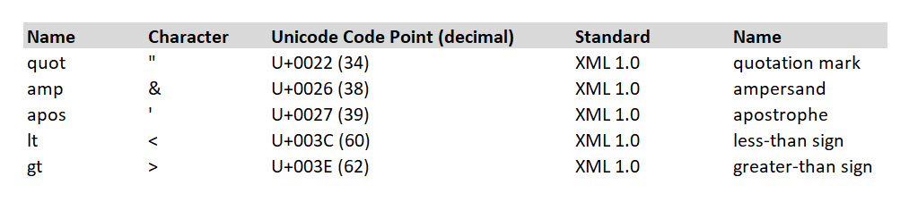
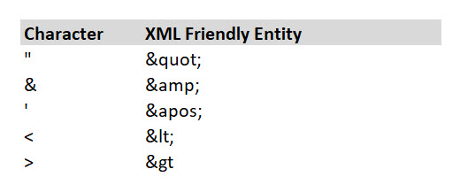

# Issue

Biml is an XML (eXtensible Markup Language) based language, and as such there are a number of protected characters that are reserved for the XML language. These protected characters must consequently be handled specially when used in Biml code. The following sections will detail options for using these protected characters.  
 

**Protected Characters**

The following characters are protected in XML and may pose an issue when incorporated into any created Biml code.

 

List sourced from [https://en.wikipedia.org/wiki/List\_of\_XML\_and\_HTML\_character\_entity\_references](https://en.wikipedia.org/wiki/List_of_XML_and_HTML_character_entity_references)

  
For the remainder of this article consider the following code:

<OdbcSource Name="Src" Connection="odbcConn">  
  <DirectInput>SELECT 'Column 1' FROM test.table1 WHERE 'Column 1' < 25</DirectInput>  
</OdbcSource>

When compiling the Biml code, the following error will be produced:

System.Xml.XmlException: 'Name cannot begin with the ' ' character, hexadecimal  value 0x20. Line 11, position 81.'

This is due to the protected "<" character. Below are some approaches for circumventing protected character errors in XML and Biml code.   
 

# Resolutions

See below for multiple methods on how to handle protected XML characters in Biml code. Optimal resolution varies depending on the code being edited.  
 

**Method 1: CDATA**

The first solution is to wrap any code with protected characters in a CDATA tag. CDATA is shorthand for "Character Data". It is a special construct that tells the XML parser to ignore any protected characters inside of it. The above code could be fixed as such: 

<OdbcSource Name="Src" Connection="odbcConn">  
    <DirectInput>  
        <!\[CDATA\[SELECT 'Column 1' FROM test.table1 WHERE 'Column 1' < 25\]\]>  
    </DirectInput>  
</OdbcSource>

The CDATA approach tends to be best when there are multiple protected characters in a contiguous span of user-entered text.  
 

## **Method 2: Escape Sequences**

Rather than using the CDATA tag, especially if only handling few protected characters, one can simply use sequences of characters that get escaped at runtime into the desired special character. This will avoid XML validation issues.

Below is a list of the commonly used Biml protected characters and the code needed to use to escape them.   
  
 

Referencing the sample code above, the solution using escape sequences would appear as such: 

<OdbcSource Name="Src" Connection="odbcConn">  
  <DirectInput>SELECT 'Column 1' FROM test.table1 WHERE 'Column 1' &lt; 25</DirectInput>  
</OdbcSource>  
 

**Method 3: Automatic Handling without Escaping**

Most XML parsers, including the parser used by the Biml Engine, will attempt to automatically permit protected characters to be used based on an examination of the context for that character usage. If the parser can definitively determine that the protected character is being used as text, it will ignore the protected status of that character. In such cases, CDATA blocks and escape sequences are not required.

Consequently, many Biml developers prefer to write code without any CDATA blocks or escape sequences and only correct those instances that the Biml compiler cannot automatically resolve.