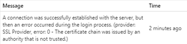
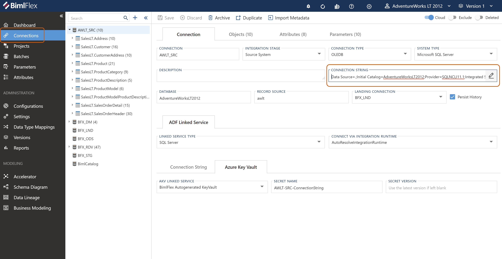
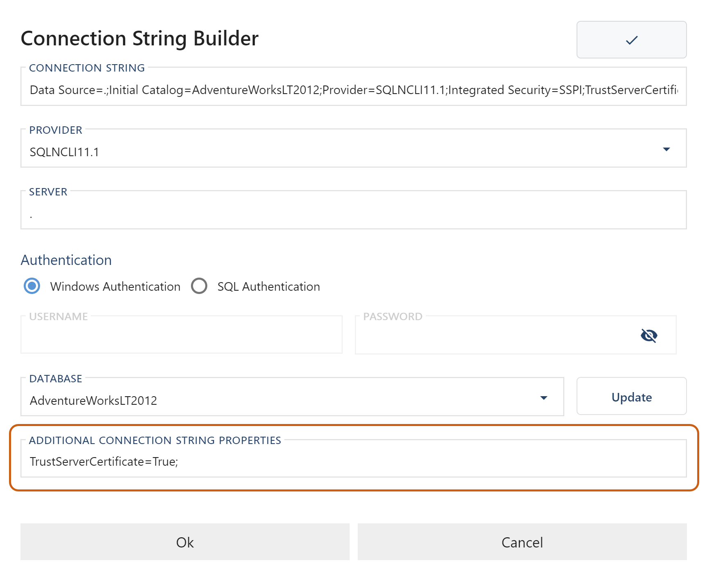

# Issue

Users are encountering an error within BimlFlex indicating that an SSL Provider connection was successful, but that the certificate chain was issued by an authority that is not trusted. 

 

# Cause

This issue is known to be caused by a breaking change in the general availability for Microsoft.Data.SqlClient 4.0. update for SQL Server features targeting numerous .NET platforms.

The default value for the \`Encrypt\` connection has been changed from \`false\` to \`true\`. This has been changed due to the increased importance of a "secure-by-default" mentality due to the growth of cloud databases.   
 

# Resolution 

There are multiple resolutions to this issue, as suggested by Microsoft directly [in this TechCommunity article](https://techcommunity.microsoft.com/t5/sql-server-blog/released-general-availability-of-microsoft-data-sqlclient-4-0/ba-p/2983346). While users are able to troubleshoot this issue in any number of the ways suggested by Microsoft, Varigence recommends the optimal resolution to be: Set Trust Server Certificate to True.  
  
Most users may not want to install trusted certificates on their SQL Servers, especially their development servers. This is why we recommend that users change their TrustServerClient connection string setting to \`true\`.  
  
Microsoft has robust documentation on [toggling settings within encrypted connections](https://docs.microsoft.com/en-us/sql/database-engine/configure-windows/enable-encrypted-connections-to-the-database-engine?view=sql-server-ver15) for those unsure of the above process, and additional workarounds.  Users will make this change to the Connection String field from within the **Connections Editor** in BimlFlex: 

  
  
  
Click the pencil icon to edit the _Connection String_ properties. In the _Additional Connection String Properties_ field add:   
  
TrustServerCertificate=True;  
  
  
  
Click \`Test\` in the top-right to ensure the _Connection String_ is still valid. Save the form and refresh the metadata. The error should now be resolved. 

# Conclusion

The breaking change in the general availability for Microsoft.Data.SqlClient 4.0 has been well-documented by Microsoft, and its necessity justified by the growth of cloud databases.  There are numerous resolutions to this issue but Varigence has selected the above method as what we expect would be most preferred by our users.