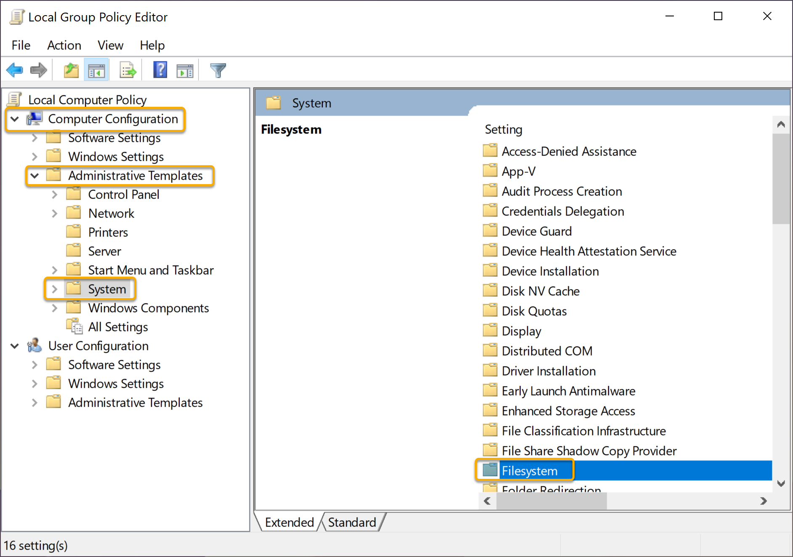
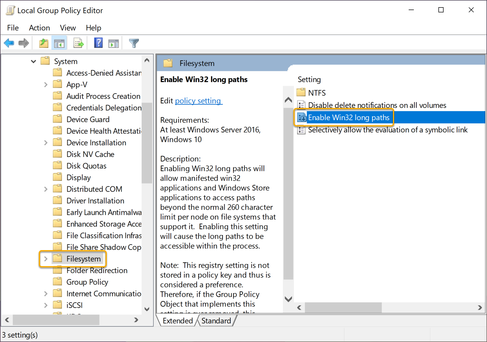
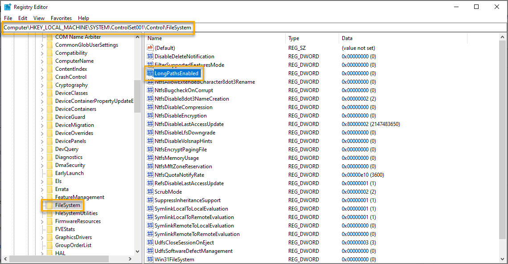
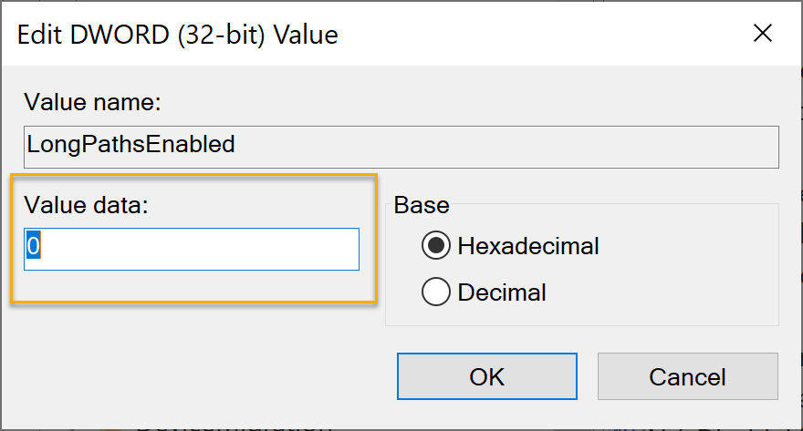

# Issue

The following error has been encountered:  
  
MSBUILD : error : Error:: Error generating SSDT Project Files: System.IO.PathTooLongException: The specified path, file name, or both are too long. The fully qualified file name must be less than 260 characters, and the directory name must be less than 248 characters  
 

# Cause

File path character limits are, unfortunately, a limitation imposed upon users through Microsoft's Win32 API library, wherein the MAX\_PATH value is set at 260. Most standard Windows applications, including Windows Explorer, do not work correctly with file paths that approach, and exceed, 256 characters.   
 

# Resolution 

Users have three (3) recommended methods to resolve the \`PathTooLongException\` error, detailed below.  
  
**Method 1: Manually Change the Naming Convention to Produce Shorter Paths**   
  
The most direct resolution to this issue is to have the user simply alter their naming conventions to product shorter paths. This resolution depends on the flexibility of one's architecture, and the ability to enact a such a change.  
  
This method is most preferred, as it is the simplest resolution and involves no other technical manipulation.   
  
**Method 2: Enable Long File Paths in Group Policy Editor**  
  
Open the 'Run' command **(Win+R)** and type gpedit.msc and press Enter. This will open the Group Policy Editor. Navigate to:   
  
Computer Configuration > Administrative Templates > System > Filesystem   
  
  
  
Click \`Filesystem\` and then double-click \`Enable Win32 long paths\` to open the Policy settings.   
  
In the Enable Win32long paths window, choose \`Enabled\` followed by \`Apply\`. Win32 long paths are now enabled.   
  
 
  
**To Revert:** Follow the above steps and toggle the setting back to \`Disabled\`.  
  
**Method 3:** **Enable Long File Paths in Registry Editor**  
  
**IMPORTANT:** There is risk involved in modifying the Registry. Changes can irreversibly damage your OS if not followed precisely.   
  
Open the 'Run' command (Win+R) and type Regedit and press Enter. This will open the Registry Editor Console. Navigate to: 

HKEY\_LOCAL\_MACHINE\\SYSTEM\\ControlSet001\\Control\\FileSystem  
  
 
  
Locate the REG\_DWORD file named \`LongPathsEnabled.\` Double-click the file, and change the Value Data from 0 to 1.   
  
 
  
Close the Registry Editor Console and restart the system. Win2 Long Paths are now enabled.   
  
**To revert back:** Follow the above steps and toggle the Value Data back to 0. Again, restart the system. 

# Conclusion 

The above resolutions are listed in order of riskiness. As stated above, the character limitation is imposed by Microsoft's Win32 API library, and as such, a user's Output Path will always be subject to such limitations.   
  
The most recommended resolution to this issue is Resolution Method 1: Alter the naming conventions to produce shorter file paths.