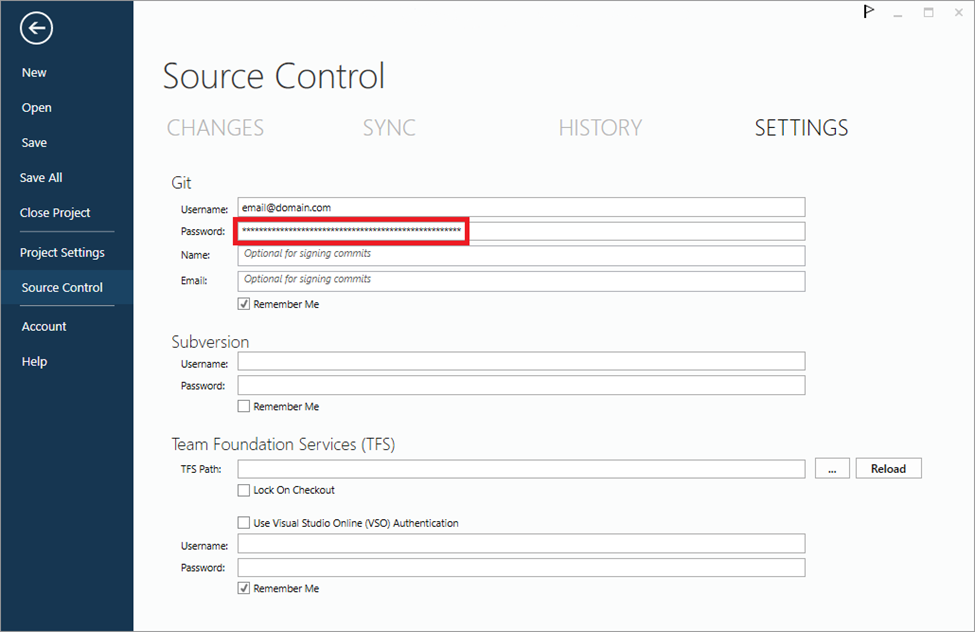

### Issue

Users have been unable to configure source control functionality integration with BimlStudio.   
 

### Resolution

Users may integrate Azure DevOps with BimlStudio directly, or use a third-party application to achieve the same integration. Both methods are detailed below.  
  
 

**Method 1​​​​​​: Use BimlStudio with Azure DevOps git**  
  
First, users must install [BimlStudio 2022 R3](https://download.varigence.com/downloads/bimlstudiosetup_22.3.175.0.exe), build 175 or later. This release includes logic to correct path separators that are returned from Azure DevOps with an incorrect format.  
  
Secondly, users must create a Personal Access Token (PAT) and use that PAT as the password value within the BimlStudio Source Control Settings menu: 

  
​  
To create a Personal Access Token, follow the instructions located [here](https://learn.microsoft.com/en-us/azure/devops/organizations/accounts/use-personal-access-tokens-to-authenticate?view=azure-devops&tabs=Windows).   
  
**Method 2: Use a Third-Party Application for Source Control Functionality**  
  
For users who are NOT using BimlStudio 2022 R3, they may alternatively use the source control functionality built into Visual Studio. All changes to one's BimlStudio project, and its constituent files, can be managed in any client application that supports git.  
  
Microsoft provides a partial list of these supported clients [here](https://learn.microsoft.com/en-us/azure/devops/user-guide/tools?view=azure-devops). 

### Conclusion

Source control integration can be achieved easily within BimlStudio using Azure DevOps or with any other preferred third-party application through Visual Studio.