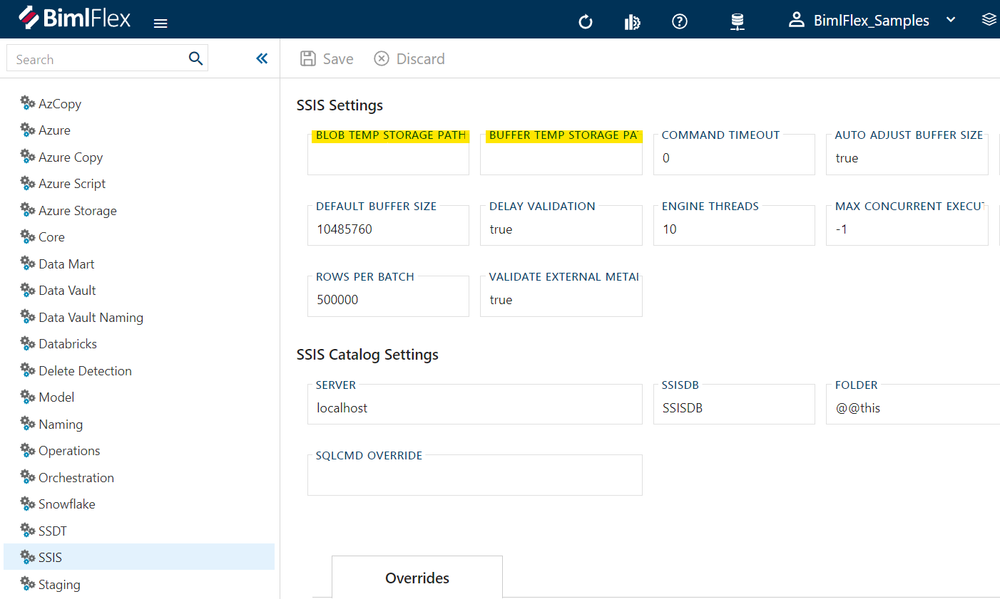

**Overview:**  
When loading data using SQL Server Integration Services (SSIS) packages in Visual Studio, you may encounter an issue with loading columns that have datatype NTEXT. The error message will typically read "Failed to retrieve long data for column" and is followed by other error messages.  
  
**Cause:**  
The issue occurs due to the customer configuring the BLOB TEMP STORAGE PATH(BLOBTempStoragePath) and BUFFER TEMP STORAGE PATH(BufferTempStoragePath) Settings in BimlFlex to a folder that either doesn't exist or has been renamed. As a result, the package is unable to retrieve data from the column of datatype NTEXT, leading to the failure of the SSIS package.  
  
**Solution:**  
To resolve the issue, you should follow these steps:  
  
Open the BimlFlex and navigate to Settings.  
  
Click on the Settings tab and locate the BLOB TEMP STORAGE PATH and BUFFER TEMP STORAGE PATH settings.  
  
 
  
Ensure that both the paths specified in these settings exist and are accessible to the user running the SSIS package.  
  
If the specified paths do not exist or are inaccessible, modify the paths to a valid location and click on the Save button.  
  
Rebuild the solution and rerun the SSIS package to confirm that the issue has been resolved.  
  
Conclusion:  
If you encounter an error while loading columns that have datatype NTEXT while running SSIS packages in Visual Studio, you should check the BLOB TEMP STORAGE PATH and BUFFER TEMP STORAGE PATH settings in BimlFlex. Ensure that the paths specified in these settings exist and are accessible. If not, modify the paths to a valid location, save the changes, and rebuild the solution before rerunning the SSIS package. This should resolve the issue and allow you to load the required data.