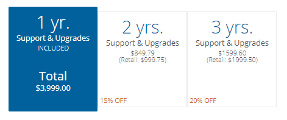

# Issue

A user who has encountered an error, bug, or requires technical guidance as they attempt to deliver a data solution wants to know what type of support is available to them.   
 

# Resolution

Varigence offers two types of paid support: **Support, Maintenance, and Upgrades (SMU)** and **Remote Consulting Hours.**   
  
Both support options are described below. Knowing what your support covers, and where coverage ends, is important to making sure you and your team have the right support structure in place.   
  
**Option 1: Support, Maintenance, and Upgrades**  
  
Support, Maintenance, and Upgrades (SMU) entitles the user to:

*   direct customer support through Varigence
*   maintenance of product related bugs, as they relate to any user-specific projects or solutions
*   official updates and patches to either BimlStudio or BimlFlex  
     

**Technical Support Coverage**  
  
Varigence Support addresses problem resolution through several mechanisms, including basic technical guidance, defining workarounds, logging bugs, providing bespoke patches (where appropriate), and through general software releases with fixes and feature additions included based on severity and priority.    
 

Varigence strives to provide comprehensive customer support for a wide range of solutions to various issues. These issues include, but are not limited to project metadata review, assessment of faulty code generation, and general software-related defects (e.g. actions not performing “as defined” or incorrect functionality). If a defect is identified in Varigence software or its code generation, Varigence Support will log the issue and coordinate with the development team to define and triage the issue. When possible, an issue severity and resolution timeframe will be communicated to the customer for both critical and minor bug fixes. 

  
**Technical Support Limitations**  
  
Varigence products are designed as development tools to enable customers to write code that can be executed on their local systems. As a result, customers may experience issues that are not related to defects in Varigence products or documentation, but rather arise from misconfigured local environments, inexperience with the application’s functionalities, “how to” requests, database design inadequacies, incorrect code written by users, or other factors outside of Varigence's control. 

Varigence Support will advise when technical support issues are determined as such and will assist, within reason, in guiding customers to potential resolutions or external documentation for self-guided troubleshooting and cease further support efforts.    
 

This policy ensures that Varigence can focus its resources on providing technical assistance to customers who are experiencing genuine software or functionality issues.  

  
All customers with a valid SMU contract are subject to the same support coverage and limitations.  
  
  
**Obtaining Support, Maintenance, and Upgrades**  
  
A contract for SMU is included with many different product types from the moment of purchase. Any Varigence subscription-based model includes SMU, regardless of whether the subscription frequency is monthly, annual, or prepaid. A contract for SMU will remain valid for as long as the subscription does. This requires no action from the purchaser or user to activate.   
  
BimlStudio, the only Varigence product available to be purchased with a perpetual license (unending) includes one free year of SMU from the date of purchase.  
  
**Additional SMU Coverage Options**  
  
One single year of SMU retails for $999.75. Additional years of SMU can be purchased upfront at a discount. One additional year of SMU is available for a 15% discount (for a total of two years) and two additional years of SMU is available for a 20% discount (for a total of three years).   
  
 
  
Expired SMU can always be renewed. Expired SMU must be purchased from the date of expiration to be brought up-to-date, rather than only purchased "when needed."   
  
**Example:**   
  
A BimlStudio perpetual license, with one free year of SMU was purchased on 2019-01-01.   
The license remains valid forever, but the SMU contract expires on 2020-01-01.   
  
On 2021-06-01, the organization wishes to renew their SMU in order to obtain the newest update for BimlStudio.   
  
SMU will need to be purchased for the period of time between 2020-01-01 to 2021-06-01, as well as however far into the future the organization decides to purchase.   
  
  
  
**Option 2: Remote Consulting Hours**  
  
Remote Consulting Hours are utilized as more direct and guided learning sessions, as opposed to SMU's focus on general product support. Services offered with Remote Consulting Hours include, but are not limited to: 1-on-1 support calls, metadata modelling assistance, custom Extension Point development, and user/application training sessions.   
  
Due to the specific nature of this service, Remote Consulting Hours are **not** included with subscriptions nor as an ongoing form of support.   
  
**Note:** Remote Consulting Hours do not provide congruent benefits as SMU.  
  
**Example:**   
  
A user does **not** have a valid contract for SMU but does have available Remote Consulting Hours.  
In a Remote Consult session, a defect is identified in the code/product. To resolve this, the bug will need to be fixed and patched in a future update.   
Despite the issue being realized during a Remote Consult session, the user will need to renew their SMU contract to be able to install the update with their fix.   
  
**Obtaining Remote Consulting Hours**   
  
Remote Consulting Hours can be purchased by reaching out to [Varigence Sales](mailto:sales@varigence.com) directly.  
  
This service is only sold in increments of 10 hours, with time subtracted in 15 minute (.25 hour) increments. These hours **do not** expire and can be left to be used when needed.   
  
**Additional Questions**   
  
For any additional questions regarding SMU contracts and/or Remote Consulting Hours, please do not hesitate to contact [Varigence Support](mailto:support@varigence.com). We will be happy to walk you through the process of what support may be needed for any given situation.    
  
**Additional Resources**  
  
Please reference the following Knowledge Base articles for additional support assistance: 

*   [Product Support Process and Resources](xref:kb-product-support-process-and-resources)
*   [Creating and Managing Support Case](xref:kb-creating-and-managing-support-cases)