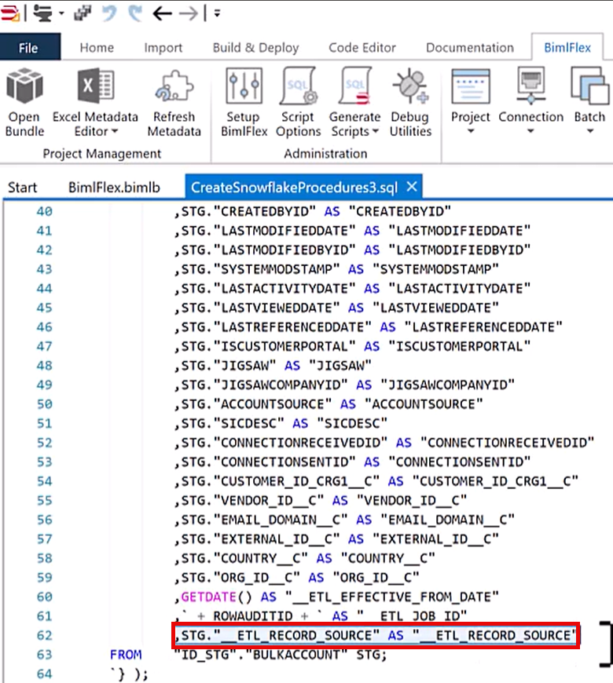
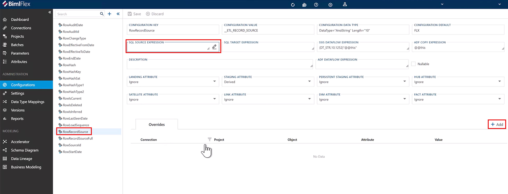
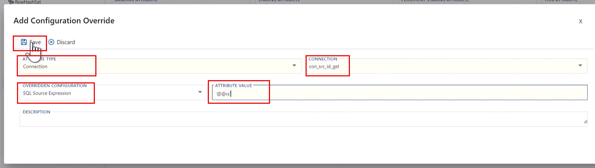
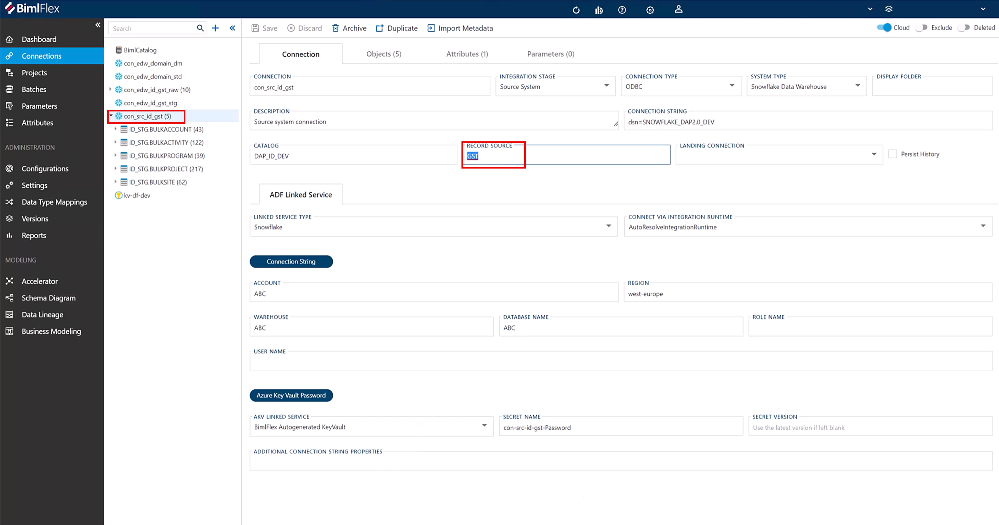

# Issue

The system generates scripts that attempt to move data from a staging area to a Data Vault, but the scripts fail because they try to load data from a column that does not exist in the staging area. In this example, the name of the field is "\_\_ETL\_RECORD\_SOURCE."  
 

 
 

# Cause

The column does not exist in the staging area because the data was staged by an external (non-Varigence) product or system. BimlFlex assumes that the staging area has this column because BimlFlex would create this column when it stages data, but the system that created this staging area did not include the "\_\_ETL\_RECORD\_SOURCE" column.

This can be verified by checking metadata for the column that the scripts are trying to load. To do so, go to the "Connections" tab in BimlFlex, select the connection, and then select the Object from the treeview menu. Navigate to the Columns tab and check for the column in question. If the column that you're trying to import data from is not there, then the problem has been found.  
 

# Resolution

To resolve this issue, go to the "Configurations" editor in BimlFlex and create an override for the error-causing column.

In this example, navigate to "RowRecordSource" in the treeview menu, then select the "SQL Source Expression" field and click "+Add."  
 

 
 

The "Add Configuration Override" dialog box will appear. "Attribute Type" should be "Connection," the connection should be the one where the scripts are failing. The overridden configuration should be "SQL Source Expression," which should come pre-filled, and attribute value should be '@@rs', which will use the Object's record source value, instead of trying to use the non-existent record source column that BimlFlex is expecting.  
 

 
 

After making this update in BimlFlex, enacted changes can be confirmed by going back to BimlStudio, refreshing metadata, and regenerating scripts. Now, the same value from the Record Source field should be observed as having been added into the scripts as a string.  
 

 
 
 

# Conclusion

The application expects certain functionality, including columns, that are standard in Varigence products. If the user would like to extend functionality by integrating with external systems, additional configuration like the above may be necessary. When integrating with unsupported system(s), there will always be limitations to what those extensions of functionality can achieve.   
 

# Note

Varigence is dedicated to improving the cross-platform user experience. When challenges are encountered or powerful solutions are found using the software, sharing these with the Varigence Support helps document valuable insights for the benefit of future users.