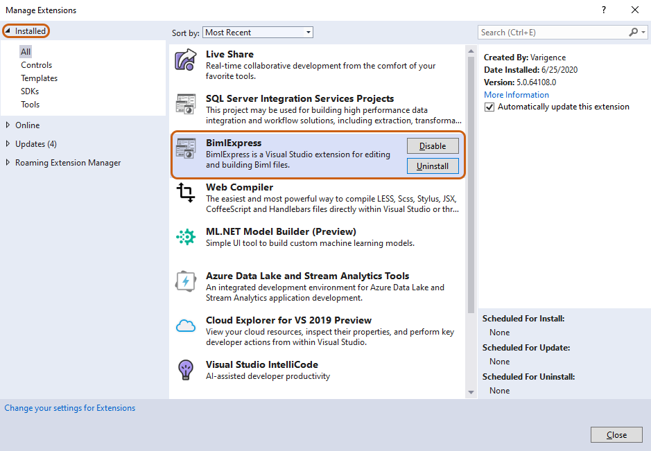

# Basic Uninstallation of BimlExpress

To uninstall BimlExpress, first open whatever version of Microsoft Visual Studio is installed. In the Visual Studio tool bar, click "_Extensions" > "Manage Extensions."_ In the "Manage Extensions" window, click "_Installed_" from the left menu, and then "_All_" to show a list of all currently installed extensions. Select BimlExpress from this menu and click "_Uninstall."_  
 

 

If uninstallation was prompted due to an installation error, and a reinstall is planned, this basic method of uninstallation may not suffice. If problems persist after reinstallation, additional steps will be required to troubleshoot, detailed below.   
 

# Advanced Uninstallation of BimlExpress

First, uninstall BimlExpress as detailed above. Next, open Regedit, or any preferred registry editing tool, by searching "regedit" in the search bar on the taskbar. Alternatively, Regedit is also located at C:\\Windows on most machines. 

Within Regedit, navigate to:

HKEY\__CURRENT\__USER → SOFTWARE → Varigence → BimlExpress → 5.0

Delete the contents of this folder.   
 

 

BimlExpress is now ready to be reinstalled.  

**\*Note:** The BimlExpress product key will need to be re-entered since registry keys were deleted in the above step.