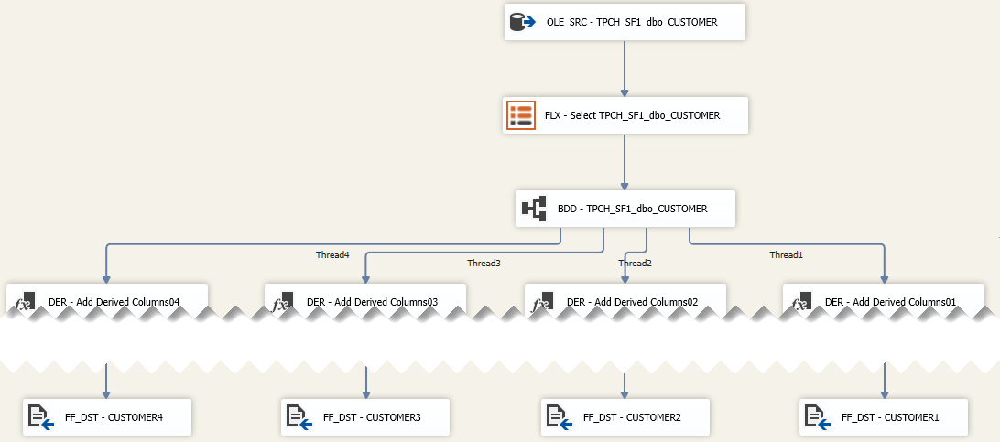
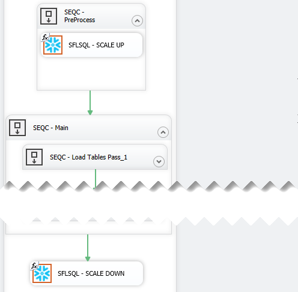
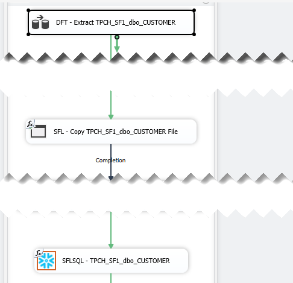

## Overview

So you have done all your research and have decided that [Snowflake](https://www.snowflake.com/) is the one to have and hold your data from this day forward, well good on you, great choice.

I'm not going to list all the great features of Snowflake here, because the best place for those is on their own website. Instead, let me address some of the challenges you might face especially if you are used to working with on-premises database systems like Microsoft SQL Server, Oracle, MySql, etc.

We were in the same boat and one of the biggest challenges we faced converting our push down ELT patterns to Snowflake is the limited deployment tools and the lack of stored procedures support, but more on that later. First, let's break down the components required to move data into Snowflake and then integrate that into an enterprise data warehouse.

## Snowflake Automation Architecture

## Importing Metadata

Before we get into all the cool data integration options the first step is to have a way to use the technical metadata from your source systems and use this to derive your staging layer.

BimlFlex makes this super easy and support all the major source systems you simply point the app at your system and choose the tables to be integrated.

### Ingest Data

Getting your data into Snowflake is actually quite easy to automate using the recommended Snowflake Stage with SnowSql path. Other options using S3, [Azure Blob Storage](https://azure.microsoft.com/en-au/services/storage/blobs/) or [Azure Data Lake](https://azure.microsoft.com/en-us/solutions/data-lake/) is also available, but that is for another day.

Well, actually it turns out that it is not quite that simple because you have to accommodate for change data capture and high watermark source extracts. Luckily we have already solved this for our [Azure SQL Data Warehouse](https://azure.microsoft.com/en-au/services/sql-data-warehouse/) templates and it turns out that being able to split the extract into multiple files has measurable performance improvement when loading the data into Snowflake using their `COPY` command.

Working with one of our early adopters they recommended that we should add a configuration to perform `RESUME` and scale the `WAREHOUSE_SIZE` when the workload batch start and then scale it down and `SUSPEND`, so we did.

### Orchestrate

As you know there are a variety of tools out there that support ETL/ELT for Snowflake, but they all basically just push down SQL and let Snowflake do its thing.

We decided to pick the most widely used `ETL` tool, [SQL Server Integration Services](https://docs.microsoft.com/en-us/sql/integration-services/sql-server-integration-services?view=sql-server-2017), out there and it just so happened that we have the expertise to bridge this gap by creating an SSIS custom component to execute the ELT code within a transaction.

One of the challenges we faced in porting our [Azure SQL Data Warehouse](https://azure.microsoft.com/en-au/services/sql-data-warehouse/) templates over to Snowflake was the lack of `SQL` stored procedures and the `ODBC` driver only supporting a single statement at a time. Our development team used the [Snowflke Connector for .NET](https://github.com/snowflakedb/snowflake-connector-net) as a baseline and create both an SSIS Custom Component and [Azure Data Factory](https://azure.microsoft.com/en-au/services/data-factory/) Custom Activity that will be available in our next release.

Now that we had a robust interface it was simply a matter of refactoring our ELT code and utilise the best Snowflake features. The refactoring did not take our team to long because of the `ANSI SQL` compatability of our templates, we just had to refactor the use of `TEMPORARY` and `TRANSIENT` table declarations and some of the `CTAS` statements. The fact that we did not have to accomodate `HASH` distribution in Snowflake was a relief to our team and it would be greate if other vendors adopt this.

### Stage & Persist

Landing the data as flat files is just the start of the data warehouse process. Depending on whether your target is a Data Vault or Dimensional data warehouse you will need to apply some transformation and if required delta processing.

Our staging SQL will detect deltas and perform record condensing and de-duplication if required. If you flipped the switch in BimlFlex to keep a historical (persistent) staging copy of your source data the delta will be saved and persisted. This is very useful when you want to quickly get a source system into Snowflake and keep all the history and do the modelling and reloading into an integrated data warehouse later.

Another benefit of using SSIS was that we could thread the output into multiple files to make full use of the Snowflake COPY command. When we showed this to the Snowflake team they all nodded and I took this as a good thing.

### Integrate

Landing your data into Snowflake is not enough to call it a data warehouse. As powerful and scalable as Snowflake is it is "just" a database and all the other integration tasks that make your solution an enterprise solution will still need to be done.

For Data Vault and Data Mart implementations BimlFlex helps you accelerated the modeling and use the associated metadata to generate optimized push-down ELT harnessing the Snowflake engine. So to simplify (very) you draw a picture and BimlFlex do all the coding for you, just imagine the time money saved instead of manually writing the code.

## See it in action

BimlFlex is a collection of templates, metadata definitions, and tooling that enables you to build an end-to-end data solution without ever writing a single line of code.

Contact us to take the next step. [Request Demo](https://varigence.com/BimlFlex#RequestDemo)
or simply email [sales@varigence.com](mailto:sales@varigence.com)