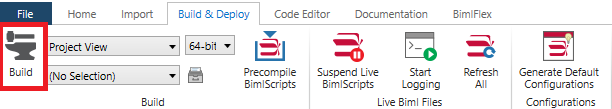

In BimlStudio, navigate to the *Build & Deploy* tab and locate the build button in the ribbon menu.

Alternatively, a build button can also be accessed from the toolbar.

Once the project has built, its assets can be examined from within the project's output directory.
