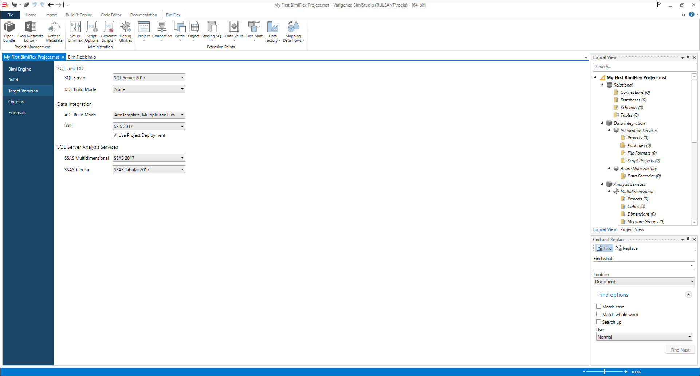

For further, more detailed configuration, the BimlStudio project options include settings such as the target SQL Server version, SSIS and ADF versions, and whether to use the project or package deployment model for SSIS.

Most of these are optional to change, but when using SSIS the target version and deployment method needs to be correct for the packages to open correctly in Visual Studio, and run correctly on the destination SSIS server.

If this is the first time a solution is being built, the user should check their project settings to ensure that the correct target versions are set.

The project settings can be accessed via the 'File' menu in BimlStudio, and then selecting 'Project Settings' from the menu. Within the dialog, users may select settings for `Biml Engine`, `Build`, `Target Versions`, `Options`, and `Externals`.

:::danger

> Once all settings are completed, restart BimlStudio and reopen the BimlFlex project to load the metadata.

:::

The most important settings to configure initially are the **Build** and **Target Versions** settings.

>[!NOTE]
> Users should also check that their output path is correctly configured. If one is not provided then the generated assets will be created in the `output` folder of the directory that contains the .mst file.

For additional information, please refer to the [BimlStudio reference documentation](xref:bimlstudio-user-guide).

Access Project Settings by clicking `File` then `Project Settings`.
