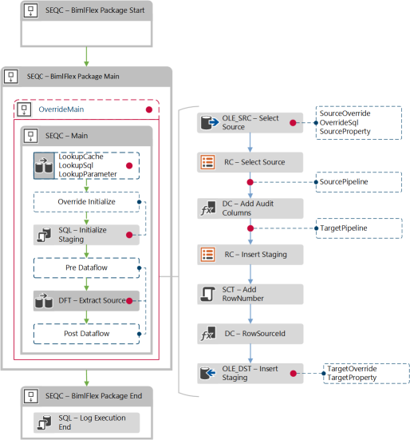
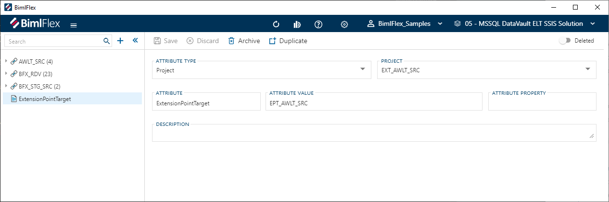
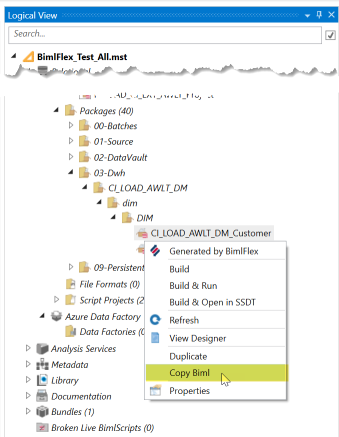
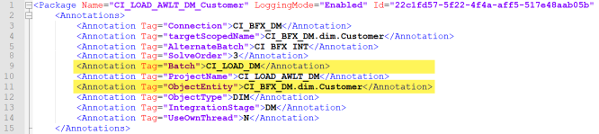
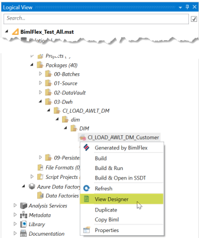
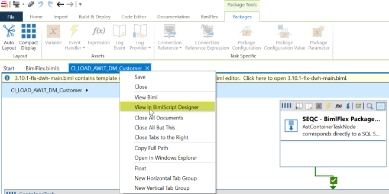
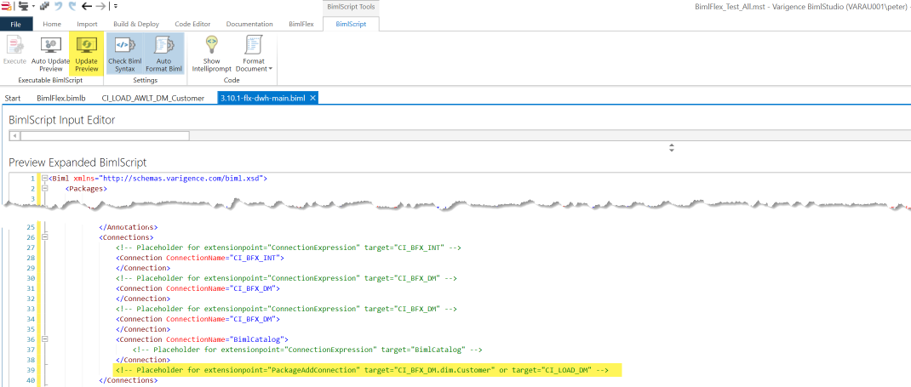

# Extension Points

[!include[ExtensionPoints](_incl-header-extension-point.md)]

## Creating a new Extension Point

The available Extension Points in BimlStudio can be considered as templates to define code overrides. Each Extension Point template contains starter code, and when selected in BimlStudio will create a new Biml file which is automatically added to the `Bundle Extensions` folder in the BimlStudio Logical View. This indicates that the Extension Point file is part of the solution, and any code will be applied to its specified target.

:::note


> It is a good practice to rename the Extension Point file that is created from the template, and in a way that refers to its target or scope.

:::


The newly created file will already contain the type of Extension Point, as visible in the *extensionpoint="`ExtensionPointName`"* property in the file. The target will be empty by default, and will need to be configured.

Creating an Extension Point file and applying the required target attribute is all that is needed for it to be included into the project. when BimlFlex builds the solution any Extension Point code is applied to the corresponding object(s).

## Extension Point Targets

Extension Point Targets define _where_ the custom code is applied, for example the object such as a connection, project, transformation or process step. In the Extension Point this is the *target=""* property or reference.

Below is an example of where Extension Points can be added to the data logistics structure. The red dots indicate injection points (targets) for Extension Points.

.

The target is relative to the Extension Point, and refers to the object name within the solution. This can be a Project, Connection, Column and more generally any object involved in data transformation. In BimlStudio, the objects are visible in the Logical View in principle.

### Defining scoped Extension Point Targets in the BimlFlex App

The BimlFlex App provides a feature that allows defining a target for an Extension Point for a collection of objects. This is the `ExtensionPointTarget` Attribute, accessible in the Attributes screen within the BimlFlex App.

.

The Extension Point Target BimlFlex Attribute can be configured for a specific scope and by adding the Attribute Value as the target for an Extension Point the custom code will be applied to any relevant Objects within this scope.

The following can be configured:

* Attribute Type. This is the scope where a drop-down allows selection from a number of values such as (but not limited to) 'Project', 'Batch', 'Customer' or 'Connection'.
* Object. This property, which is dynamic depending on the selected Attribute Type, contains the specific details for the type of Object configured in Attribute Type. For example, for a Project the Project Name can be entered and for an Object the Connection and Object can be specified.
* Attribute. This indicates the Attribute Type, which in this case must be an Extension Point Target Attribute ('ExtensionPointTarget').
* Attribute Value. The value that can be used as target reference inside the Extension Point code.
* Attribute Property. This is not used for Extension Point Target Attributes.
* Description. Any free-format description of the intent of the Extension Point Attribute can be added here.

Inside Extension Point code, the target reference can be updated to refer to the Attribute Value of an Extension Point Target Attribute, and this will apply the modified code to all related objects.

### Finding Extension Point targets

In addition to specifying one or more Extension Point Target Attributes, a target for an Extension Point can be identified through either of these steps:

#### Option 1 - Use the Target Name

* If the **Extension Point** is known and just the target name of an object is needed, right-click the Object in the Logical View in BimlStudio and click `Copy Biml`.



* Paste the `Biml` into a text editor, such as `Notepad` or `Visual Studio Code`. the Screenshot uses Notepad ++ and have the language set to `XML` to enable highlighting.
* Use either the `Batch` or `ObjectEntity` information depending on the Extension Point scope.



#### Option 2 - Find Extension Point Location and Target

This is a more technical approach that requires some `Biml` knowledge.

1. `Right Click` the target Object and choose `View Designer`.



1. Right Click on the tab with the package name, in this case `CI_LOAD_AWLT_DM_Customer`, and choose `View in BimlScript Designer`



1. click `Update Preview` on the `BimlScript` tab.
1. In the `Preview Expanded BimlScript` there are `XML` comments with the available `Extension Point` types and their targets.
1. When targeting the parent of an Object-based Extension Point, also set `CustomOutput.ObjectInherit = true;`



## Extension Point Directives

Special attention should be paid when editing the directives of an extension point because a user must have them correctly defined before they will be able to test the output of their Biml code.

The purpose of a directive is to indicate to the compiler exactly what the purpose of the Biml code is that you are writing and where it should be injected. To write a directive simply insert the appropriate line of code between the following tags `<#@ #>`

The following table outlines the attributes of these directives.

| Extension Point Directive Attribute | Attributes Description |
| ----------------------------------- | ---------------------- |
| bundle                              | File name of the bundle being used, for BimlFlex this is always `bimlflex.bimlb` |
| extensionpoint                      | Key defining the type of extension point |
| target                              | The name of the object that the extension point will be applied to |

The next directive is the property directive which is specific to the type of object you are trying to modify. Below is a table with the attribute definitions.

| Property Directive Attribute | Attributes Description |
| ---------------------------- | ---------------------- |
| name                         | Name of the entity this extension point targets: `sourceTable`, `targetTable`, `connection` etc. |
| type                         | This is the entity type: `string`, `BimlFlexModelWrapper.ObjectsWrapper`, `BimlFlexModelWrapper.ConnectionsWrapper`, etc. |

## Extension Point Inheritance Code

Extension Points can inherit the attributes and related items from an object. This is useful because, in some cases, properties relating to a certain objects are required as part of what is needed to effectively do what we want to in an Extension Point.

Below are two of the required directives that need to be in place in order to use inheritance.

```biml
`<#@ property name="table" type="BimlFlexModelWrapper.ObjectsWrapper"  #>`
`<#@ import namespace="Varigence.Biml.Flex"  #>`
```

A small block of BimlScript code will enable us to gain access to the items we need. A BimlScript is a piece of C\# that is injected into a Biml file that gives us the ability to use Biml in a programmatic way. We will use C# methods to create variables that contain the objects and information we need.

First, we will need to write the first line that will allow us to obtain a copy of the targeted object. This is done by entering the following line.

```biml
`<# CustomOutput.ObjectInherit = true; #>`
```

Next, we will declare the variables we need to hold our information and use methods to obtain the objects of interest in this example. First, create a variable by using the `var` keyword and then giving the variable an appropriate name. In this example, we will get the source connection of a given table and add it as the value of the variable. Because we have already added the table as a property in our directive we can reference it directly.

```biml
`<# var sourceConnection = EntityHelper.GetSourceConnection(table); #>`
```

From here if we want to pull out any of the information about the object, we can insert it directly into our Biml code using the following tags: `<#= #>`. This will take the value stored in any variable, convert it to a string and insert in place of where the original BimlScript tags were.

For example:

```biml
`<#=sourceConnection.Name#>`
```

## Output Path and Input Path Variables - Optional

Output path variables hold the name of the current task that you are modifying. The input path variable contains the previous task's name in the control flow or data flow so that the task you are working on can reference the previous item in your Biml code and remain attached.

These two path variables are required when using extension points that either completely replaces tasks or when you are inserting a new task into an existing data flow or control flow.

If you are replacing or modifying a task at the end of a data flow or control flow then an output path variable is not required. In a similar fashion if you are replacing or modifying the first task in a control flow or data flow then an input path variable is not required.

We will see more examples of where we need to declare an output/input path variable later on.

```Biml
`<# CustomOutput.OutputPathName = @"TaskName/SequenceContainerName"; #>`
```

## Example Extension Point - Discard Empty Rows

This is an example where an SSIS Source Pipeline Extension Point is used to discard all incoming rows where the Integration Key column value is empty. This can be used in a scenario where a file was loaded with empty rows that needed to be discarded.

The following will occur:

* Any row with an empty Integration Key is discarded.
* A count of the total number of discarded rows is logged to the BimlCatalog as an exception.

Create the Extension Point in the project by choosing the **Object** button in the BimlFlex ribbon tab, Extension Points group. In the drop down, choose `Source Pipeline`.

Add the source object name in the target definition. All other information will be derived automatically. The below example contains a placeholder target reference, because for the actual full object for a file is the combination of the Connection, Schema and the Object itself.

Note that the file is not the actual filename, but the object that references the files e.g. the file connector.

```biml
`<#@ extension bundle="BimlFlex.bimlb" extensionpoint="SourcePipeline" target="<ConnectionName.SchemaName.FileName>" #>`
`<#@ property name="sourceTable" type="BimlFlexModelWrapper.ObjectsWrapper" #>`
`<#@ property name="targetTable" type="BimlFlexModelWrapper.ObjectsWrapper" #>`
`<#@ property name="inputPath" type="String" #>`

<!-- Will discard any row with an empty value in the Integration Key column and log the row count as an Exception (Type 8) in the BimlCatalog -->

`<# var tgtTable = new TableObject(targetTable, "STG", "STG");  #>`

<ConditionalSplit Name="CSPL - Discard Empty Rows">
    <InputPath OutputPathName="<#=inputPath #>" />
    <OutputPaths>
        <OutputPath Name="Discard">
            <Expression>`<#=tgtTable.IntegrationKeyName #>` == &quot;&quot;</Expression>
        </OutputPath>
    </OutputPaths>
</ConditionalSplit>

<CustomComponent Name="FLX - Discarded `<#= tgtTable.SourceSsisSafeScopedName #>`" ComponentTypeName="Varigence.Ssis.RowCount, Varigence.Ssis`<#=RootNode.ObjectTag["ComponentVersion"]#>`, Culture=neutral, PublicKeyToken=e9fb56b2a63ffbab">
    <InputPaths>
        <InputPath OutputPathName="CSPL - Discard Empty Rows.Discard" HasSideEffects="true" ErrorOrTruncationOperation="" Identifier="RowCountInput"></InputPath>
    </InputPaths>
    <CustomProperties>
        <CustomProperty Name="RowCountObject" DataType="String" SupportsExpression="true">`<#= tgtTable.SourceSsisSafeScopedName #>`</CustomProperty>
        <CustomProperty Name="RowCountType" DataType="Int32" TypeConverter="Varigence.Ssis.RowCountSerialize+RowCountTypeEnum, Varigence.Ssis`<#=RootNode.ObjectTag["ComponentVersion"]#>`, Culture=neutral, PublicKeyToken=e9fb56b2a63ffbab" UITypeEditor="">8</CustomProperty>
        <CustomProperty Name="RowCountSum" DataType="String" SupportsExpression="true"></CustomProperty>
    </CustomProperties>
    <Connections>
        <Connection Name="BimlCatalog" ConnectionName="BimlCatalog" />
    </Connections>
</CustomComponent>

`<# CustomOutput.OutputPathName = @"CSPL - Discard Empty Rows.Default"; #>`
```
