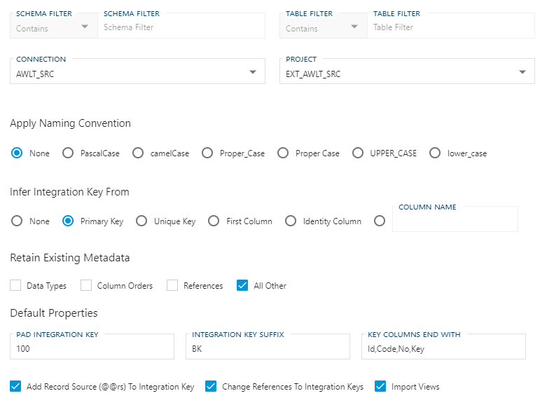
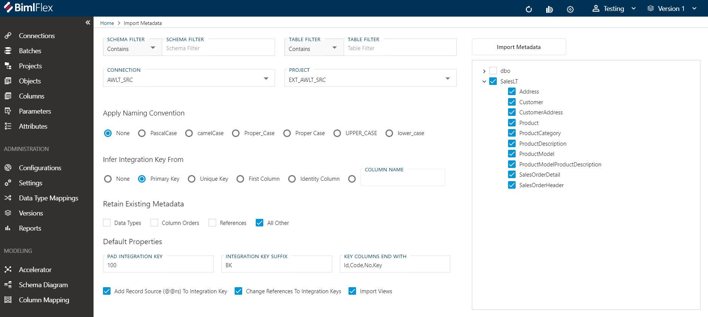

# Importing Metadata

[!include[Customers](_incl-header-metadata-import.md)]

## Import Metadata User Interface

There are a number of options for importing metadata. The user must align these options with the solution architecture and metadata conventions.

The example connection in the Sample Metadata is `AWLT_SRC` which points to the AdventureWorksLT database, using the project `EXT_AWLT_SRC` as the target project for imported metadata.

Below the Connection and Project drop downs are all the main options. These can be configured to control the behavior of the import, such as what object types to import, naming conventions to apply and what to retain if the metadata has been imported before.

:::tip

> Have a look at our [recorded video](https://www.youtube.com/watch?v=ClMJcZPdSks?rel=0&autoplay=0) covering how to import metadata using BimlFlex.

:::

### Metadata Options Definitions

This section provides a brief overview of the Import Metadata tool user interface.

#### Filter Tables and Schemas

The *Schema Filter* and *Table Filter* can be used to limit the metadata made available / visible for import. This is useful if a subset of available tables will be imported, or if new tables are added to an existing repository. Filtering also improves performance when connecting to and importing large database schemas.

#### Source and Target

| Option | Definition |
| ----------------- | ---------- |
| Connection | Name of the connection that points to the data source the metadata is intended to be extracted from. The corresponding Connection String is used as defined in the [Connections](bimlflex-connection-editor) configuration. |
| Project | Name of the project that will use this metadata as its source in the source to target loading. This project has to be defined previously. For more information, please refer to the [Projects](bimlflex-project-editor) documentation |

#### Table and column names

Naming convention to use for objects and columns. Options are:

* `None` - This will retain the source system default naming conventions.
* `PascalCase` - E.g. "CustomerAddress"
* `camelCase` - E.g. "customerAddress"
* `Proper_Case` - E.g. "Customer\_Address"
* `Proper Case` - E.g. "Customer Address"
* `UPPER_CASE` - E.g. "CUSTOMER\_ADDRESS"
* `lower_case` - E.g. "customer\_address"

#### Inferred Metadata

Where to infer the Integration Key from. Options are:

* `None`
* `PrimaryKey`
* `UniqueKey`
* `FirstColumn`
* `IdentityColumn`
* `ColumnName::[NameOfColumn]`

When specifying `ColumnName`, a name needs to be added in the Import Metadata screen or specify `ColumnName::UID` to auto populate the column name field with `UID`.

#### Retain Changes to Previously Imported Metadata

What existing Metadata should be retained when doing an import of existing data. Options are:

* `Data Type` Changes
* `Column Order` Changes
* `Foreign Key` Changes
* `All Other`, Don't override anything else

To override everything, uncheck all checkboxes.

#### Default Properties

This controls default behavior of inferred Integration Keys.

* Pad Integration Keys (Amount) – Number of Characters to pad the Integration Key to
* Integration Key Prefix or Suffix - based on your settings, it will auto populate a value which can be overridden here. It will add this value as prefix or suffix onto the column name to indicate Integration Key.
* Key Columns End With – When inferring key/reference names, what substring to look for at the end of a column name - `Id`, `Code`, `No`, `Key`, or any custom string added.

#### More Options

* Add Record Source (@@rs) To Integration Key
* Change References To Integration Keys
* Import Views

## Retrieve Objects for Import

Click the `Connect to Database` button. If the Connection String is correct and the user has permissions to the schema, it will list all the tables and views (if Import View were selected in the options) as Importable Assets.

### Importable Assets

The Importable Assets list is read from the Source Connection. Choose items that should be included in the metadata import.

Upon clicking the `Import Metadata` button, the metadata will be imported into the BimlFlex app and will be available for review and modeling.

### Verify Imported Metadata

Navigate back to the Connection or Project and view the Objects tab. You should see all the newly imported Objects.

## Import Metadata Over Existing Metadata

If there are changes to the source schema it is possible to safely run the Import Metadata on the same data again. Use the options to make sure you don't override anything you have changed after running the original import.

I.e. If a new column is available on a table where you modified the column ordinals, then check `Column Orders` under the `Retain Existing Metadata` options before you import the table.
