# Driving Keys in Data Vault

A **Driving Key** is a **Unique Key** (or a combination thereof) on a Link that is used to determine the effectivity of a relationship or series of relationships. The Driving Key tracks when a relationship changes, and defines which side of the relationship *determines* (drives) the change.

This is commonly used when a relationship is tracked by a Business Concept itself, and not through context (e.g. expiry information) provided by source systems. This may be the case when this data is simply not available in, or provided by, the source systems.

In these scenarios, implementing the Driving Key concept can help to close (end-date) relationships which otherwise would remain active.

Driving Keys allow to interpret a relationship as many-to-one relationship, on the otherwise many-to-many Link structure.

This section provides an overview of how Driving Keys are managed in BimlFlex.

## Driving Keys in BimlFLex

By design, Data Vault Links represent many-to-many relationships. However, if a relationship changes it may be required to interpret the creation of a new relationship as a closure of the previous one.

An example is the relationship in AdventureWorksLT between a *Product* and its *Product Category*. By definition, the source system only allows a product to be part of a *single* Category at a given point in time. If the product is moved from one category to another, it will cease to be part of the previous category. 

However, this information is not otherwise captured in the source system. There is no separate table that records the ending of the relationship between Product and Product Category, so this can only be inferred from the data event that a new relationship was created for an existing key.

Since Links can maintain any number of relationship, e.g. a Product can exist in any number of Categories in the Link, this behavior needs to be enforced by rules. These rules can be implemented using the Driving Key concept in Data Vault. The Driving Key in the relationship is the consistent part of the key - the primary driver for the relationship.

For the Product to Category example, the Product can be configured as the Driving Key.

Defining Driving Keys for Link Relationships is done in the BimlFlex Metadata Attributes. These keys define which parts of the Link drive the changing of existing relationships.

BimlFlex manages the information about the effectiveness of the relationship in the corresponding Link Satellite. For the Product to Product Category Link this is maintained by the `LSAT_Product_ProductCategory_AWLT` Link Satellite table.

The Accelerator and the BimlFlex framework will automatically apply Driving Key type relationships for any Links derived out of a Hub, as they are based on Foreign Keys in the source and by definition imply a Driving Key scenario. This will be automatically included in the load logic, no separate attribute will be added in the Attributes metadata.

If a Driving Key behavior needs to be manually defined, such as from a Link type source table, a corresponding Driving Key attribute is added to the Attributes metadata. This is defined using the Link table SK column that represents the Driving Key column

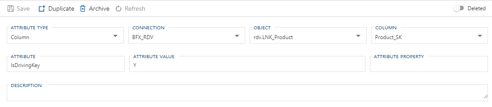

The Data Vault build logic will include the required processing in the Link Satellite to maintain data consistency throughout load by adding and closing relationships, emulating the behavior of the single Foreign Key relationship from the source.

The Driving Key logic only operates on the Effective To date of the Link Satellite, so for BimlFlex to maintain the Driving Key relationship information the Link need to have Link Satellites enabled, and that Link Satellite need to implement end dating. Both of these are controlled through Configurations and Settings. The settings for creation of Link Satellites (`DvAccelerateLinkSatellite`) and End Dating in the Data Vault (`DvEndDateSatellite`) that can be enabled selectively for only the objects that require it, or globally for all entities.

## Driving Key Observability

From a modeling perspective, Driving Keys are a qualifier on an existing Key, not a new construct.
Commonly, the Business Key of the driving Business Concept, or source key, is persisted as a degenerate field on the Link itself.
Driving Keys do not change a model.
Driving Keys indicate how ELT/ETL should be performed, and how a relationship is maintained.

## Relationships in a Data Vault

A core tenet of Data Vault modeling methodology is to track *business relationships* in a **Link**.
A Link is made up of a unique set of business keys referencing *business concepts* represented by **Hubs**.
One of the more challenging elements is tracking relationship effectivity and which part of the key determines or drive a new instance of the relationship.

For simplicity of explanation, we focus on modeling and capturing Link effectivity and not the pros and cons of inserts versus updates, or using Link Satellites at all.

<!--
A core tenet of Data Vault modeling methodology is to track relationships in a Link and to be modeled as a many-to-many relationship.
Effectivity is then tracked in a Satellite based on the observation of when a unique interaction of Business Concepts are observed.
When a relationship is observed for the first time it is created and marked as active based on the date it was observed.
When a relationship is terminated similar logic is used and the relationship is terminated based on the date of the observed termination.
By nature these exist exclusively with no relation to any other observed relationship.
A Driving Key is required when a relationship should be tracked, observed and terminated based around a central Business Concept and not simply the relationship itself.
Effectivity is then started and ended based on when a Business Concept was first observed and when a relationship change occurs on the driving Business Concept.
-->

### Tracking by Historical Relationship

A common Data Vault practice is to create a Satellite on the Link (LSAT) which contains history specific to the Link.
This allows one to track specific historical changes to a relationship.
Using an LSAT allows maintaining historical data where end-dated relationships may need to be reopened or reactivated without fear of losing any data.

**For example:** Imagine the operation of a tavern.
The tavern opens for business on August 10, 2020.
A tavern will store kegs of different varieties of beer and distribute through a tap system hooked up to the bar.

>[!NOTE]
> In this article's examples, Link Keys have been simplified in order to shift focus on Driving Key behaviors.

This tavern has five (5) varieties of beer: Pale Ale, Stout, Lager, IPA, and Cider.
There is only one (1) tap for distribution.
This setup demonstrates a one-to-many relationship.
There is one tap and many beers.
The *type* of beer available on tap is, essentially, inconsequential.
At any time only one (1) beer is going to be available despite there being five (5) different options.

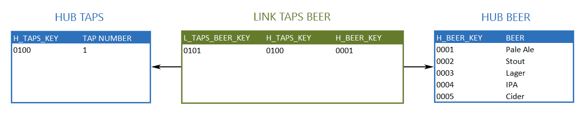

One month later on September 10, 2020, the tavern installs a second tap.
Now there are two (2) possible options for available beer.
The Hub for Taps can be edited to include a second tap without issue.
This addition does not change the architecture of the model, but now there are two (2) one-to-many relationships.

 One-to-Many Link Relationships")

<!--
A many-to-many relationship would show multiple relationships between Taps (*a possible two (2)*) and Beers (*a possible five (5)*).

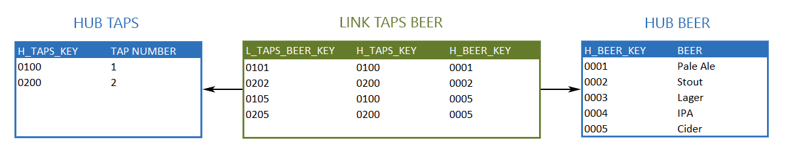

An additional example of a many-to-many relationship would be a single tap having multiple active records for various beers that can also be active on other taps.
This may be done when tracking status for a empty keg and an active record for the current beer being served.
-->

### Tracking by Driving Key

In this example, the Taps entity is defined as "driving," meaning that ETL enforces the logic that a single Tap cannot be associated with multiple beers at any time.

>[!NOTE]
> Hub Taps and Hub Beer do not change for the remainder of this example, and are excluded from the below examples.

Continuing with the same example, historical tracking through a Link Satellite would look like such:

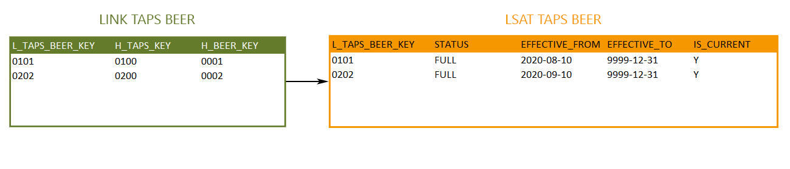

<!--
"Zero Records" are optional records which indicate the first recognized interaction with a Driving Key.
The paramount indicator for a zero record is an interaction with a Driving Key, not when a record first enters the system.
In this instance our Driving Keys are the Taps, and zero records would appear as such:

-->

After enough pints sold a keg will be kicked (emptied).
A new beer will then replace the now-empty beer.
Data Vault tracks historical data so the record for the kicked beer will be end-dated and a new record will be created for the new relationship.

The Pale Ale on Tap #1 was kicked on October 10, 2020. It was replaced the following day with the Cider.

The changes to inventory would appear as such in the Link and Link Satellite:

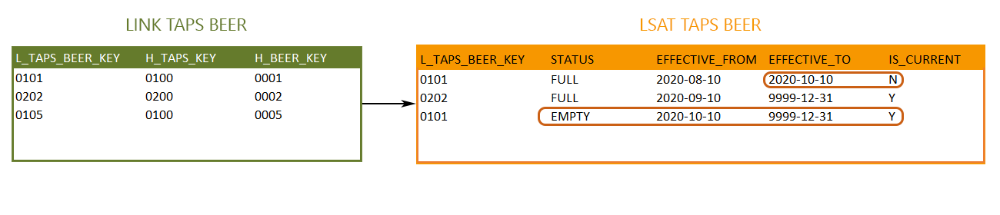

The record for Beer on Tap #1 expired on October 10, 2020, the date the keg kicked.
A new record was created to mark the termination on October 10, 2020, noting the status as "empty."

Next, a new record will be created, and activated, to mark that a new Beer is now hooked up to Tap #1, with the status noted as "full."

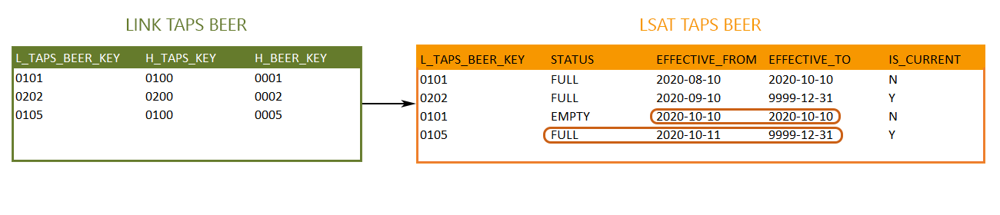

The two active relationships at this point in time, October 11, 2020, are Beer on Tap #1 and the separate Beer on Tap #2.

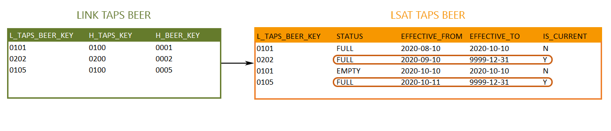

The final model for this architecture would look as such:

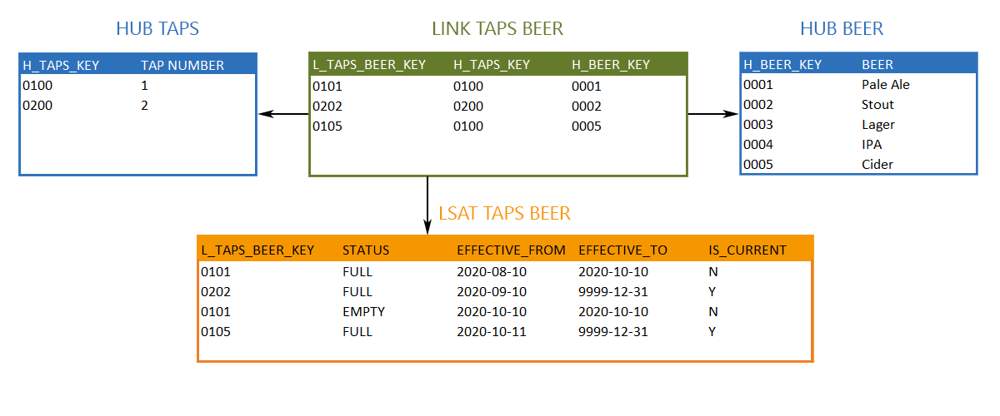

## BimlFlex Handling of Driving Keys

BimlFlex is optimized to recognize Driving Keys automatically. The Accelerator allows the framework to automatically apply Driving Key type relationships for any Links derived out of a Hub and be included in the load logic. Alternatively, users may manually define Driving Keys through simple settings.
The simple process for both implied creation and manual creation of Driving Keys within BimlFlex are detailed below.

### Implied Creation of Driving Keys

:::note

> The following requirements apply:
>  
> * The **Accelerator Object Type** for the **Object** *must be `Hub`
> * A **Column** must exists in the **Object** that references an **Accelerator Object Type** other than `Hub`

:::

BimlFlex can automatically apply a Driving Key to any relationship created from a table being loaded with a *MODEL OBJECT TYPE* = `Hub`.
Due to the Foreign Keys in a database requiring a many-to-one in the source, the application of a Driving Key scenario can be applied.
This will be automatically included in the ETL logic and no separate **Attribute** will be added in the **Attribute Editor**.

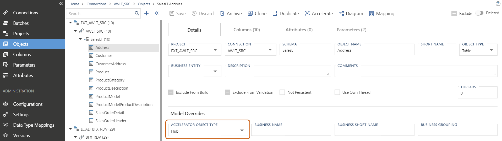

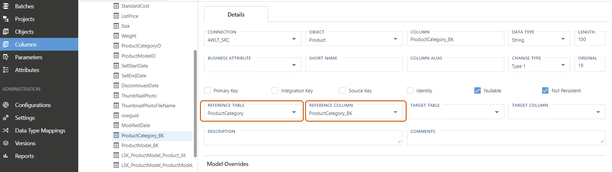

### Default Driving Key Application

The default behavior within the BimlFlex Accelerator is to automatically apply Driving Key type relationships for any Links derived out of a Hub.

Any changes made to the Driving Key relationships by the user after the first accelerated modeling will be upheld in all future model accelerations.

### Manual Creation of Driving Keys

:::note

> The following prerequisites apply:
>  
> * The Link must already be accelerated
> * The column to be used for the Driving Key must be on the LNK (not LSAT)

:::

The simplest way to define a Driving Key within BimlFlex is from the **Object** Editor.
Upon selecting the **Link** from the Object editor tree and selecting the **Columns** view, a Driving Key may be assigned from the drop down menu in the *Change Type* column.

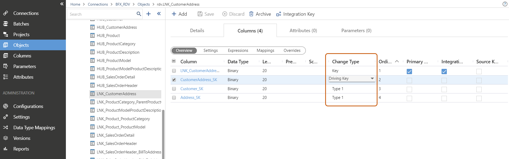

BimlFlex also allows manual definition of Driving Keys by way of **Column Attributes**.
This is done be flagging the required **Column** on the LNK with an **Attribute** to indicate that it is the Driving Key.
The BimlFlex App will automatically enforce a Driving Key relationship on the LSATs associated with the LNK, terminating relationships as needed.

**Objects** => Select LNK => Attributes Tab => [Add]

| Field          | Entered Value           |
| -------------- | ----------------------- |
| Attribute Type | Column                  |
| Column         | Column to be used as DK |
| Attribute      | IsDrivingKey            |

Driving Key settings are all adjusted in the "Add Attribute" dialog box:

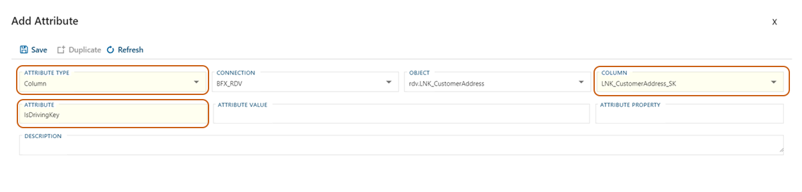

:::note

> For additional information regarding BimlFlex's assignment of Driving Keys or the technical walkthrough for manually defining Driving Keys, please reference the following documents:
>
> * [Data Vault Templates](bimlflex-data-vault-index)
> * [BimlFlex Data Vault Best Practices](bimlflex-data-vault-best-practices)
> * [Driving Keys](bimlflex-data-vault-driving-keys)

:::

