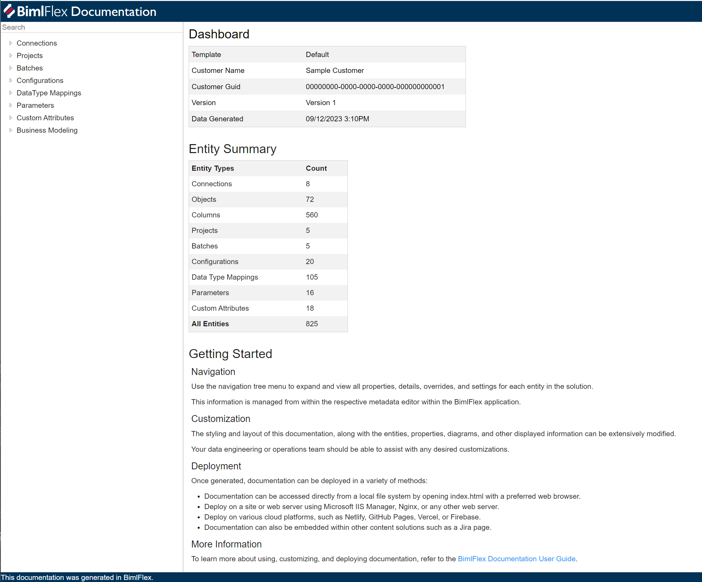
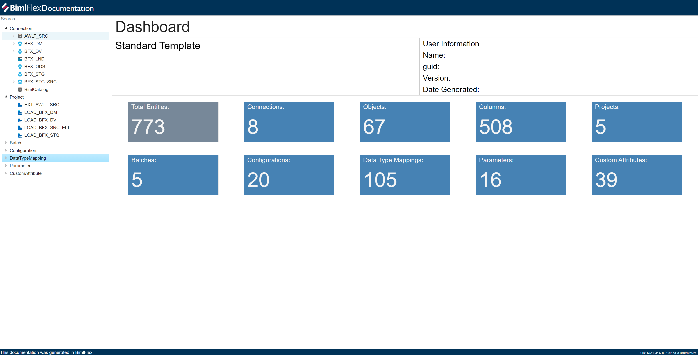
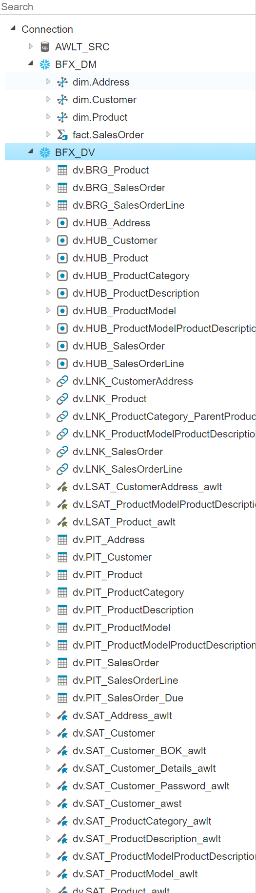
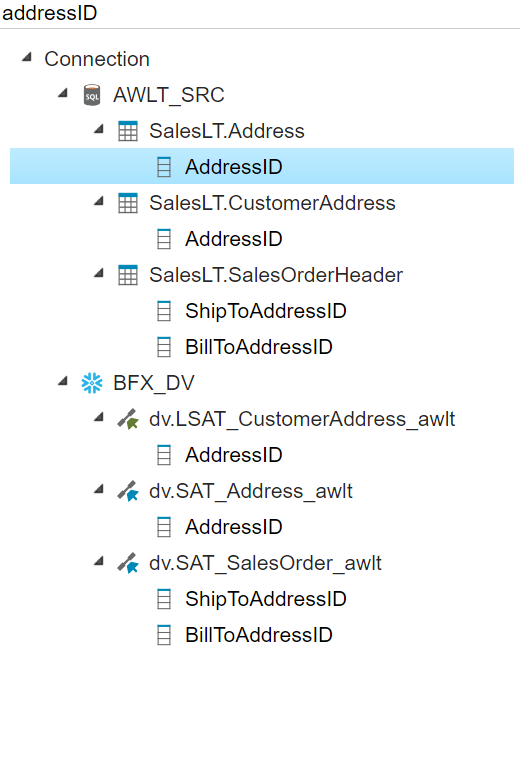

---

title: BimlFlex Documentation Viewer User Guide
description: Documentation for generating, deploying, and customizing BimlFlex Documentation
tags: [BimlFlex, Guidance]
---

# Overview

This guide aims to provide a step by step process of utilizing the BimlFlex Documentation generator. A table of contents for each section is outlined below.

## Initialization

This section covers the setup of BimlFlex Documentation, including important files and how they are used to generate and deploy documentation.

### Files

The following files are generated when the Documentation is ready for publishing or sharing. Interactions with these files may occur during deployment or management of the completed Documentation.

* **bundle.js**: A JavaScript file that contains all the necessary code to run the Documentation. It is compiled and optimized to ensure a rapid and efficient loading. This file is essential for Documentation being deployed on a web server.
* **bundleInfo.json**: A JSON file that carries metadata about the bundle.js. This file may contain information such as version number, file size, and other details related to the build process. Although primarily used internally by the app, it can provide insights into the specific build if required for troubleshooting or version management.
* **editor.worker.js**: A web worker script that assists with real-time editing functions within the Documentation. This script handles tasks such as spell-check and grammar analysis without slowing down the main browser thread.
* **index.html**: The main HTML file used to display the Documentation. It references other files, like bundle.js, and contains the structure and content of the Documentation. If hosting the Documentation on a web server, this will be the file that requests to view the content. This is also the primary file used for customization(s). For more information on how to implement personal templates and styling, refer to the [HTML](#html) and [CSS](#css) sections of [Customization](#customization).
* **metadata.bundle.js**: A JavaScript file that contains organized information about the structure, content, and configuration of the Documentation. It may include elements such as the table of contents, index, and other organizational data. It assists the app or web browser in understanding how to present the Documentation and navigate between different sections.

### Deployment

This section provides detailed instructions on the various methods for deploying to an HTML/JavaScript site.

**Method 1: File System Deployment**  
For viewing a site without an active internet connection, Documentation can be accessed directly from a local file system:

* Navigate to the directory containing the HTML file.
* Right-click on the file and select "Open with" from the dropdown menu.
* Select a web browser from the list of programs.

:::note


>
> * Some features might not function as anticipated due to security restrictions when loading web pages directly from the file system.

:::


**Method 2: Web Server Deployment**  
Deploying a site on a web server allows anyone with the server's IP address or domain to access it. Two web server deployment options covered below are: Microsoft's IIS server, suitable for Windows environments, and Nginx, a popular lightweight server for various platforms.

**Microsoft IIS**

* Install IIS via the "Turn Windows features on or off" panel in the Control Panel.
* Once installed, open the IIS Manager.
* In the Connections panel, expand the tree and right-click on "Sites", then select "Add Website".
* Enter the site name, physical path (location of the HTML/JavaScript files), and binding information, then click "OK."

**Nginx**

* Install Nginx, typically through a package manager like apt for Ubuntu or brew for macOS.
* Copy the HTML and JavaScript files to the appropriate directory. For a basic setup, this is usually /usr/share/nginx/html.
* Start or restart Nginx. On most systems, this can be done with the command `sudo systemctl restart nginx`.

**Method 3: Deployment on Cloud Platforms**  
Various cloud platforms can host an HTML/JavaScript site. Platforms like Netlify, GitHub Pages, Vercel, or Firebase offer free or affordable hosting. These platforms typically require uploading of files or connecting to a source code repository, and then handle the remainder of the deployment process.

**Method 4: Integrating into an Existing Jira Site**  
Although not designed to host websites, an HTML/JavaScript site can be embedded within a Jira page using an iframe, by doing the following:

* Host the site using any of the above methods.
* Once the site is live, copy the URL.
* On the Jira page, select the option to edit the page.
* Add an HTML macro to the page where the site should appear.
* In the macro, include an iframe that references the site. An example of code that could be used:

```html
<iframe src="SAMPLE_SITE_URL" width="100%" height="600"></iframe>
```

Replace `SAMPLE_SITE_URL` with the URL of the live site. The width and height values can be adjusted as needed.

:::note


>
> * When embedding a site within Jira, ensure the server where the site is hosted allows it to be loaded within iframes from the Jira site's domain. This is controlled by the 'X-Frame-Options' or 'Content-Security-Policy' HTTP header.

:::


**Method 5: Using Confluence to Serve HTML**  
Confluence permits serving static content including HTML pages, CSS, JavaScript, images, and other files. This can be especially useful for serving static HTML pages, storing content to reference from other Confluence pages or other sites, providing files to download without Confluence's size limitations, setting search engine rules through robots.txt, and more.

To utilize this feature:

* Place any file to be served in the `<CONFLUENCE_INSTALL>/confluence/` directory on the Confluence server. These files will not be affected by Confluence's style and will be served as independent files.
* The content can be accessed via the URL using the pattern `http://<confluence-url>/myfile.html.` If a file is saved as `<CONFLUENCE_INSTALL>/confluence/myfile.html`, it can be accessed at that URL, and HTML files will be rendered by the browser.
* Other file types will be displayed as plain text, or downloaded, depending on the browser settings. Modern browsers may also play media content like audio, video, or PDF files in the browser.
* To organize the files, folders can be created within the `<CONFLUENCE_INSTALL>/confluence/` directory. The directory name must be added to the URL to access the file, such as `http://<confluence-url>/mydir/myfile.html`.

This method allows serving static content independently from Confluence and can be a useful way to provide additional resources, pages, or files.

:::note


>
> * While the above methods offers the foundational knowledge needed to deploy an HTML/Javascript site, each deployment is unique and the ideal deployment method depends on the specific needs and resources of the user.

:::


## **Customization**

### Configuration

The configuration for the Documentation viewer is defined using a set of interfaces and enums. Below is a detailed explanation of each property and how to use them within the configuration.

#### General Settings

* **htmlTemplatePath** (optional): Path to the HTML template file used to render the documentation.
* **useMonacoEditor** (optional): A boolean value that enables or disables the Monaco editor, a popular code editor.
* **showEmptyFields** (optional): A boolean value that controls whether empty fields are displayed. Set to `true` to show them or `false` to hide them.
* **propertyOrder** (optional): Defines the order in which properties are displayed. Options are `Default`, `Alphabetical`, `Reverse Alphabetical`, and `BimlFlex App Order`.
* **propertyDisplayMode** (optional): Controls how properties are displayed. Options are `Always`, `Non-Empty`, and `Truthy`.
* **includeObjectLineageDiagrams** (optional): A boolean value that controls whether to include diagrams depicting object lineage.
* **includeConnectionSchemaDiagrams** (optional): A boolean value that controls whether to include diagrams depicting connection schemas.

#### Item Settings

*  **itemSettings** (optional): An object containing configurations for individual items, where the key is the qualified name of the item. Possible settings for each item include:

  * **isExcluded** (optional): Boolean value that excludes the item if set to `true`.
  * **displayMode** (optional): Controls how the property is displayed, using the same values as `propertyDisplayMode`.
  * **propertyOrder** (optional): Defines the order of properties, using the same values as `propertyOrder`.

### HTML

This section describes the process of customizing the application's HTML structure in `index.html`. Depending on the requirements, the HTML content is fully replaceable. Modify the `<landing-page>` `<div>` to suit each organization's needs, or remove it entirely.

To ensure the documentation's functionality remains intact, some essential elements must remain in `index.html`. These are described in detail below.

#### **Required Scripts**

These scripts are essential to the core functionality of each application. They must be included within the `<head>` HTML element:

```html
  <head>
    <script src="config.bundle.js"></script>
    <script src="metadata.bundle.js"></script>
    <script src="bundle.js"></script>
  </head>
```

#### **Core Components**

These core components form the main structure the application and should not be removed. They are housed within the root-container:

```html
    <div id="root" class="root-container">
      <div class="root-header">...</div>
      <div class="root-content">...</div>
      <div class="root-footer">...</div>
    </div>
```

Although it is required to keep these scripts and core components intact for the documentation to work as intended, they are customizable according to each application's specific needs. This achieves the balance between necessary functionality and a unique identity of the app.

Any HTML element with an `id` starting with `"config-"` is designed to store and display data in the documentation. For example:

```html
  <div id="config-rootLogo" class="root-logo"></div>
  <span id="config-rootName" class="root-name">Documentation</span>
```

These elements are responsible for holding and displaying the data for the root header. Below is an example of how the root header may look by default:

[place holder image here]

#### **Configuring HTML Data**

There are three main methods to configure the data of HTML elements:

**Method 1: Using the `config.ts` File**

Utilizing the `config.ts` file is the recommended way to make permanent content changes in the HTML. Each time the documentation is loaded, the `config.ts` file updates any configured elements with the content stored in the `htmlMetadata` object.

In order for `htmlMetadata` to properly update the documentation, the targeted element's `id` must follow the `config-{property}` format. For example, the property `version: "1.2.1"` would correspond to the element with the `id = "config-version"`.

By default, the entire value of the HTML element will be replaced by the corresponding `htmlMetadata` property value. 

To insert a value into an already non-empty HTML element, use the `_` character to indicate where the new value should be inserted.

For instance, for an HTML element like `<div id="config-numConnections"> there are _ connections </div>`, the `numConnections` property in `htmlMetadata` will replace the `_` with its respective value.

**Method 2: Using the `allBimlFlexMetadata` Global Variable**

Metadata for the BimlFlex app is stored in a global variable called `allBimlFlexMetadata`, assigned to a JSON object. A simplified structure of the object would be:

```javascript
{
  "Entities": { "Batch": [...], "Project": [...], /* other entities */ },
  "Meta": { "AttributeType": [...], "BimlFlexSetting": [...], /* other meta types */ }
}
```

Each list in the JSON object contains all of the available entities or types, along with their properties. A `Batch` entity could look like:

```javascript
{
  "EntityType": "Batch",
  "UID": "13403310-3d14-44b2-9284-48fd4736a862",
  // other properties
}
```

Since `allBimlFlexMetadata` is a global variable, a script block can be created inside the HTML to access and manipulate the metadata. This allows metadata to be displayed in the HTML.

An example script to access and display the first `Connection` entity:

```html
<script>
  function getFirstConnection() {
    const metadata = window.allBimlFlexMetadata.Entities;
    const connections = metadata.Connection;
    const firstConnection = connections[0];
    
    document.getElementById('config-rootName').innerHTML = firstConnection;
  }

  $(document).ready(getFirstConnection); // Use jQuery's ready event
</script>
```

**Important Notes:**

* To access the `allBimlFlexMetadata` object, specify the type of data (such as `Entities` or `Meta`) and the specific object type (such as `Connection` or `AttributeType`).
* Using jQuery's `$(document).ready()` function ensures that `allBimlFlexMetadata` has been initialized and changes made won't be overridden by the config file.
* While not strictly necessary, elements that store and display data should have an `config-` formatted `id` to maintain consistency and to signify which elements should be configurable. 

**Method 3: Direct HTML Changes**

The HTML can be changed directly. However, this is the least dynamic way to handle HTML customization. Furthermore, Methods 1 and 2 take precedence over any changes made directly to the document.

#### **Landing page**

This section covers the default landing page and how to replace it.

#### The Default Landing Page

In `index.html` find the following element:

```html
      <!-- This is the landing page, will load inner-html when url is default -->
    <div id="landing-page" style="display: none;">...</div>
```

This element is used to store the HTML responsible for creating the landing page for the documentation.

It can be fully customized following the [HTML](#HTML) guide.

An example of a previous version of the landing page, where values for an entity summary were loaded from a metadata file, would appear with the following structure:

```javascript
    htmlMetadata: {
        customerName: "John Smith",
        g        version: "0.1",
        dateGenerated: "08-03-2023",
        numConnections: "5",
        numObjects: "25",
        numColumns: "4",
        numProjects: "3",
        numBatches: "10",
        numConfigurations: "3",
        numDataTypeMappings: "2",
        numParameters: "30",
        numCustomAttributes: "5",
    },
```



By customizing the HTML file the documentation landing page could be edited to look like:



The above examples show the extent to which the landing page is fully customizable.

**Dashboard**

The dashboard, which is the heading of the landing page, is denoted by the `<div>` tag with the id `config-landingHeader`. This serves as the main entry point for the project.

**Project Lineage**

The `project-lineage` `<div>` simply contains the text "project" but should be changed to reflect the specifications of the docs being implemented.

**User Information**
This section is contained within the `user-information` `<div>`. 

| Item | HTML ID | Description |
| ---- | ------- | ----------- |
| **Name** | `config-customerName` | displays the name | 
| **guid** | `config-guid` | a unique identifier | 
| **Version** | `config-version` | denotes the version of the system or project | 
| **Date Generated** | `config-dateGenerated` | the date this data or page was generated | 

**Entity Summary**

This section, enclosed in the `entity-summary` `<div>`, provides an overview of the various entities present in the project. These entities are subdivided into various sections, each representing a different entity type. The character `_` denotes a placeholder where changes should be made to the values associated with each of the following:

| Item | HTML ID | Description |
| ---- | ------- | ----------- |
| **Connections** | `config-numConnections` | the number of connections in the project | 
| **Objects** | `config-numObjects` | the number of objects present | 
| **Columns** | `config-numColumns` | signifies the number of columns |
| **Batches** | `config-numBatches` | it denotes the number of batches present | 
| **Configurations** | `config-numConfigurations` | the number of configurations | 
| **Data Type Mappings** | `config-numDataTypeMappings` | the number of data type mappings | 
| **Parameters** | `config-numParameters` | the total number of parameters | 
| **Custom Attributes** | `config-numCustomAttributes` | the number of custom attributes | 

#### Custom Landing Page

Since the landing page is loaded from the `<div id="landing-page" style="display: none;">...</div>` element, any HTML that is inside will be loaded whenever the URL is set to its default path. Replace the HTML inside this element with custom HTML to change the look of the landing page.

### CSS

#### Adding Custom Styling

Custom styling can be added by following these steps:

1. **Create or Edit a CSS File:** If a new CSS file is needed, create it in the same directory where the HTML files are, or simply edit the existing styles.css.

2. **Add Custom Styles:** Open the CSS file in a text editor and write or paste custom styles. The elements most likely to be of interest for customization in the documentation include:

* The root-header and root-footer classes of elements.
* The tree-container element.
* The data-header class of elements.
* The expander-header class of elements.

3. **Link the CSS File in HTML:** If a new CSS file was created, it must be linked in index.html. Open the index.html file in a text editor, and add the following line in the <head> section.

```html
<link rel="stylesheet" type="text/css" href="path/to/templatecss.css">
```

Replace `path/to/templatecss.css` with the actual path to the CSS file.

4. **Save and Refresh:** Save all changes and refresh the browser to see the updated styling.

By following the above steps, styling of the HTML/JavaScript app can be modified according to preference. It is important to test changes across different browsers to ensure consistent appearance.

### Tooltips

Cell-label tooltips are generated using the `Tippy.js` package included in every documentation bundle. To customize the CSS of these tooltips, reference them by the id `tippy-box`. Further customization of the tooltips may be possible be injecting JavaScript code into index.html and manipulating the `tippy()` object provided by `Tippy.js`. This function accepts an options object which allows the specification of several properties:

* **content:** A String or Element that represents the tooltip's content.
* **placement:** This can be 'top', 'bottom', 'left', 'right', or 'auto', defining the tooltip's position relative to its target.
* **delay:** A Number or Array defining the delay in milliseconds before the tooltip is shown and hidden.
* **duration:** A Number or Array determining the duration of the tooltip's show and hide animations.
* **animation:** A String specifying the type of animation to be used for the tooltip.
* **interactive:** A Boolean value determining whether the tooltip should be interactive (e.g., whether it remains visible when hovered over or clicked on).

See below for an example:

```javascript
tippy('#targetElement', {
    content: 'Greetings!',
    placement: 'top',
    delay: [500, 200],
    duration: [300, 250],
    animation: 'scale',
    interactive: true,
});
```

For further configuration options and advanced use-cases, refer to the [Tippy.js Documentation](https://atomiks.github.io/tippyjs/v6/all-props/). This documentation provides a complete list of all properties and values one can use with Tippy.js, as well as detailed guides on more complex topics like themes, HTML content, nested tippys, singleton, and more.

### Monaco Editor

The Monaco Editor is the code editor that powers Visual Studio Code, a popular open-source code editor developed by Microsoft. It is written entirely in TypeScript and designed to work in the browser. It provides a robust set of features but is used exclusively by the Docs Viewer for the purpose of language-specific syntax highlighting. It supports a multitude of programming languages out of the box and can be customized and extended with additional languages, themes, and other functionalities. Monaco Editors are customized by referencing the `monaco-editor` element within their attached CSS templates. 

One can modify the Monaco Editor object through various options and methods provided by the library.

* Changing the content: The content in the editor can be changed using the setValue() method:

```javascript
editor.setValue('New code text');
```

* Changing the language: The language of the editor can be changed by calling the setModelLanguage() method:

```javascript
monaco.editor.setModelLanguage(editor.getModel(), 'python');
```

* Changing the theme: The editor theme can be changed by using the setTheme() method:

```javascript
monaco.editor.setTheme('vs-dark');
```

* Listening to changes: One can listen to content changes by adding an event listener on the onDidChangeModelContent event:

```javascript
editor.onDidChangeModelContent(() => {
    console.log('Content changed!');
});
```

The Monaco Editor offers many more features and customizations. Explore them in detail in the [Monaco Editor Documentation](https://microsoft.github.io/monaco-editor/) provided by Microsoft. 

## Usage

### Navigation

#### **Navigation Menu**

This serves as the main method of navigating through the BimlFlex Documentation. The menu is made up of nodes for each entity present in the BimlFlex configuration, forming tree menus that represent the relationships between each item.



#### **Search**

Above the menu is a search bar that will filter the menu based on the entered content.



#### **URL**

Every entity has a unique identifier (UID) that the URL uses to load the associated entity. This allows navigation directly through the URL where any entity can be directed by adding # followed by the entity's UID to the Documentation's default URL.

#### **In-Form Navigation**

Entities that are linked to other entities such as Projects to Batches, will have blue hyperlinks that contain the URL for the linked entity.

### Understanding the Documentation

#### **Menu**

This contains all of the entities that have been included in the Documentation. It is the main navigation hub of the Documentation.

#### **Forms**

Each entity has a form which displays all fields based on the current configuration settings.

  * The fields are displayed in tables which are separated by their respective grouping.
  * Tables are composed of each field and their value.
  * At the top-right of each form is a empty fields toggle which will add or remove empty fields.
    > [!NOTE]
>This will only effect **empty** fields. Fields with false values, such as empty checkboxes, will not change.

  * Entities with Parameters and/or Custom Attributes will have a table listing all such Entities.
  * Lineage Diagrams are located at the bottom of applicable forms.

    > [!NOTE]
>
>Lineage diagrams can be zoomed by clicking and moved by dragging.
