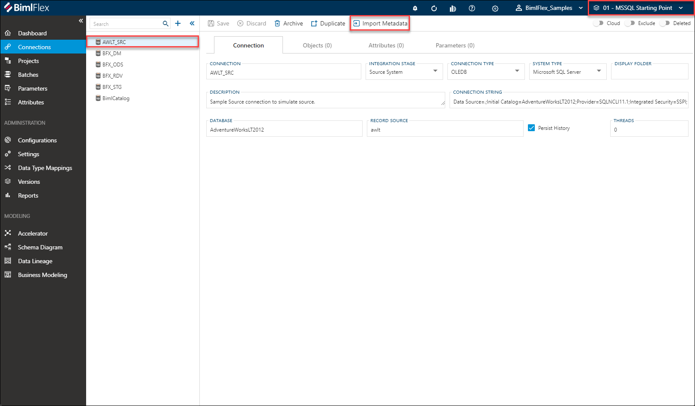
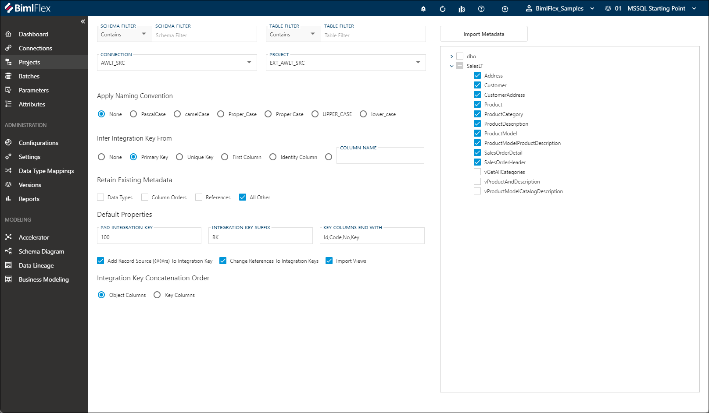
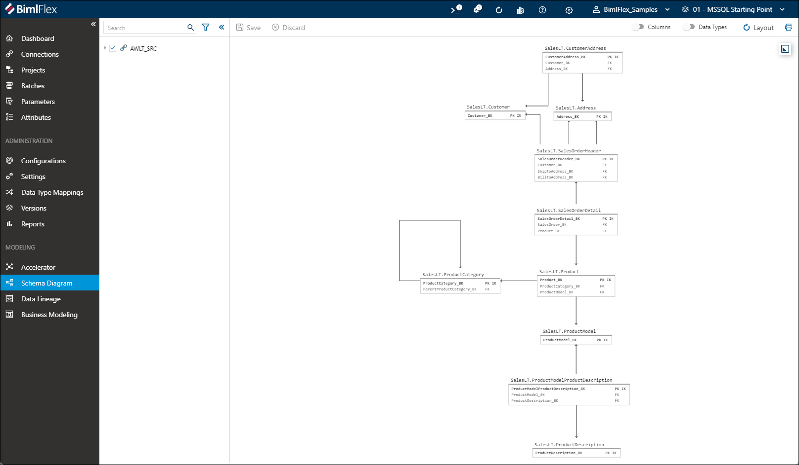
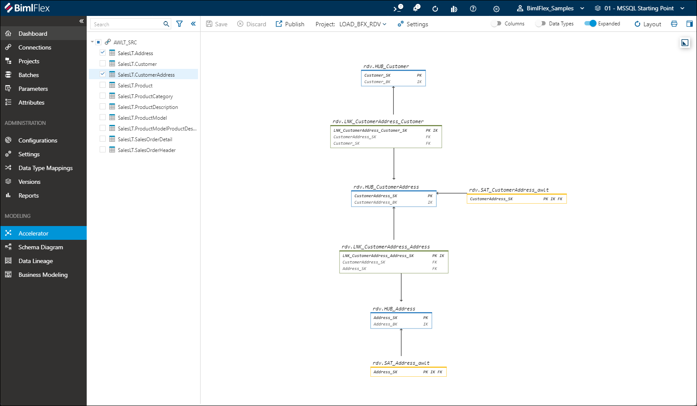
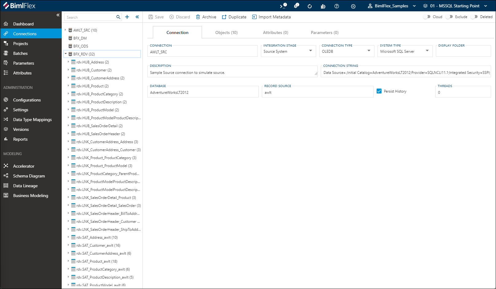

# My First BimlFlex Solution

This is a step-by-step guide for building a data solution using BimlFlex. For these examples, a local installation of BimlFlex and BimlStudio are used for development.

The examples here use SQL Server as the technical environment, with on-premise SSIS for the load process. The Microsoft AdventureWorksLT sample database is used as a data source.

:::note


> Before following this example, please start with the following steps:
>
> * [Installing BimlFlex](bimlflex-setup-installing-bimlflex)
> * [BimlFlex Initial Configuration](bimlflex-getting-started-initial-configuration)

:::


The target architecture for this guide is a three-layered data solution that includes a staging layer, a Data Vault, and a Data Mart layer.

The staging layer will be configured with both a transient staging database and a persistent staging (archive) database. The Data Vault layer illustrates how BimlFlex allows acceleration of an integration layer. For easy reporting and analytics, the architecture is completed with an analyst-facing Dimensional Model.

## Prerequisites

The following software is needed to reproduce this sample:

* A Windows-based development machine for local installation of BimlStudio and BimlFlex
* SQL Server 2017/2019 with SQL Server engine and SSIS/Integration services
* Visual Studio 2017/2019 with SSDT and SSIS components
* SQL Server Management Studio or similar, for managing databases and running SQL Scripts
* The [AdventureWorksLT database](bimlflex-getting-started-setting-up-adventureworkslt2012-source-database) installed on the SQL Server

## Loading Sample Metadata

The BimlFlex App includes ready-made sample metadata that can be loaded into the project. There are several sample metadata sets available for different architectures.

This walkthrough uses the **01 - MSSQL Starting Point** sample. This sample provides a default configuration for on-premise SQL Server and SSIS, with [**Projects**](bimlflex-project-editor) and [**Batches**](bimlflex-batch-editor) already created.

More information please refer to the guide for [loading sample metadata](bimlflex-sample-metadata).

## Importing Source Metadata

Source metadata management and modeling is done through the BimlFlex App. BimlFlex makes it easy to import the AdventureWorksLT source metadata into the metadata repository using the [Importing Metadata](bimlflex-concepts-importing-metadata) feature.

For this walkthrough, the AdventureWorks metadata can be imported in the 'AWLT_SRC' connection that has been prepared as part of the selected sample version.



After clicking the **Import Metadata** button, the App will navigate the user to the import feature. If connectivity is successful, the AdventureWorks database can be accessed and its contents will be visible after pressing the **Connect to Database** button.

For this guide, please select all table objects (not the views) in the 'SalesLT' schema and press **Import Metadata**.



Doing this will create the source [**Objects**](bimlflex-object-editor) as part of the 'AWLT_SRC' [**Connection**](bimlflex-connection-editor) and navigate to the [**Schema Diagram**](bimlflex-schema-diagram) designer, showing a visual representation of the imported objects.



Using these source definitions, BimlFlex can provide a started Data Vault model using the [**Data Vault Accelerator**](bimlflex-data-vault-accelerator).

## Data Vault Acceleration

The BimlFlex App provides a [Data Vault Accelerator](bimlflex-data-vault-accelerator) that creates Data Vault objects from the available source metadata.

Data Vault acceleration is recommended to be performed once the Enterprise Logical Model (ELM) has been completed, so that the path from the initial, technical-focused, Data Vault to the final business-focused Data Vault is clear.

The Data Vault acceleration uses the source metadata, added modeling metadata, and its defined relationships to create a Data Vault physical model. Based on this metadata, BimlFlex can create the required Data Vault structures, and the source-to-target mappings in the metadata repository.



The accelerator aims to simplify adding additional source object to the model in an iterative fashion. In the accelerator, the initial Data Vault can be adjusted to better represent the business-focused target state.

Typical actions, such as splitting Satellites or group Links can be performed here. In this walkthrough, we keep the physical model as it is generated by BimlFlex.

The BimlFlex App provides a graphical accelerator allowing the modeler to create and tweak the required Data Vault model out of the source model.

When the preview matches the model expectations, it is published to the metadata repository. This can be done by selecting *all* objects for the 'AWLT_SRC' connection and clicking the **Publish** button. The column and object names will change from cursive to regular, indicating that the changes have been committed.

The new Data Vault objects can be reviewed in the BimlFlex App, in the Data Vault Project under the objects tab, or as part of the objects in the [**Treeview**](bimlflex-treeview) under the connection that has been configured for the Data Vault layer in the solution - 'BFX_DV' in this example.



If any objects need to be changed, these can always be archived from the 'BFX_DV' connection and re-accelerated. In BimlFlex, design metadata is saved against the source objects. Any time the Accelerator is used, the relevant information will be evaluated against what has been defined in the source objects.

## Building the Data Vault Project

Once the metadata meets the data warehouse requirements it is time to use BimlStudio to build the databases, tables, scripts and load packages for the Data Warehouse process. This includes creating the table and load scripts and building SSIS packages.

:::tip


> The Varigence YouTube channel contains various introduction videos about using BimlFlex and BimlStudio. [This video](https://www.youtube.com/watch?v=a4-dgVcpE2o?rel=0&autoplay=0) shows an example of how to build/compile output for the source-to-staging process.

:::


### Building Databases, Tables and SSIS packages for source to staging in BimlFlex

In BimlStudio, the BimlFlex project is able to create SQL DDL scripts to create databases and tables for the Data Warehouse. These can be run on the database server to create all artifacts required to run the getting started process. This is an agile way to create tables while developing.

BimlFlex also builds Visual Studio SQL Server Data Tools (SSDT) Projects for all databases and artifacts. This feature is enabled by default and these projects can be used to deploy the databases and tables. This approach can be integrated into a deployment pipeline for continuous integration, continuous deployment scenarios.

Once the tables are available in the data warehouse database server, it is possible to use the build process in BimlStudio. This will build the SSIS projects and packages for the source to staging and persistent staging loads.

The creation and building of the initial source to staging will validate that all local configurations and build tools are in place and working as expected. it will also validate access to the database server used for the data warehouse.

The output window in BimlStudio will show the build process and will also detail any errors. Should there be an issue in the build, review the output window and troubleshoot based on the first error message.

Some common build failure scenarios:

* BimlStudio can not connect to the source database to validate the query. Review the connection information for the source and validate that the current user credentials can connect to the server.
* BimlStudio can not connect to the persistent staging database to validate the lookup query for existing rows. Verify that the PSA (and all other) database and tables have been created and that they are available to the current user.
* A client without the 64-bit SSIS components is building using 64-bit configuration setting. Change the bitness in the `Build & Deploy` ribbon tab to 32-bit.
* BimlStudio is configured to build using an SSIS version not available locally. Verify that the project is configured for the correct SSIS version and that the corresponding SSDT BI tools have been installed locally.

### Detailed Steps

The following detailed steps walk through the creation of database scripts and building of the SSIS project:

#### Refresh metadata

To start, click the `Refresh Metadata` button to make sure BimlStudio has the latest metadata from the database

#### Creating SQL DDL scripts to create databases and tables

In BimlStudio, navigate to the `BimlFlex` tab. In the `Generate Scripts` dropdown, choose `Create Table Script`. BimlFlex will generate the database, schema and table create scripts. Copy the script or open the generated file in Microsoft SQL Server Management Studio and execute them on the target SQL Server. This will create all Data Warehouse databases and tables for the process and allow the SSIS packages to be created.

#### Building SSIS packages in BimlStudio

Once the tables are available it is possible to use the build process in BimlStudio to create the SSIS project and packages for the load process

In BimlStudio, navigate to the `Build & Deploy` tab, choose the `32-bit` build option in the dropdown unless there is a local installation of 64 bit SQL Server SSIS components and click `Build`

#### Opening and reviewing the SSIS project in Visual BimlStudio

The output folder for generated artifacts is configurable, the default location is a folder called `output` in the BimlFlex project location.

In the output folder, there are multiple folders for all the created artifacts.

BimlFlex creates folders for SSIS projects, expanded code for both Biml and SQL as well as SSDT projects for all databases.

The load project is located in a folder called `EXT_AWLT`, the same name as the project name defined for the Metadata project.

Open the `EXT_AWLT_Project.dtproj` project file in a compatible version of Visual Studio to review the generated packages. To test the load, run the `EXT_AWLT_Batch.dtsx` SSIS package. This package will call the individual Table load packages and load the data from the source database to the staging and persistent staging databases in the Data Warehouse.

Once the SSIS package execution is completed, the staging and persistent staging tables will contain data.

#### Reviewing the SSDT Project

BimlFlex also builds an SSDT database project for each database by default.

The default location for this is under the Project output folder in `SSDT\CustomerUID\VersionName\DatabaseName\`

These projects can be used to deploy and manage the database pipeline instead of using the Script generation feature in BimlStudio.

The default output folder for these SSDT projects can be changed through the `SsdtOutputPath` Setting

## Applying Load Parameters

To load only new data every time the load process is run, add load parameters where needed. The Parameters function in BimlFlex allows easy adding of high water mark load parameters to the sourcing process.

The way the load process should derive a valid delta is an important steps in the analysis of a source system.

The delta is the set of changes that has happened in the source since the last load into the Data Warehouse.

Instead of loading every row from the source every time, only loading the delta allows the minimum amount of data to be processed by the extract mechanism.

For some sources there are delta data sets presented for easy consumption, others have Change Data Capture (CDC) or Change Tracking (CT) enabled. Some sources have no concept of change tracking so the data warehouse architect needs to analyze change patterns and derive an alternate change detection or delta sourcing approach.

One common approach is to use a high water mark column that serve as a parameter for loading. The columns max value, after each load, is stored in the parameters table in the BimlCatalog and that value is used as a query parameter on the next load.

BimlFlex has direct support for parameter management, and can either use a simple single value for sources where the new value can be easily derived (such as for a database destination), or it can support source windowing by querying both the from and to values directly from the source for blob storage destinations.

The load process can use any number of parameters and the get and set process can be tweaked to match the sourcing requirements through the Extension Points feature.

For the getting started process, a high water mark load parameter is used. The AdventureWorksLT source system has been analyzed, and the `ModifiedDate` column has been determined to be trustworthy enough to be used as a high water mark column. Table loads can use this column as a parameter to only get the data that has changed since last load.

Add load parameters through the BimlFlex App on the source objects.

The `Parameter` name is used in the parameter management as the descriptive name.

The `Default` value is used when there is no existing value stored, such as the first time the data is loaded.

The `Parameter SQL` is the query that will be run on the Staging table after the load completes to identify the next load from parameter value. The getting started process uses the following sample SQL statement to get the maximum modified date after load:

```sql
CONVERT(VARCHAR(23),MAX(@@this),121)
```

The `@@this` shortcut refers to the current `ColumnName`.

The extract packages are expanded with the required get and set parameter tasks and the source queries are expanded with the required `WHERE` SQL syntax to only load data that changed since the last load.

As the parameters are stored in the BimlCatalog database it is necessary to reset these if a new initial load is performed, such as after rebuilding the persistent staging tables in a getting started scenario. If the tables are emptied and the load parameter is kept, a package execution will not load any of the existing source data to the staging tables.

## Business Data Vault Model

The Point in Time and Bridge table structures are used in Data Vault to make the Data Vault easier to query and to improve query performance.

The `Point in Time` (PIT) and `Bridge` (BRG) structures are used in Data Vault to make the Data Vault easier to query and to improve query performance.

* Point in Time, PIT, tables are used to create timelines for all changes in all or some Satellites attached to a business entity in a Hub
* Bridge, BRG, tables are used to link business entities in Hubs, through their link tables, into easy to query constructs

### Point in Time introduction

For insert-only Data Vault solutions, the Point in Time constructs provide a convenient way to recreate timelines and end date records so that timeline-sensitive queries are easier to create. This is useful when a Hub has multiple Satellites attached and there is a requirement to query data from several of these Satellites for an event DateTime.

:::note


> Example:
> A Sales Order has a sale event DateTime when the sale occurred. The customer involved is identified through a link between the SalesOrder Hub and the Customer Hub. The Customer has a Satellite with demographic information as well as Satellites for marketing and promotions data, geographic/address information and loyalty status. All these satellites have individual timelines and finding the relevant rows from each table for the sale event time can require a complex query. The Point In Time table would pre-calculate these timelines so that the query becomes more straightforward.

:::


### Bridge introduction

The Bridge constructs allow multiple Links surrounding a Hub to be combined in one table, minimizing the required joins.

:::note


> Example:
> A Sales Order Core Business Concept is stored in a Hub. This has several separate Link table relationships to Hubs for Customer, Shipping Address, Billing Address, Product, Marketing Campaign, Store etc. A query to gather attributes from multiple attached Satellites from the linked entities would need to join from the main Hub to the Links to the related Hubs to Satellites or Point In Time tables for each related entity. This rapidly becomes a large number of joins. The Bridge table pre-calculate the joins and allows for more straightforward queries.

:::


BimlFlex implements these artifacts using tables for data storage, Stored Procedures for loading and SSIS packages for orchestration.

The PIT and Bridge objects are created in the BimlFlex App using Hub objects as the starting point. From the BimlFlex App, navigate to a Hub that is going to be used as a starting point. Click the `Create PIT` or `Create Bridge` buttons to show the creation dialog.

Once the PIT and BRG artifacts are created they are visible in the objects list and their tables, load stored procedures and SSIS orchestration packages can be created in BimlStudio.

### Building PIT and BRG Tables

The PIT and BRG Tables are included in the `Generate Scripts` function in BimlFlex. They are also included in the generated SSDT project for the Data Vault database.

Configure the `Script Options` in BimlStudio to only create the Object Types for BRG and PIT. Save choice by clicking Commit. This allows the creation of only the table scripts for the BRG and PIT tables in the Generate Scripts function.

Run the table create script in SQL Server Management Studio to create the new BRG and PIT tables.

### Adding Default Values Hub records

BimlFlex will use a null default value placeholder for PIT and BRG entities with no corresponding Data Vault entity record, allowing for inner joins in more scenarios.

Scrips for these placeholder records are created through the `Generate Script`, `Data Vault Default Insert Script`. This will generate SQL insert scripts for all relevant entities. Deploy these to the Data Vault database to simplify the required queries.

The script is also part of the SSDT Database project for the DV database, in the form of a Post Deployment script.

Run the placeholder create script in SQL Server Management Studio to create the placeholder values.

### Creating PIT and BRG Stored Procedures

Use the `Generate Scripts`, `Business Vault Procedure Script` option in BimlStudio to create the scripts for the PIT and BRG procedures.

They are also included in the generated SSDT project for the Data Vault database.

These stored procedures need to be created in the Data Vault database.

### Building the PIT and BRG load packages

Once the metadata for the PIT and BRG objects has been loaded in BimlStudio there will be Batches generated for executing the PIT and BRG stored procedures.

The default name for these are built out of the Data Vault load name with either PIT or BRG added, in the trial demo case the following Batch packages are added to the Load Data Vault SSIS project:

* `LOAD_BFX_DV_BRG_Batch`
* `LOAD_BFX_DV_PIT_Batch`

These batches allow easy scheduling and orchestration of the Stored Procedure execution through SSIS.

## Dimensional Model

The Dimensional model is built on top of the Raw and Business Data Vault model. By using a view-based abstraction layer between the tables and the Data Mart load it is possible to more easily accommodate future changes and optimize the sources for the Dimensions and Facts.

:::tip


> The Varigence YouTube channel contains various introduction videos about using BimlFlex and BimlStudio. [This video](https://www.youtube.com/watch?v=UKq-libt3xg?rel=0&autoplay=0) provides an overview of delivering Dimensional Models using BimlFlex.

:::


The dimensional model, Data Mart, is optimized for analytical tools, end-user queries, and for building models for Analysis Services cubes and tabular models.

This type of layer has many names, Information Mart, Data Mart, Kimball Model, Dimensional Model, Reporting Layer, Semantic Layer. They can be either Raw, without business rules applied, or refined with any number of filters, rules, and data processing steps applied. BimlFlex allows the rapid creation of any of these constructs by applying a metadata-driven modeling and generation process.

The getting started process follows the general dimensional approach of building Fact tables that contain metrics and connections to Dimension members and Dimension tables that contain descriptive attributes.

While the Data Vault is loaded with uninterpreted data, the Dimensional model normally requires that a set of Business rules are applied to the data so that it is fit for the required analytical purpose. In the process of creating the end to end solution, it is common to also create raw versions of these artifacts that are used to refine the business rules used to create the final model.

In this process, both Fact and Dimensional source views are created, based either on the staging tables or the raw Data Vault or on the Point In Time and Bridge tables in the Data Vault layer. These are used to populate a dimensional model in a Data Mart as a presentation/reporting layer.

Querying the Data Vault layer can be made easier by utilizing the Point In Time and Bridge tables. To also include relevant contextual data it is necessary to join from these constructs to any Satellite that contains effectiveness information as well as the metrics or attributes needed. By using the time slice information in the Satellites the relevant record for the event date-time is added to the dimensional model.

### Architecture

The Dimensional model is created in the BimlFlex metadata in the form of a source to target mappings set of objects and columns. The source is generally implemented as a view on top of the existing staging or Data Vault constructs. For Data Vault, this includes tables from the Data Vault, Business Vault constructs, Point In Time and Bridge tables and any extra required interpretation views and abstraction views that are required to feed the dimensional model.

For the getting started process, a set of views are provided in the sample metadata and used as the source objects for the dimensional model.

### Detailed Steps

The following detailed steps walk through the creation of the Dimensional Model from Data Vault

#### Creating the source views for the dimensional model

The views used as sources for the dimensional model can either be managed and source controlled through the BimlFlex metadata or through the SQL Server Data Tools project for the databases. Use the approach most compatible with the deployment pipeline used.

Sample source views are included in the Sample Metadata.

Review the sample metadata for the architecture of choice. All Data Mart source objects have their corresponding source objects defined with source SQL definitions for their respective source view. These views are included in the scripts and database projects.

#### Creating the destination metadata through the Clone Table feature

The BimlFlex App provides a `Clone Table` metadata creation tool for creating the destination dimension and fact tables.

Select the source object in the Objects page and click the `Clone Table` button. Choose the object type (Fact or Dimension), define a destination schema and table name and, for Dimensions, choose to add an Identity Column to the destination. Checking the `Add Target Column Mappings` will populate the source to target column mappings between the source and destination objects.

#### Adding Fact to Dimension relationships and Dimensional key lookups

One feature of the Dimensional implementation is the use of integer sequence numbers as primary keys. The Data Vault layer uses the hash of the Integration Key as the primary key for entities. Some analytical tools prefer integer keys for primary keys and Fact to Dimension relationships. BimlFlex provides a value-to-key lookup function that will use the standard SSIS lookup transformation to translate the value from the source to the key used in the dimension.

This mapping is done for dimensions that have the primary key defined as an identity column. A dimension without an Identity column primary key is assumed to be a smart key that doesn't require a lookup.

The Dimension object has an Integration Key and a Primary Key, the lookup will compare against the Integration Key value and replace it with the Primary Key value.

The Fact table source has the corresponding lookup value (the same value as the Integration Key in the Dimension). When cloning the source object to the Fact object this column is included and is mapped from the source to the Fact table destination.

The metadata imported from the views will not have any relationships defined as these are not provided by the views. The target Facts and Dimensions will not have any relationships defined. Add the relationships between the target fact and the target dimension objects in the BimlFlex App schema diagram.

Adding the relationship between the Fact table Integration Key and the Dimension allows BimlFlex to also update the used keys, their data types and names so that the lookup functionality works as expected.

#### Building the dimensional model SQL artifacts

With the metadata defined, refresh the metadata in BimlStudio and create the SQL Artifacts through the Generate scripts option or the SSDT project build.

The source views and destination tables will be included in the table script. Run the script in the Data Warehouse database.

Should the source views be managed through SSDT, deploy them as normal through Visual Studio or the sample deployment scripts.

#### Building the dimensional model SSIS load project

Once the metadata is complete and refreshed in the BimlStudio project and the tables and source views are available it is possible to build the load project. This is built, tested and deployed in the same way as the already created source extraction and Data Vault load projects.

The Data Mart project is separate to the Source to Staging and Data Vault Load project. Add the project to the Visual Studio solution if needed.

Once the Batch package has been run the dimensional model in the Data Mart will be available for querying.

#### Querying the Data Mart

Use a reporting or analytics tool to query the Dimensional Model to analyze the data or query the model with these sample queries:

```sql
-- Sample Dimensional Query for Fact and Dimensions:
USE BFX_DM
GO

SELECT *
FROM fact.SalesOrder fact
INNER JOIN Dim.Date orderdate ON orderdate.DateKey = fact.OrderDate_DateKey
INNER JOIN Dim.Date shipdate ON shipdate.DateKey = fact.ShipDate_DateKey
INNER JOIN dim.Customer dimcustomer ON dimcustomer.CustomerKey = fact.CustomerKey

-- Sample Dimensional Query for Fact and Dimensions, get total sales per order month:
USE BFX_DM
GO

SELECT
    orderdate.[Year]
  , orderdate.[MonthName]
  , SUM(fact.TotalDue) AS TotalDue
FROM fact.SalesOrder fact
INNER JOIN Dim.Date orderdate ON orderdate.DateKey = fact.OrderDate_DateKey
GROUP BY
    orderdate.[Year]
  , orderdate.[MonthName]
ORDER BY
    orderdate.[Year]
  , orderdate.[MonthName]
```
