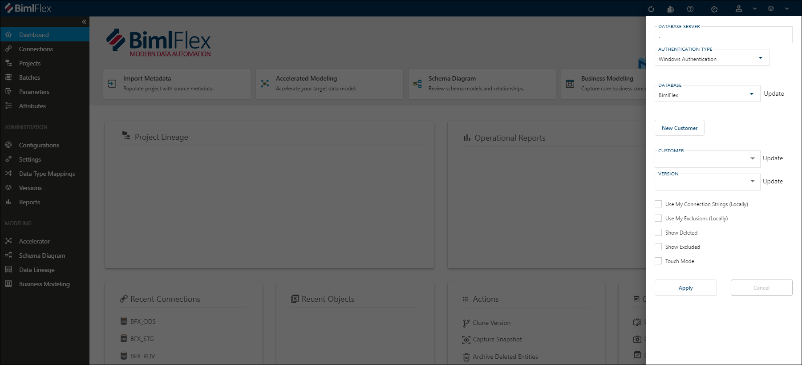

import InclHeaderBimlstudioConnect from '../build-and-deployment/_incl-header-bimlstudio-connect.md';
import InclHeaderBimlstudioProjectBuildOutputSettings from '../build-and-deployment/_incl-header-bimlstudio-project-build-output-settings.md';
import InclHeaderBimlstudioProjectSettings from '../build-and-deployment/_incl-header-bimlstudio-project-settings.md';
import InclHeaderBimlstudioProject from '../build-and-deployment/_incl-header-bimlstudio-project.md';
import InclHeaderSamples from './_incl-header-samples.md';
import InclHeaderBimlflexApp from '../metadata-editors/_incl-header-bimlflex-app.md';
import InclHeaderDashboard from '../metadata-editors/_incl-header-dashboard.md';
import InclHeaderNewCustomer from '../metadata-editors/_incl-header-new-customer.md';

# Initial Configuration

Once the BimlFlex installation is completed, it is time to set up the environment for a BimlFlex project. The initial setup of BimlFlex include the steps to set up the full development environment:

* Connecting to the BimlFlex database
* Loading sample metadata (optional)
* Creating the BimlStudio project

## BimlFlex App

<InclHeaderDashboard />
<InclHeaderBimlflexApp />

## Metadata Connection

To begin designing your data solution, start the BimlFlex App and configure it to connect to the BimlFlex database.

Set up the Connection through the **Database Setup Pane**, which can be accessed from the **Database Settings Cog** in the top menu bar. The database setup pane contains options to specify connectivity to the BimlFlex database. The **Update Button** can be pressed to refresh the database contents when connection details have been modified.

Once connection has been established, a new [**Customer**](bimlflex-concepts-customer) can be created. Or, an existing Customer and [**Version**](bimlflex-concepts-version) can be selected.

### New Customer Creation

<InclHeaderNewCustomer />

### Load Sample Metadata

<InclHeaderSamples />

## BimlStudio Configuration

With the BimlFlex database available, and a new customer created, the metadata can be connected to via BimlStudio so that the metadata can be compiled into the various data solution artifacts - table scripts, procedures and data logistics processes.

Open the BimlStudio application and create a new, empty BimlFlex project.

:::note

> BimlStudio and the BimlFlex Excel Add-in will prompt for a License Key the first time a new installation starts.
> If a trial key is required, please contact Varigence BimlFlex Support at [support@bimlflex.com](mailto:support@bimlflex.com).

:::

### Creating the BimlFlex project

<InclHeaderBimlstudioProject />

### Connect to the BimlFlex Database

<InclHeaderBimlstudioConnect />

### BimlStudio Project Settings

<InclHeaderBimlstudioProjectSettings />

#### Build Output

<InclHeaderBimlstudioProjectBuildOutputSettings />

#### Target Versions

In the target version section, the correct versions of the technical environment can be specified. These settings will direct the Biml compiler to output the generated artifacts in a way that matches the version, so these settings should match the target architecture.

SQL and DDL

* SQL Server, this corresponds to the SQL Version to use for Scripts and SSDT Projects
* DDL Build Mode, always leave as None for BimlFlex projects. BimlFlex provides direct script options and SSDT Projects for DDL instead

Data Integration

* ADF Build Mode. ADF can be managed through multiple, separate JSON files or Azure ArmTemplate files
* SSIS, the SSIS Server version to build for
* Use Project Deployment, should the build spawn Project Deployment ready projects and packages. This is the preferred deployment methodology for SSIS since SQL Server 2012

SQL Server Analysis Services

* SSAS Multidimensional, not included in BimlFlex projects
* SSAS Tabular, not included in BimlFlex projects
