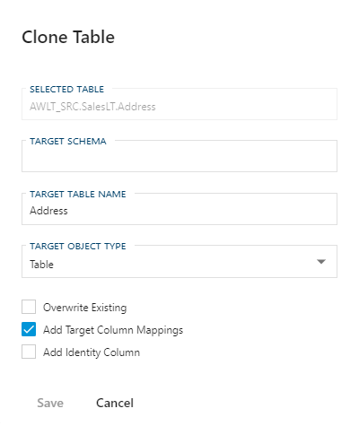

#### Clone Table Dialog

The **Clone Table** feature is primarily provided to allow for quick generation of **Dimensions** and **Facts**, but it can also be used to quickly define a new target **Object** for a given selected (source) **Object**. The location where the new target object is created is derived from the **Project** configuration of which the selected object is part of.

For example, if a given object is part of a project that targets a Data Vault **Connection**, the cloned object will be created in this connection.

The most common use case for using the clone feature is to create a Data Mart target for a manually created view, typically sourcing from the Data Vault. This view has already been created for the intended target state and structure.

:::note

> Please refer to the [**Data Mart**](bimlflex-data-delivery-index) section for more information on delivering data using Data Marts and Dimensional Models.

:::

When cloning an object, please provide the intended *Target Schema*, choose your *Target Object Type*, set your [Clone Table Options](#clone-table-options) and click  **Save**.

##### Clone Table Options

| Option                     | Description                                                                                                                                                                                                                                                           |
| -------------------------- | --------------------------------------------------------------------------------------------------------------------------------------------------------------------------------------------------------------------------------------------------------------------- |
| Overwrite Existing         | When enabled, if the **Object** or associated **Columns** already exist, the **Object** and/or **Columns** will be overridden with current settings. When disabled only not existing entities will be created.                                                        |
| Add Target Column Mappings | This will automatically map the appropriate **Target Columns** to the columns of the source object.|
| Add Identity Column        | Adds an **Identity Column** that can be used as the **Surrogate Key** (SK) for the cloned table that can be defined as Primary Key. The identity column automatically provides an incremental number value so that each record is guaranteed to be unique. This is common for a **Dimension Object** to support **Type 2** (history tracking) values. It is generally not used when designing a **Fact Object**, unless there is a specific use case. Please note that when providing this column, the Primary Key is automatically enabled and the ordinal position will be set to '1'.|
