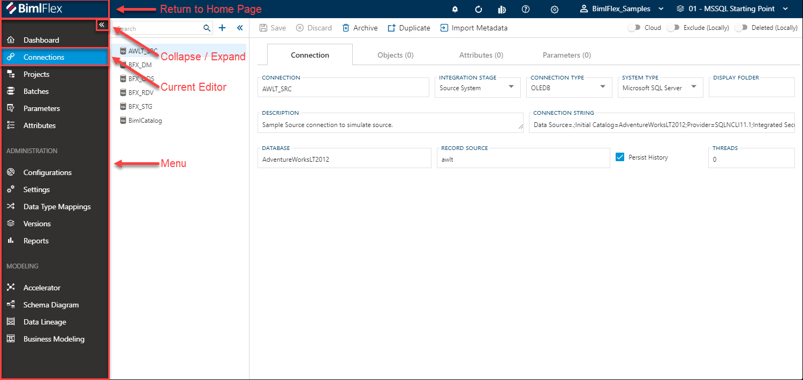
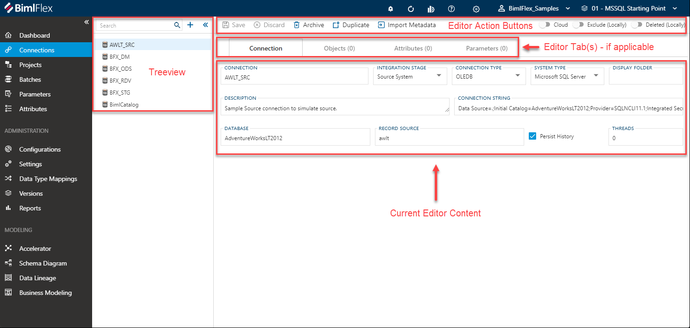
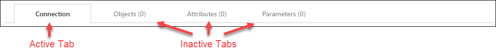
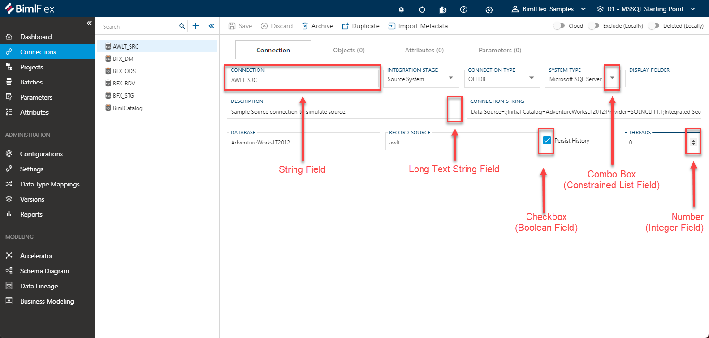
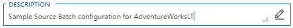
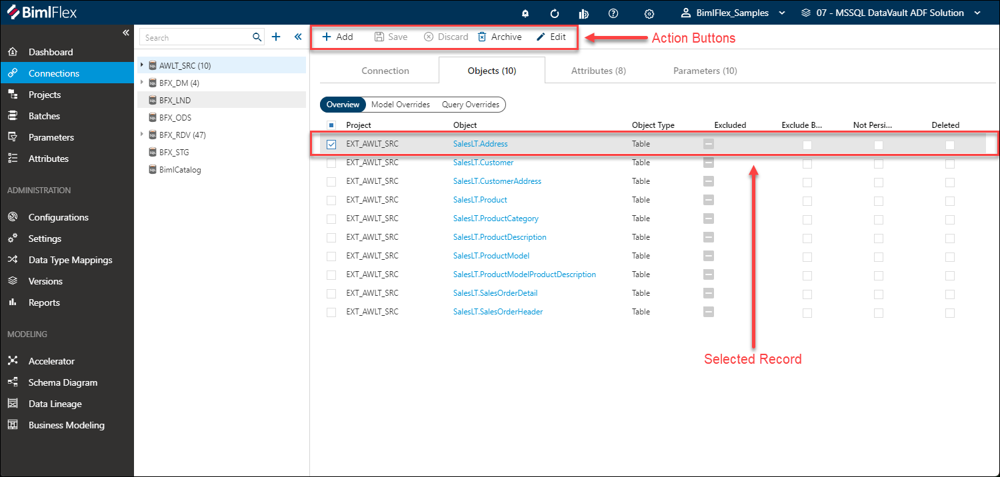
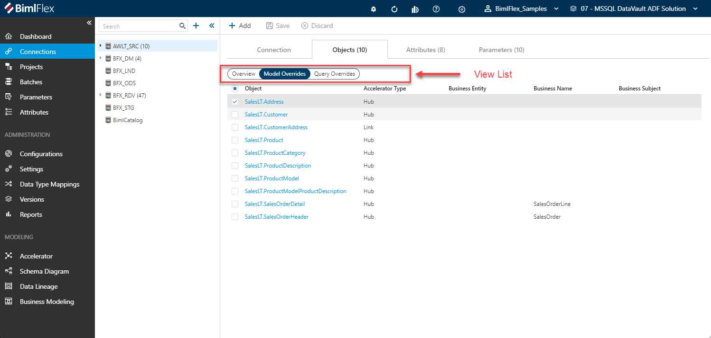
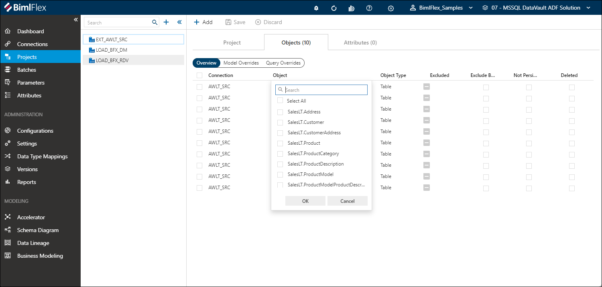
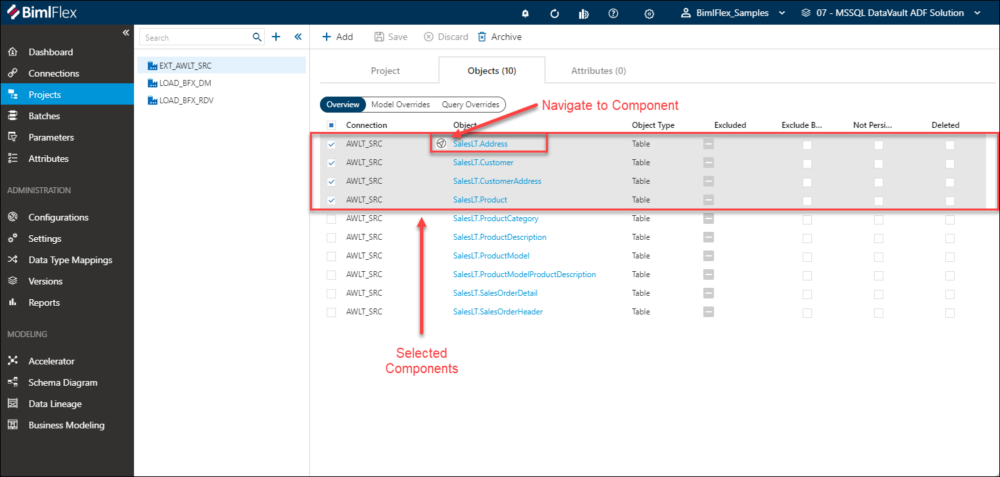

# BimlFlex App Introduction

The following sections describe the user interface elements that make up a Metadata Editor ('editor'), and how the features provide navigation and interaction.

[!include[BimlFlex Toolbar](_incl-toolbar.md)]

## BimlFlex Menu  

The BimlFlex Menu provides quick navigation to the available editors and modeling tools. The menu is dynamic and automatically expands and hides based on the current size of the application window.

If the menu is hidden, for example due to the size of the BimlFlex window or screen resolution, you can use the **Collapse**  and **Expand**  icons annotated below to open or close the menu.

## Editor Layout  

The BimlFlex metadata editors aim to provide a streamlined and intuitive way to enter and manage your metadata. The visible features may vary from editor to editor, but they all use the same layout.

What follows is a quick tour of the various editor elements and how they function. For detailed information of the available the features reference the relevant documentation for the appropriate editor.

### Editor Action Buttons  

The **Editor Action Buttons** list the actions available within the currently selected item or user interface element in BimlFlex. While most areas in the BimlFlex App will show a set of generic action buttons, they are in fact context specific to the currently selected item or element. This means that buttons will be enabled or disabled when appropriate based on the selected element.

For example, if tabs are available,  different button (such as 'add') will be available than if a specific metadata element is selected.

The Editor Action Buttons are always located on the top of the screen, just under the [BimlFlex Toolbar](xref:bimlflex-tour#bimlflex-toolbar).

| Action | Overview |
| ----------------- | ---------- |
| Save | This will commit the values from the selected context to the BimlFlex Database. The application will prompt the user to save when context (e.g. screens) are changed and there is a risk that entered values will be lost |
| Discard | The discard button will revert any changed values in the current context to the original values before they were updated, assuming these have not been saved yet |
| Archive | Archive permanently deletes the metadata from the BimlFlex Database |
| Duplicate | The duplicate action button will create a new item based on the (values of) the selected item |
| Cloud | This slide toggle will show / hide certain configuration options that are only application to cloud connections |
| Excluded | This will determine if a selected item and its metadata will be excluded along with the rest of the solution. The item can still be seen by users who select the 'show excluded' option in the settings.
| Deleted | This slide toggle can flag a selected item to be considered deleted from the model, however the metadata is not physically removed from the BimlFlex database. The item can still be seen by users who select the 'show excluded' option in the settings.

>[!NOTE]
> In some cases, action buttons will appear greyed out. This indicates these are disabled for the current context.

### Treeview

The [**Treeview**](bimlflex-treeview) provides an overview of existing components relative to the selected editor, and quick access to common features for managing the selected component.

When an editor is opened through the BimlFlex Menu, the default action is to show all components for the selected editor without any filtering applied.

>[!TIP]
> For additional information on the [**Treeview**](bimlflex-treeview), including the **Search** and **Filtering** options, please refer to the [**Treeview Documentation**](bimlflex-treeview).

### Editor Tabs

If the selected editor supports them, tabs are used to switch between managing of the selected parent component (with the name of the active editor) and managing of the associated child components.

>[!TIP]
> The first tab is considered the 'main' tab for an editor, and has the name of the active selected editor. For example 'Connection', 'Project' or 'Batch'.

## Current Editor Content

The editor is where all the metadata for the associated entity is represented. Layouts can vary depending on the editor being used but generally falls into one of three categories:

* Field List
* Table, or
* Multiple Views

### Field List  

A Field List provides a series of context sensitive fields that can be used to enter and update metadata. BimlFlex will dynamically hide and expose fields depending on the current properties of the selected editor.

Additionally, BimlFlex automatically applies field-level validations to prevent misconfiguration of metadata.

#### String Field

A string field allows for textual values, such as names or codes in free-text. An example is a name for a batch or connection.

#### Combo Box

A combo box, or constrained list field, shows possible values that can be selected from a drop-down list. These are the options provided by BimlFlex.

#### Number

A number, or integer, field accepts a natural number. The value can be increased or decreased by clicking on the up- and down arrows.

#### Checkbox

The checkbox, or Boolean, field can be turned on or off. When the checkbox has been enabled, a check will be visible. In some cases, a tri-state checkbox is available in BimlFlex. This indicates that lower-level features include a mix of enabled and disabled checkboxes.

#### Long Text String Field  

The long text string field can be resized by dragging the adjustment corner in the field. It also include an editor dialog with enhanced features for when a lot of information needs to be entered.

The editor dialog is accessed by clicking the  icon when the long text string field is in focus.

The editor dialog will open with the text from the long text string field. The editor dialog features include:  

* Text suggestions based on entered text
* Tab auto complete
* Scroll preview
* Line numbers

When changes are complete, click the '**Ok**' button to keep the changes that have been made. Click '**Cancel**' to discard the changes that have been made and close the editor.

### Table  

Table content is provided when an entity features some complex logic and should be edited through a dialog box. New items can be entered entered via the  **Add** button.

Existing items can be edited by selecting a row and then using the  **Edit** button.

#### Table Content

### Multiple Views  

When **Multiple Views** are used, an oval selector will appear listing out alternative views.
The active view is highlighted and can be changed by clicking another available option.
The alternate views only change what properties of an entity are visible/editable and will not filter, remove or resort the underlining list of entities.
Values can be edited by double-clicking the desired property.

### Sorting and Filtering

All grid views support sorting and filtering. Sorting can be done by clicking on the grid header, and repeat clicking will change the sorting direction.

Hovering over the header will show the  **Filter** button. Clicking this opens the filter dialog.


:::note

> All of the columns support the ability for filters but the button is hidden by default. To show the button mouse over the field you would like to filter.

:::

### Navigational Transitions and Checkbox Selection

BimlFlex features the ability to navigate directly to another component whenever it is referenced by a table or form. 

Click the light blue value will allow you to navigate directly to the the object referenced in the associated editor. Click the  icon for global navigation to any entity within the project.
Every navigable entity within the  will have such an icon.

BimlFlex features a checkbox UI system for any list of items being viewed. Highlight over a single item, and a checkbox will appear on the left. If selected, checkboxes will appear for all items in the list.

Selecting the checkbox at the top of the list will select/deselect all items. Having multiple items selected will allow the user to bulk-archive as many items as are currently selected.

With multiple items selected, users may select `Integration Key` from the **Objects** Action Bar to enter the Generate Derived Integration Key dialog menu with the desired items already selected.

