# Business Modeling

[!include[BusinessModeling](_incl-header-business-modeling.md)]

## Business Modeling Configuration

When you use the Business Modeling feature for the first time, you will be asked to select a **Modeling Configuration**. This sets the default that is used as template for creating new Business Models.

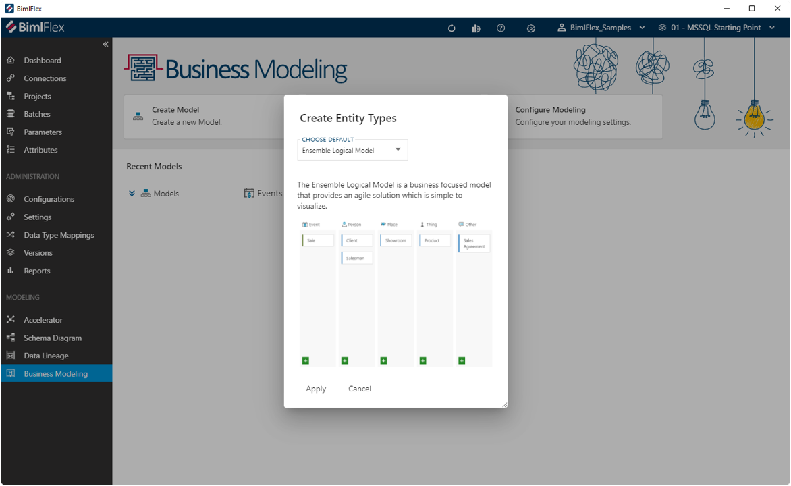

The Modeling Configuration provides a number of predefined Entity Types that will allow the various Business Entities to be organized on the **Business Model Canvas**. The Entity Types will represent 'swimlanes' on the Business Model Canvas where individual Business Entities can be placed.

After the initial selection, the default configuration can be adjusted using the **Configure Modeling** button.

### Entity Types

 On the first tab of the Configure Modeling screen, new Entity Types can be added and existing ones removed.

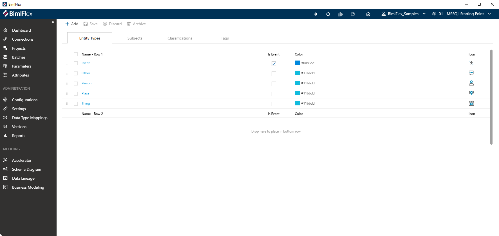

Here, the following Entity Type details can be changed:

| 
Property
 | Description |
| --------- | ----------- |
|Name| The name or label of the Entity Type.|
|Is Event| An indicator if the Entity Type is considered an Event. This will allow an **Event Matrix** to be created from a Business Entity that has been classified as this Entity Type.|
|Color| a specification of the color a Business Concept will be presented with on the **Business Model Canvas** when classified as this Entity Type.|
|Icon| The assigned icon for an Entity Type provides a visual cue in the **Treeview**, where all Business Entities are visible. Also, this icon appears next to the Entity Type name on the **Business Model Canvas**.|

It is also possible to direct the **Business Model Canvas** to create a second row of swimlanes. This can be implemented by dragging an Entity Type to the second row, following the 'Drop here to place in bottom row' cue.

For example, moving the default 'Person' Entity Type to the second row will visualize the swimlanes on the **Business Model Canvas** as follows:

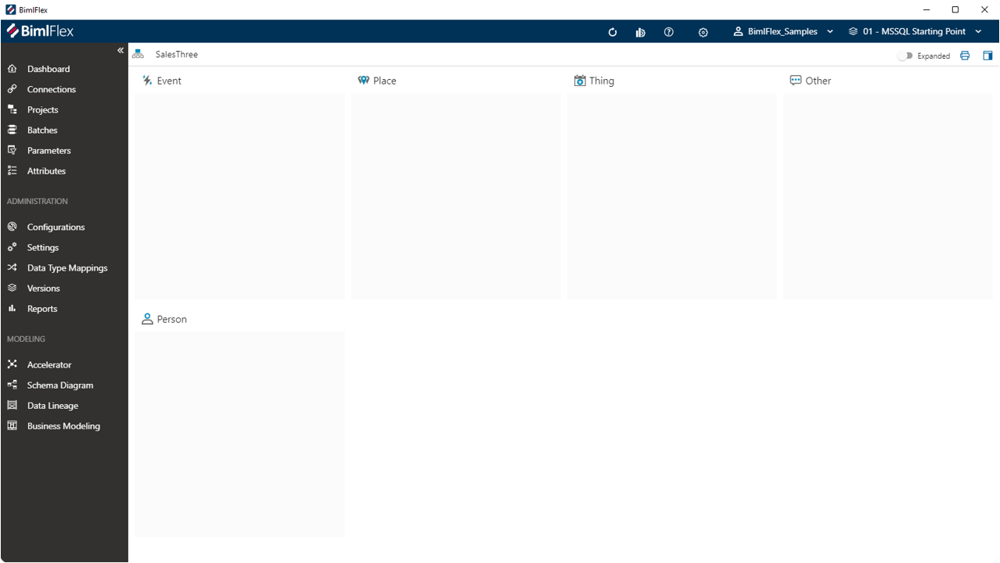

### Business Subjects

A **Business Subject** provide an additional way to classify Business Entities. Each Business Entity can be associated with a single **Business Subject**, and a **Business Subject** can contain multiple Business Entities.

This feature is intended to provide a grouping of related Business Entities.

Business Entities can be created from the **Configure Modeling** screen (shown below), or alternatively directly from the Business Entity selection.

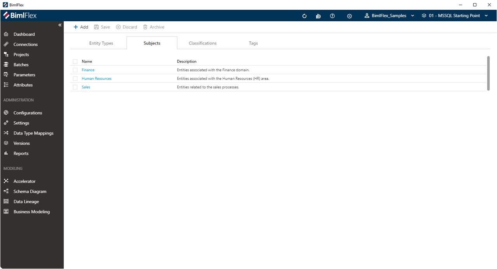

### Classifications

**Classifications** can be defined as part of the modeling configuration defaults. They can be added to an existing Business Entity to provide a categorization that is different from the Entity Type. This assists in organizing the Business Entities in different ways, by being able to organize them according to classification - or to simply notify other modelers of a specific function or intent.
Classification is the process of categorizing businesses into different groups based on their characteristics, such as their size, industry, products or services, target customers, and business model. This classification is important in business modeling as it helps to identify similarities and differences among businesses and to develop appropriate strategies and models for each category. Common classifications include industry-based, as well as size-based classifications such as small, medium, and large enterprises.

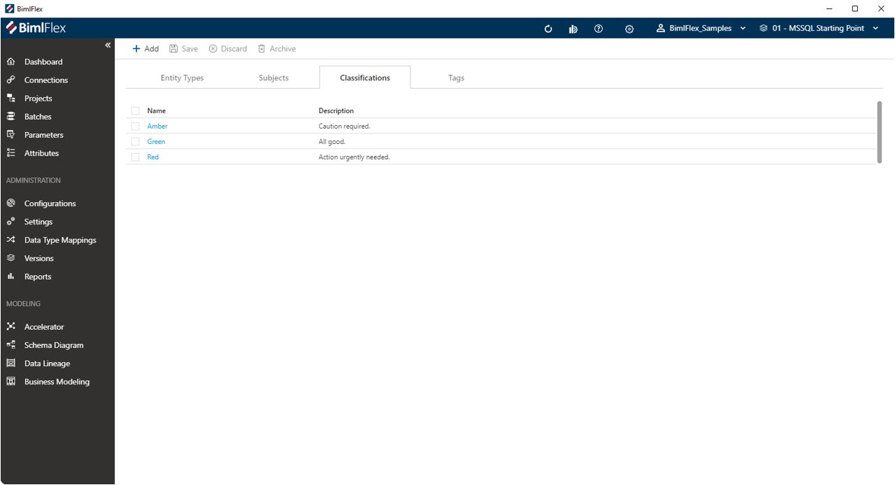

**Classifications** are visible on a Business Entity Tile once assigned. It is possible to add additional **Classifications** directly to a Business Entity, after which they will also appear on the **Configure Modeling** screen.

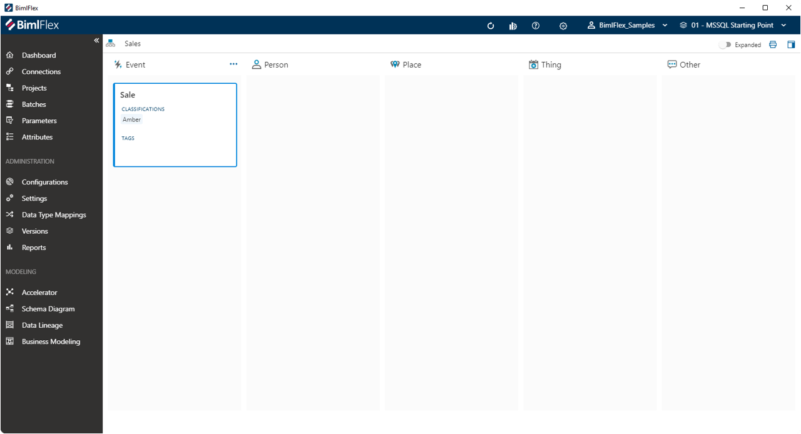

### Tags

Like **Classifications**, **Tags** can be added to an existing Business Entity to provide additional context. **Tags** also appear directly on the Business Entity Tile on the **Business Model Canvas**.

**Tags** can be created from the **Modeling Configuration** screen as shown below, or directly by adding one or more tags to an existing Business Entity on the **Business Model Canvas**.

Defining **Tags** as part of the **Modeling Configuration** creates a central reusable library of **Tags**.

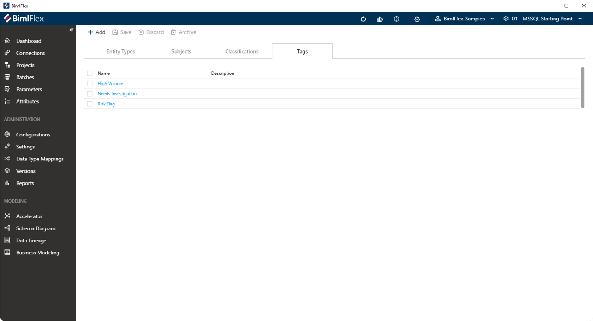

## Creating a Business Model

After deciding on a suitable **Modeling Configuration**, a Business Model can be created by clicking the **Create Model** button. This will open a dialog box requiring a _Name_ and optional _Description_.

The default Entity Types from the **Modeling Configuration** are also displayed here, and it is possible to add and remove Entity types. The selected Entity Types will appear as swimlanes on the **Business Model Canvas**.

This is all that is required to proceed with building out a model.

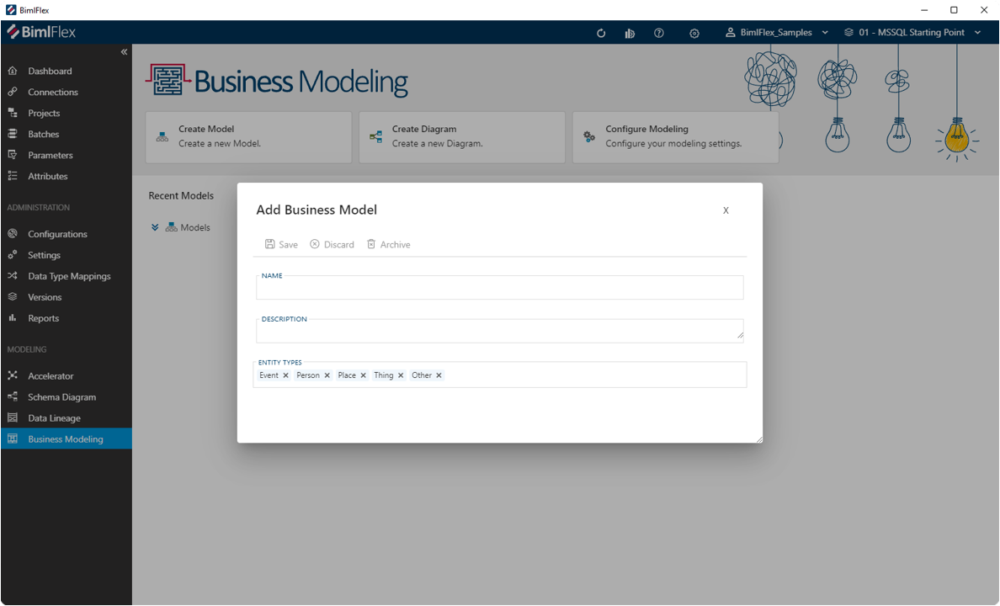

## Business Model Canvas

After creating a Business Model and opening it, users are presented with the interface to design their Business Model - the **Business Model Canvas**.

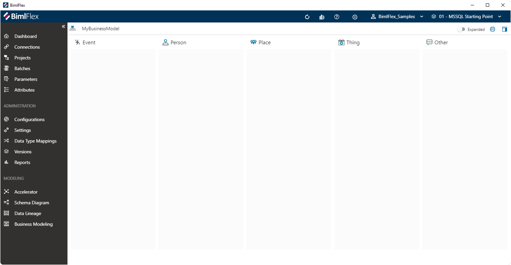

The **Business Model Canvas** allows the creation of Business Entities by clicking on one of the swimlanes visible on the canvas. Each swimlane corresponds to an Entity Type.

When doing so, an empty Business Entity tile will be created in the corresponding swimlane and a _Name_ for the new Business Entity can be entered.

The **Business Model Canvas** encourages collaboration between business- and technical teams to workshop a model of how the business operates and on what terms and definitions the team can standardize. This process prevents models from being to influenced by how operational (IT) systems are used. The intent is to document the more generic terms that capture the business process instead.

The canvas can be restructured by moving tiles across to different swimlanes, or by dragging tiles to other tiles. The changes made on the canvas will save automatically.

### Business Model Canvas Action Bar

| Icon | Action | Description |
|----- |--------|-------------|
| 

 | Edit | This icon will appear when hovering over the Business Model _name_. The edit screen for the Business Model can be opened from here.|
| 

 | Expanded | Toggle to show smaller tiles with less visible details, allowing more tiles on the screen. The expanded view will also show **Classifications** and **Tags**.|

### Editing or Archiving a Business Model

A Business Model can be edited by hovering over the Business Model _name_ and clicking either the name or the 'Edit' icon.

In the **Edit Business Model** dialog the Business Model _name_, _description_ and in-scope Entity Types can be modified. Also, the model can be archived (discarded) altogether.

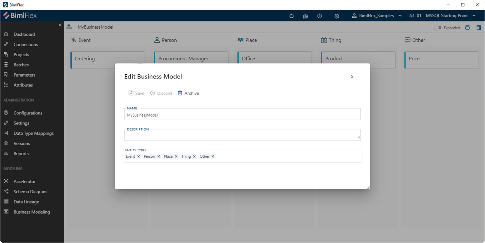

### Managing Synonyms

It is a common practice in Business Modeling workshop to first capture all involved Business Entities (concepts) and process steps on the **Business Model Canvas**, and to organize these by Entity Type.

In the course of capturing all involved concepts, it is common to find Business Entities that actually mean the same thing but have different names. Understanding these nuances and selecting the 'right' name for a Business Entity is a key outcome of the Business Modeling process. The collective team will together define which name for the Business Entity will be used, and why this is the case.

BimlFlex supports this approach with the **Known As** feature. Business Entities that are synonymous can simply be dragged onto one another, and this will present the user with a dialog to instruct BimlFlex to manage this as a **Known As** (synonym) or **Attribute** (column or property).

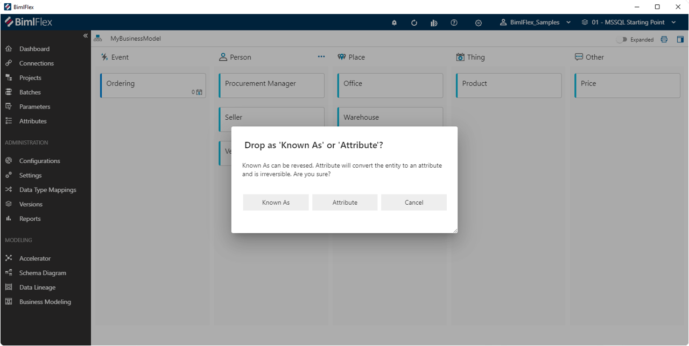

For example, the 'Vendor' and 'Seller' Business Entities are synonyms of each other. By dragging the 'Seller' Business Entity to the 'Vendor' Business Entity and selecting **Known As** this will be recorded and visible on the **Business Model Canvas**.

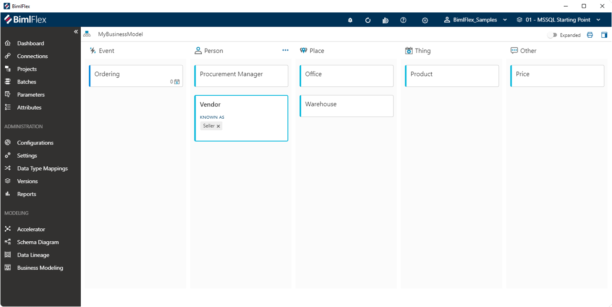

If alterations are needed, clicking the `X` next to any **Known As** will association that this Business Entity has and return it to the canvas as an individual Business Entity.  

>[!TIP]
>Defining synonyms in the Business Model records the outcomes of the Business Modeling workshops, and serves as a reminder on what the agreed terms and definitions are to organize data in the target data solution.

In BimlFlex, Business Entities can be mapped to **Objects** in the **Object Editor** or the **Accelerator**.

### Managing Attributes

As part of organizing the Business Entities on the **Business Model Canvas**, it may be found that certain Business Entities are not really (core) business concepts but rather descriptive properties of other Business Entities.

BimlFlex allows dragging a Business Entity on to another one to declare it an **Attribute**. This works the same way as defining one Business Entity to be a synonym another one, but here the **Attribute** feature should be used if the user wants declare the dragged Business Entity as a property of the target Business Entity.

Once the Business Entity has been attributed this way, it will appear as a Business Attribute to the Business Entity.

For example, the 'Price' Business Entity can become a Business Attribute to the 'Product' Business Entity by dragging the 'Price' tile to the 'Product' tile. After selecting **Attribute** the 'Product' tile will show an indicator that this Business Entity has one (1) Business Attribute.

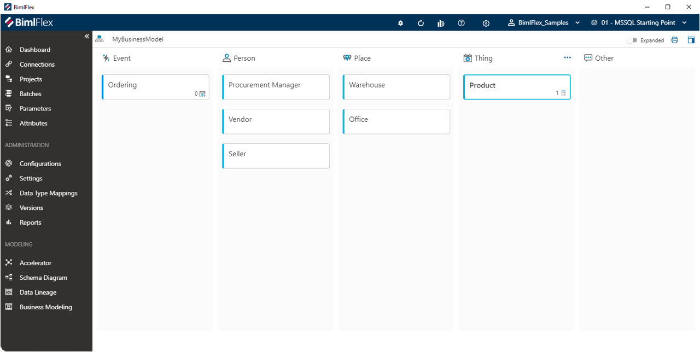

### Viewing and Editing Business Entity Details

There are two ways to view and edit the details of a Business Entity.

* Double-clicking on the Business Entity tile. This will open the **Business Entity Editor**
* Hovering over the tile will show the details ellipsis, this will display a menu for further navigation

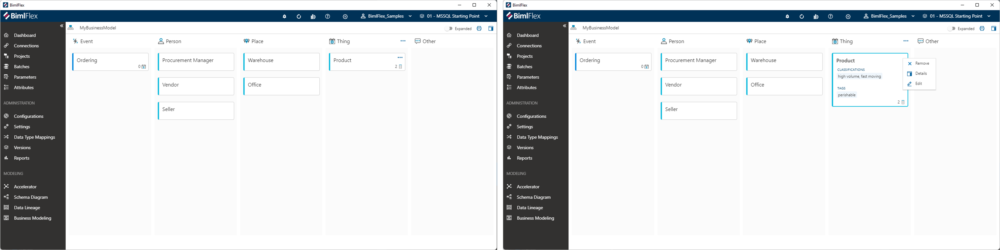

This this menu the following options are available:

| 
Option
 | Description |
| --------- | ----------- |
|Remove| This will disconnect the Business Entity from the Business Model and withdraw it from the canvas. The Business Entity still exists, but is not associated with the visible Business Model anymore.|
|Details| Display the side navigation panel of the **Business Model Canvas**, which will allow for direct editing of Business Entity details that directly apply.|
|Edit| Open the **Business Entity Editor**|

#### Business Entity Editor

Business Entities can be modified by double-clicking on the Business Entity tile. This will open the **Business Entity Editor** which allows editing of the main Business Entity properties, but also its Business Attributes and Relationships.

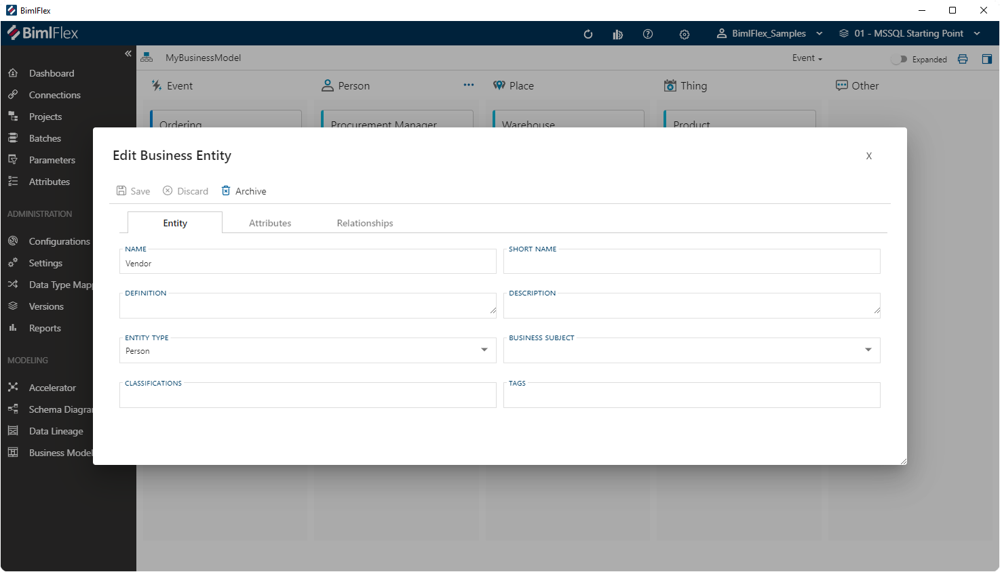

##### Entity Tab

By default, the **Business Entity Editor** will open on the Entity tab. The following properties of the Business Entity can be edited here:

| 
Property
 | Description |
| --------- | ----------- |
|Name| The name of the Business Entity.|
|Short Name| An abbreviated name for the Business Entity that can serve as alias.|
|Definition| A brief formal definition of the Business Entity.|
|Description| A meaningful overview of the Business Entity in a few words or sentences.|
|Entity Type| The **Entity Type** of the Business Entity|
|Business Subject| The **Business Subject** to which the Business Entity is part of.|
|Classifications| The **Classifications** that are applied to the Business Entity.|
|Tags| The **Tags** that are applied to the Business Entity|

The following options are available:

| Icon | Action | Description |
|----|-|--------|-------------|
| 

 | Save | This will persist changed made to the Business Entity.|
| 

 | Discard | Pending changes to the Business Entity will be discarded.|
| 

 | Archive | Archive will remove the Business Entity from the active metadata repository, and move it to the metadata archive.|

##### Attributes Tab

The second tab in the **Business Entity Editor** shows the Business Attributes that belong to the selected Business Entity. Business Attributes can be added or removed (Archived) from the Business Entity.

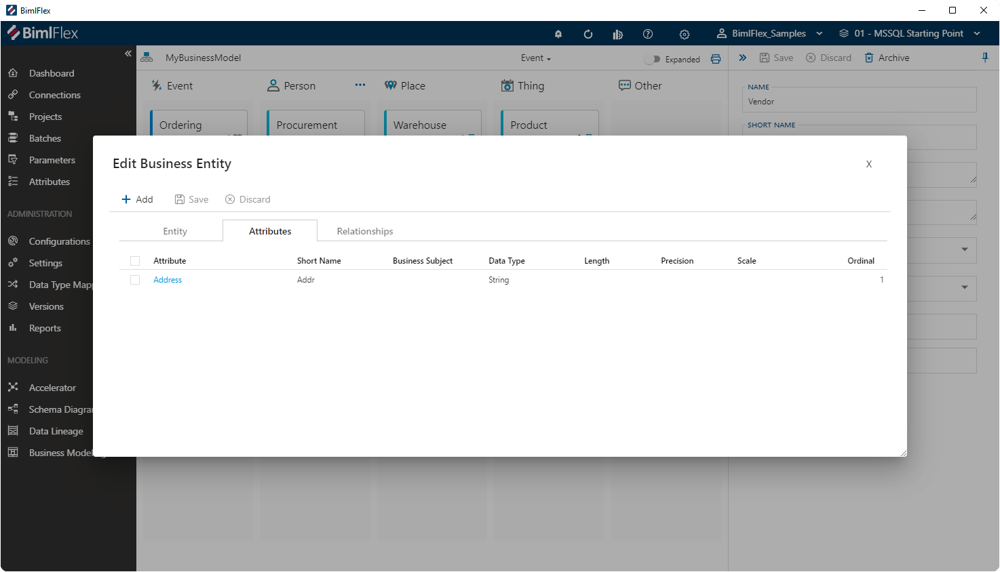

>[!NOTE]
>Archiving a Business Attribute will remove the object completely, not only disconnect it from the Business Entity.

From here, clicking on the name of a Business Attribute will open the **Business Attribute Editor**.

The following options are available:

| Icon | Action | Description |
|----|-|--------|-------------|
| 

 | Add | Open the **Business Attribute Editor** to create a new Business Attribute, which will be added to the selected Business Entity.|
| 

 | Save | This will persist changed made to the Business Attribute in the overview.|
| 

 | Discard | Pending changes to the Business Attribute in the overview will be discarded.|

When checking a single Business Attribute in the overview two additional options will become visible. When selecting two or more Business Attributes only the *Archive* option will be visible.

| Icon | Action | Description |
|----|-|--------|-------------|
| 

 | Edit | Open the **Business Attribute Editor** to modify and existing Business Attribute. This will only be visible when selecting a single Business Attribute in the overview.|
| 

 | Archive | Archive will remove the Business Attribute from the active metadata repository, and move it to the metadata archive.|

In the overview, the Business Entity properties in the table below are editable directly. Other properties require opening of the **Business Attribute Editor**.

| 
Property
 | Description |
| --------- | ----------- |
|Business Subject| The **Business Subject** to which the Business Entity is part of.|
|Data Type| The domain of the Business Attribute defining the type of values it can accept.|
|Length|The maximum allowed character length.|
|Precision|The maximum allowed numeric length.|
|Scale|The number of positions behind the comma for numeric values.|
|Ordinal|The order in which the Business Attributes are displayed.|

##### Relationships Tab

The third tab in the **Business Entity Editor** shows the Relationships the selected Business Entity has to other Business Entities. Relationships can be added or removed (Archived) from the Business Entity.

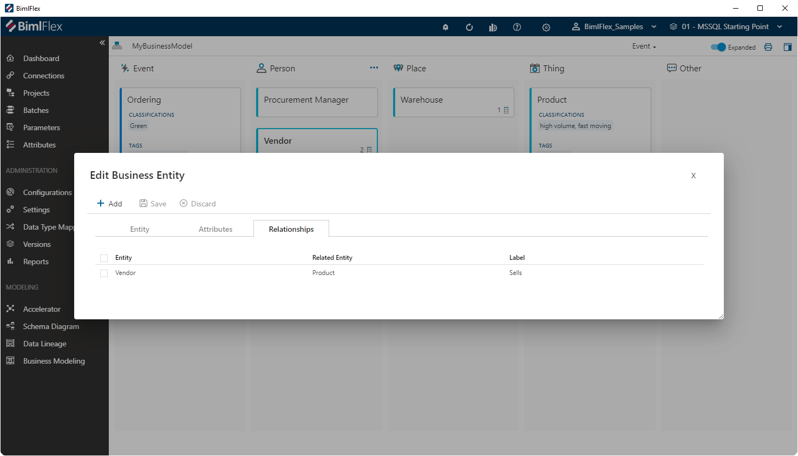

The following options are available:

| Icon | Action | Description |
|----|-|--------|-------------|
| 

 | Add | Open the **Business Entity Relationship Editor** to create a new relationship between two Business Entities.|
| 

 | Save | This will persist changed made to the relationship in the overview.|
| 

 | Discard | Pending changes to the relationship in the overview will be discarded.|

When checking a single relationship in the overview two additional options will become visible. When selecting two or more relationships only the *Archive* option will be visible.

| Icon | Action | Description |
|----|-|--------|-------------|
| 

 | Edit | Open the **Business Entity Relationship Editor** to modify and existing relationships. This will only be visible when selecting a single relationship in the overview.|
| 

 | Archive | Archive will remove the relationship that exists between two Business Entities, and keep the Business Entities intact otherwise.|

In the overview, the relationship properties in the table below are editable directly. These properties can also be edited via the **Business Entity Relationship Editor**.

| 
Property
 | Description |
| --------- | ----------- |
|Entity| The Business Entity for which the relationship is being edited. Changing the Business Entity to another one will effectively move the relationship to the new Business Entity. It will then no longer be visible by editing the Business Entity that it was originally part of.|
|Related Entity| The Business Entity to which the relationship refers.|
|Label|A descriptive text explaining the nature of the relationship.|

#### Business Entity Side Panel

The side panel can be opened by clicking on the panel icon () on the **Business Model Canvas**, or by selecting `Details` from the Business Entity tile ellipsis menu.

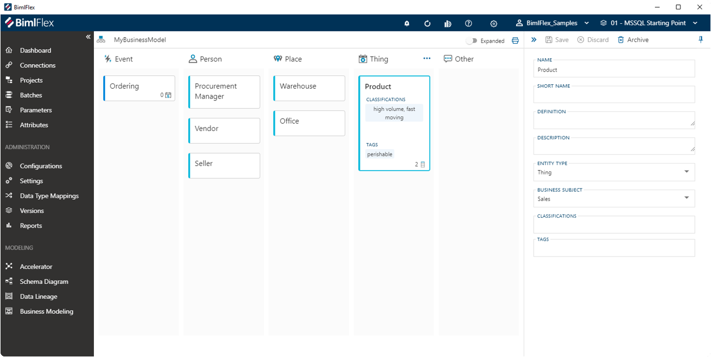

The following controls are available to operate the side panel:

| Icon | Action | Description |
|----|-|--------|-------------|
| 

 | Collapse | This will hide the side panel.|
| 

 | Save | This will persist changed made to the Business Entity.|
| 

 | Discard | Pending changes to the Business Entity will be discarded.|
| 

 | Archive | Archive will remove the Business Entity from the active metadata repository, and move it to the metadata archive.|
| 

 | Pin | The side navigation panel can be pinned and unpinned from the **Business Model Canvas**, depending if the user wants to keep it visible or not.|

The side panel enables editing of the main Business Entity properties:

| 
Property
 | Description |
| --------- | ----------- |
|Name| The name of the Business Entity.|
|Short Name| An abbreviated name for the Business Entity that can serve as alias.|
|Definition| A brief formal definition of the Business Entity.|
|Description| A meaningful overview of the Business Entity in a few words or sentences.|
|Entity Type| The **Entity Type** of the Business Entity.|
|Business Subject| The **Business Subject** to which the Business Entity is part of.|
|Classifications| The **Classifications** that are applied to the Business Entity.|
|Tags| The **Tags** that are applied to the Business Entity.|

#### Business Attribute Editor

The **Business Attribute Editor** is accessed by double-clicking on a Business Entity tile on the **Business Model Canvas** and navigating to the Attributes Tab. Either selecting a Business Attribute in the overview or clicking on the Business Attribute name will open the **Business Attribute Editor**.

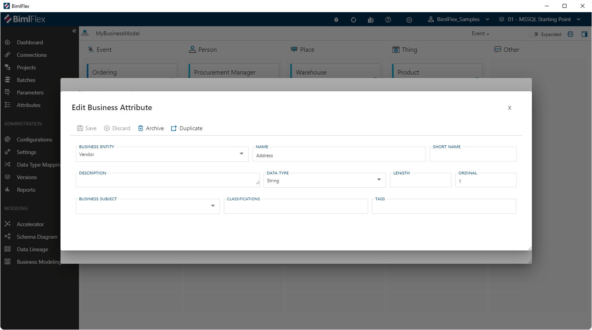

The following details can be provided:

| 
Property
 | Description |
| --------- | ----------- |
|Name| The name of the Business Entity.|
|Short Name| An abbreviated name for the Business Entity that can serve as alias.|
|Definition| A brief formal definition of the Business Entity.|
|Description| A meaningful overview of the Business Entity in a few words or sentences.|
|Entity Type| The **Entity Type** of the Business Entity.|
|Business Subject| The **Business Subject** to which the Business Entity is part of.|
|Classifications| The **Classifications** that are applied to the Business Entity.|
|Tags| The **Tags** that are applied to the Business Entity.|

The following controls are available when creating a new Business Attribute using the **Business Attribute Editor**.

| Icon | Action | Description |
|----|-|--------|-------------|
| 

 | Save | This will persist changed made to the Business Attribute.|
| 

 | Discard | Pending changes to the Business Attribute will be discarded.|

If an existing Business Attribute is edited, for example by clicking on the name on the Attributes Tab then two additional options are shown:

| Icon | Action | Description |
|----|-|--------|-------------|
| 

 | Archive | Archive will remove the Business Attribute from the active metadata repository, and move it to the metadata archive.|
| 

 | Duplicate | Allows to make a copy of the selected Business Attribute. A new dialog will be shown to provide a new unique name for the new Business Attribute.|

#### Business Entity Relationship Editor

The **Business Entity Relationship Editor** is accessed by double-clicking on a Business Entity tile on the **Business Model Canvas** and navigating to the Relationships Tab. The editor can be opened by clicking on the `Add` () button.

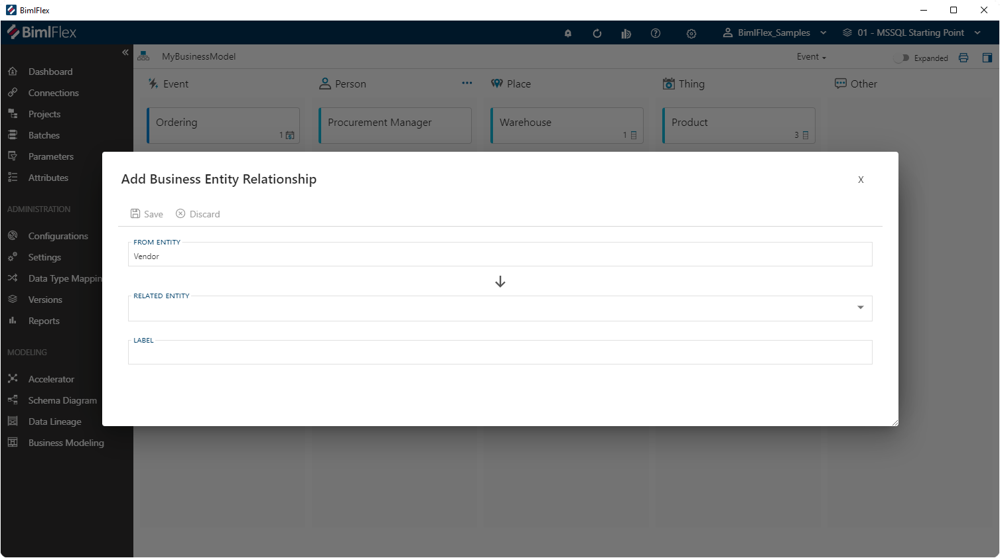

When the editor is opened, the name of the selected Business Entity will already be pre-selected in the `Entity` field.

The following details can be provided:

| 
Property
 | Description |
| --------- | ----------- |
|Entity| The Business Entity for which the relationship is being edited. Changing the Business Entity to another one will effectively move the relationship to the new Business Entity. It will then no longer be visible by editing the Business Entity that it was originally part of.|
|Related Entity| The Business Entity to which the relationship refers.|
|Label|A descriptive text explaining the nature of the relationship.|

The following controls are available:

| Icon | Action | Description |
|----|-|--------|-------------|
| 

 | Save | This will persist changed made to the Business Attribute.|
| 

 | Discard | Pending changes to the Business Attribute will be discarded.|

### Creating an Event Matrix from the Business Model Canvas

Clicking the **Event Details** button () in the lower-right corner of a Business Entity that has been classified as an `Event` Entity Type will navigate to the **Event Matrix** for that Business Entity. 

If no **Event Matrix** exists yet one will be created.

## Event Matrix Canvas

The **Event Matrix** is a specialized **Business Model Canvas**. However, the **Event Matrix** only displays Business Entities that are related to the Event.

The intent of the **Event Matrix** is to capture which Business Entities relate to a specific Event. From the **Event Matrix**, users can manually remove and edit Business Entities that only relate to that Event.

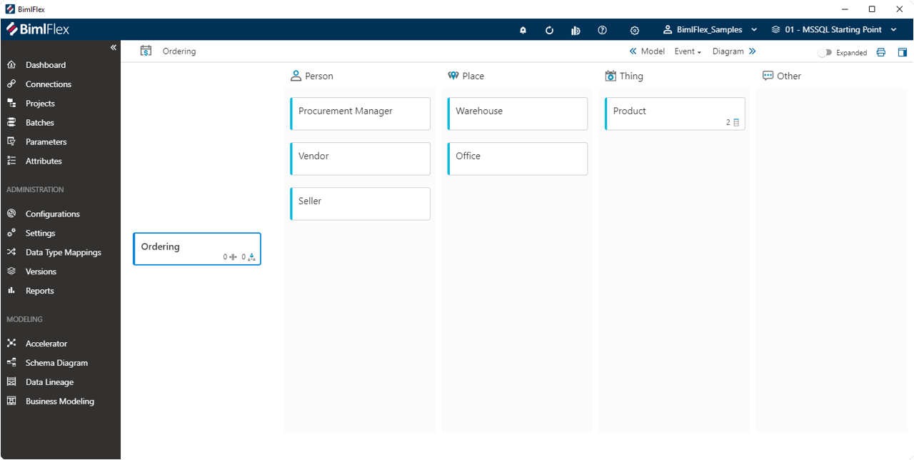

This means that the **Event Matrix** shows a subset of the Business Entities on the **Business Model Canvas**. The relationship between the **Event Matrix** and the Business Model is referred to as an `Overview Model`. An **Event Matrix** belongs to an `Overview Model`, which is the Business Model it is created in.

Any edits that are made to Business Entity tiles in this view will also apply to the **Business Model Canvas**. This allows edits to maintain parity between the **Business Model Canvas** and each individual **Event Matrix**.

When an **Event Matrix** is created, a supporting **Business Model Diagram** will also be initialized. This diagram will contain the Business Entities that are associated with the event in the **Event Matrix**.

>[!TIP]
>Workshopping an **Event Matrix** assist in clarifying relationships between Business Entities.

### Editing or Archiving an Event Matrix

The **Event Matrix** works the same way as the **Business Model Canvas**, and it is possible to add and remove Business Entities by interacting with the canvas.

The name of the **Event Matrix** will be displayed in the top-left corner of the canvas. Similar to the **Business Model Canvas**, hovering over the name will display the Edit icon (). 

Either clicking on the name or Edit icon will open the **Event Matrix Editor**.

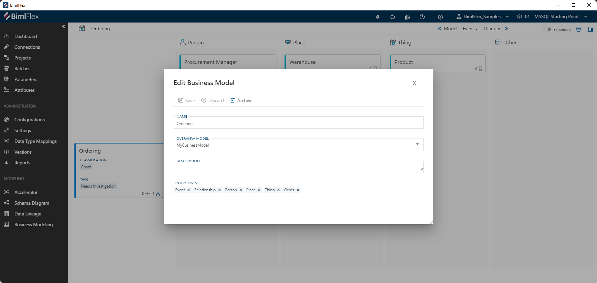

In the **Event Matrix Editor** the **Event Matrix** can be archived, modified, or associated with a different Business Model.

The following controls are available:

| Icon | Action | Description |
|----|-|--------|-------------|
| 

 | Save | This will persist changed made to the **Event Matrix**.|
| 

 | Discard | Pending changes to the **Event Matrix** will be discarded.|
| 

 | Archive | Archive will remove the **Event Matrix** from the active metadata repository, and move it to the metadata archive. It will no longer be visible as part of the Business Model.|

The following properties of the **Event Matrix** can be edited here:

| 
Property
 | Description |
| --------- | ----------- |
|Name| The name of the **Event Matrix**.|
|Overview Model| The parent Business Model this **Event Matrix**, and its Business Entities, belongs to.|
|Description| A meaningful overview of the **Event Matrix** in a few words or sentences.|
|Entity Types| The list of **Entity Types** that are defined for the **Event Matrix**, as represented as swimlanes on the canvas. This may be different compared to the parent Business Model.|

## Business Model Diagram

The **Business Model Diagram** provides a schematic overview of the Business Entities and how they relate to each other. A Business Model can contain many diagrams.

Each diagram can be used to review the Business Model, clarify relationships by adding labels and add new relationships. This specifically concerns **Natural Relationships**, which may not be immediately visible in the **Event Matrix**.

A **Natural Relationship** is a relationship between two or more Business Entities that is not directly related to an Event. For example, a 'Product' can be 'sold by' a 'Vendor' irrespective of the actual ordering process.

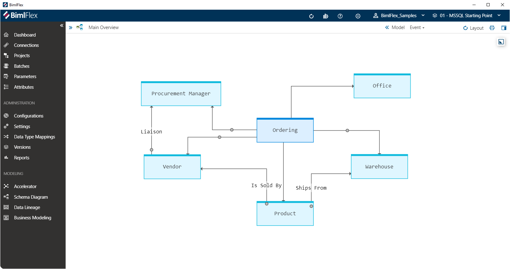

### Creating a Business Model Diagram

In BimlFlex, there are two ways to create a **Business Model Diagram**.

1. When you create an **Event Matrix**, a corresponding **Business Model Diagram** will be automatically created also
1. By clicking the **Create Diagram** button on the main Business Modeling screen

Creating a diagram from the **Event Matrix** will inherit the Business Model configuration. If you create a new diagram using the **Create Diagram** button the **Add Business Model** dialog will be presented.

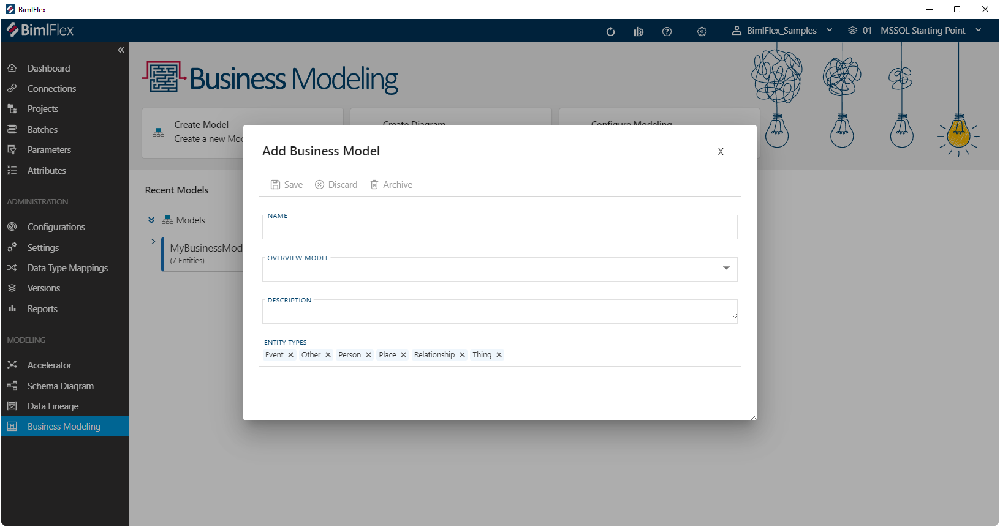

The following controls are available:

| Icon | Action | Description |
|----|-|--------|-------------|
| 

 | Save | This will persist changed made to the **Business Model Diagram**.|
| 

 | Discard | Pending changes to the **Business Model Diagram** will be discarded.|
| 

 | Archive | Archive will remove the **Business Model Diagram** from the active metadata repository, and move it to the metadata archive. It will no longer be visible as part of the Business Model.|

The following properties of the **Business Model Diagram** can be edited here:

| 
Property
 | Description |
| --------- | ----------- |
|Name| The name of the **Business Model Diagram**.|
|Overview Model| The parent Business Model this **Business Model Diagram**, and its Business Entities, belongs to.|
|Description| A meaningful overview of the **Business Model Diagram** in a few words or sentences.|
|Entity Types| The list of **Entity Types** that are defined for the **Business Model Diagram**, as represented as swimlanes on the canvas. This may be different compared to the parent Business Model.|

### Editing or Archiving a Business Model Diagram

Editing the **Business Model Diagram** configuration works the same way as the **Business Model Canvas** and **Event Matrix**. The name of the **Business Model Diagram** will be displayed in the top-left corner of the canvas. Hovering over the name will display the Edit icon ().

Either clicking on the name or Edit icon will open the **Business Model Diagram Editor**.

In the **Business Model Diagram Editor** the **Business Model Diagram** can be archived, modified, or associated with a different Business Model.

The following controls are available:

| Icon | Action | Description |
|----|-|--------|-------------|
| 

 | Save | This will persist changed made to the **Business Model Diagram**.|
| 

 | Discard | Pending changes to the **Business Model Diagram** will be discarded.|
| 

 | Archive | Archive will remove the **Business Model Diagram** from the active metadata repository, and move it to the metadata archive. It will no longer be visible as part of the Business Model.|

The following properties of the **Business Model Diagram** can be edited here:

| 
Property
 | Description |
| --------- | ----------- |
|Name| The name of the **Business Model Diagram**.|
|Overview Model| The parent Business Model this **Business Model Diagram**, and its Business Entities, belongs to.|
|Description| A meaningful overview of the **Business Model Diagram** in a few words or sentences.|
|Entity Types| The list of **Entity Types** that are defined for the **Business Model Diagram**.|

### Designing Models

The main feature of the **Business Model Diagram** is to interact with the model and make sure that this accurately represents the process, its Business Entities and their relationships.

Business Entities can be moved around the canvas by dragging and dropping each individual object.

#### Diagram Overview

It is possible to show a smaller **Overview** when working with large models. You can open this overview by clicking the **Expand Overview** icon ()in the top-right corner of the canvas. The **Overview** can be used to navigate the model quickly by dragging and zooming in the **Overview**.

#### Using the Treeview

If a Business Entity already exists, but is not yet part of the diagram it can be added using the **Treeview** feature. The treeview contains an overview of Business Entities organized by **Entity Type**. By checking or unchecking a Business Entity it can be added or removed from the diagram.

The treeview is represented as a side panel on the left of the main diagram canvas, but by default it is in a collapsed state. It can be accessed by clicking on the `Expand` icon (). Conversely, the panel can be closed by clicking on the `Collapse` icon ().

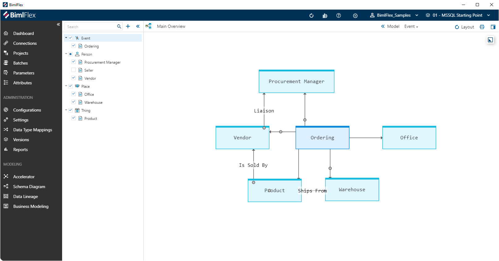

#### Editing Business Entities

Business Entities can be modified by double-clicking them in the diagram. This will open the [**Business Entity Side Panel**](#business-entity-side-panel).

Changes made here will be reflected in all places the Business Entity is present.

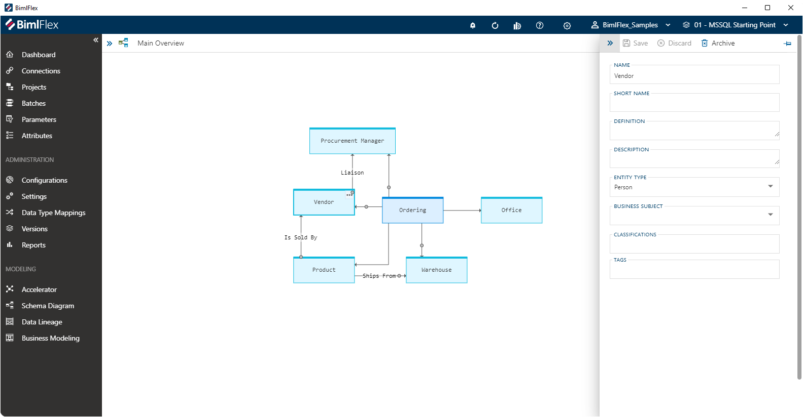

#### Creating Relationships

New relationships can be created by simply dragging a line between one Business Entity and another. When hovering over a Business Entity four **Connection Nodes** will become visible, and these can be used to draw a relationship between Business Entities.

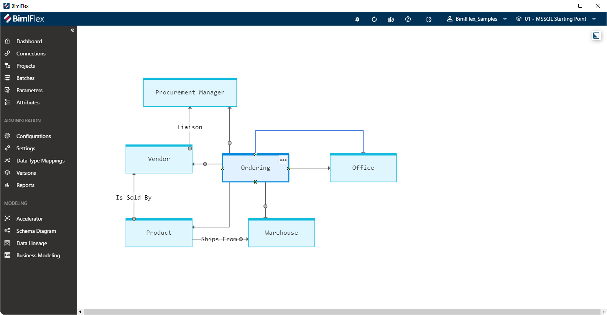

The relationship is created by drawing a line between two **Connection Nodes**.

>[!NOTE]
>It is currently supported to have only one (1) relationship between Business Entities. This will be extended in subsequent releases.

#### Modifying Relationships

Double-clicking on an existing relationship will open up the **Business Relationship Editor** side panel.

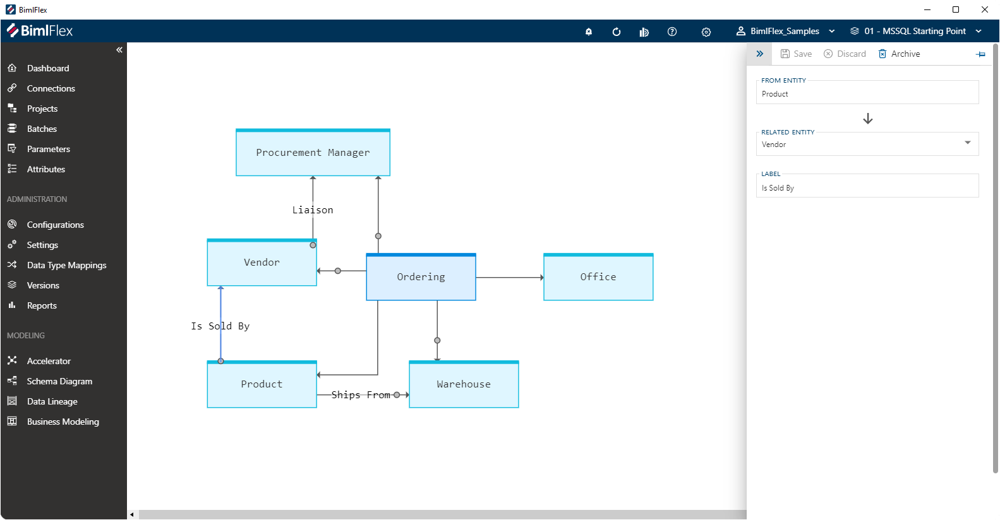

The following controls are available to operate this side panel:

| Icon | Action | Description |
|----|-|--------|-------------|
| 

 | Collapse | This will hide the side panel.|
| 

 | Save | This will persist changed made to the relationship.|
| 

 | Discard | Pending changes to the relationship will be discarded.|
| 

 | Archive | Archive will remove the relationship from the active metadata repository, and move it to the metadata archive.|
| 

 | Pin | The side navigation panel can be pinned and unpinned from the **Business Model Diagram**, depending if the user wants to keep it visible or not.|

The side panel enables editing of the following relationship properties:

| 
Property
 | Description |
| --------- | ----------- |
|From Entity| The Business Entity for which the relationship is being edited. This is the 'owner' of the relationship, and cannot be edited here.|
|Related Entity| The Business Entity to which the relationship refers.|
|Label|A descriptive text explaining the nature of the relationship.|

#### Creating Keyed Instances

Relationships are not always limited to only two involved Business Entities. In many cases, the correct granularity of a relationship includes three or more Business Entities.

In the **Business Model Diagram** this can be reflected by creating a **Keyed Instance**. This is a specific Business Entity that captures the granularity of the relationships and refers to all Business Entities that are involved. It is a Business Entity with multiple relationships to other Business Entities, and represents the relationships between these.

<!--
Relationships that are eligible for a **Keyed Instance** to be created have a small circle visible in the diagram. This circle can be dragged to other circles to define a new **Keyed Instance**.

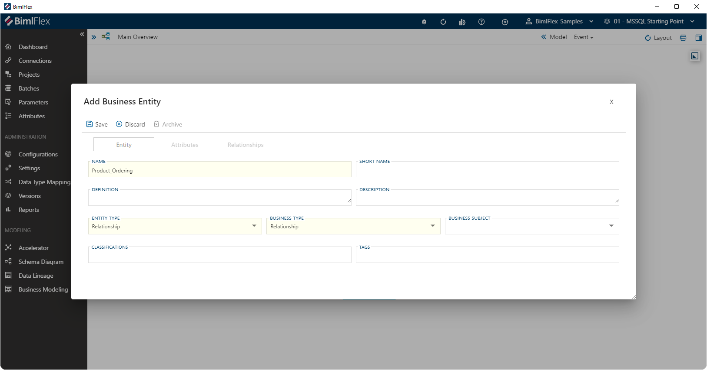

The result will be a new Business Entity that connects to the associated Business Entity. The existing relationships will be removed, as the **Keyed Instance** will act as intersection entity between the involved Business Entities.
-->

A **Keyed Instance** can be created by adding a new Business Entity with the Event Type, a `Relationship`. This will always classify **Keyed Instances** as relationships, and will organize them accordingly in the **Treeview**.

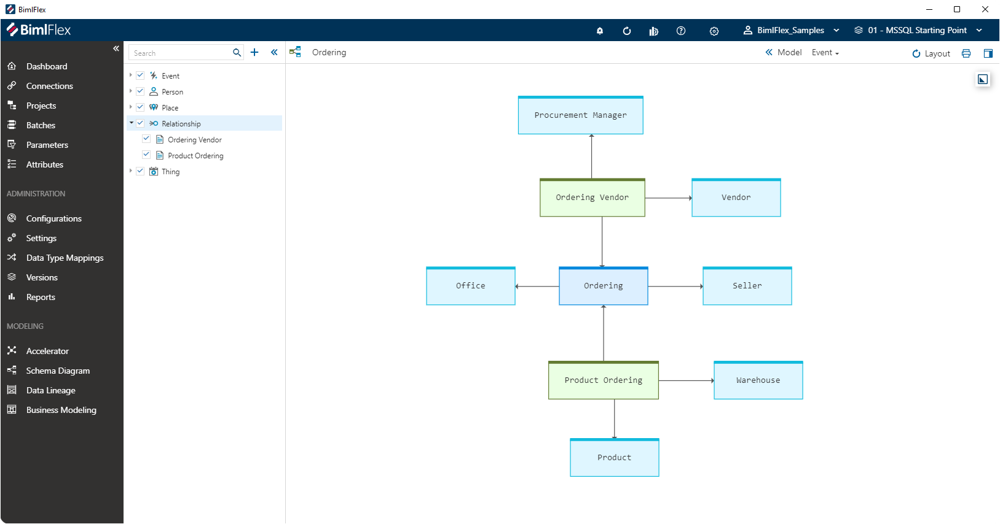