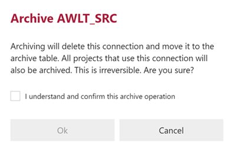

import DialogDuplicateConnection from './_dialog-duplicate-connection.md';
import InclHeaderConnection from './_incl-header-connection.md';
import TabAttributes from './_tab-attributes.mdx';
import TabObjects from './_tab-objects.md';
import TabParameters from './_tab-parameters.md';
import EnumConnectionType from '../reference-documentation/static-data/_enum-connection-type.md';
import EnumIntegrationStage from '../reference-documentation/static-data/_enum-integration-stage.md';
import EnumSystemType from '../reference-documentation/static-data/_enum-system-type.md';

# Connection Editor

<InclHeaderConnection />

## Overview

The following sections describe the User Interface elements of the **Connection Editor**, and how they are used to author and manage BimlFlex **Connections**. Detailed descriptions of each component is also available in the [reference documentation covering connections](bimlflex-app-reference-documentation-Connections).


:::note

> Detailed descriptions of all **Connection Editor** fields and options are available in the [Reference Documentation](bimlflex-app-reference-documentation-Connections).

:::

The **Connection Editor** contains four main tabs that can be used to modify connection details, as well as various properties and settings related to the **Objects** that are associated with the selected connection.

## Connection Tab

The **Connection Tab** is the first tab in the **Connection Editor**, and it is selected by default. The connection tab focuses on general connection information and configuration. This tab is used to define and create the connection itself.

### Action Buttons

| Icon | Action | Description |
|--- |--- |--- |
| 

 | Save | This will persist changes made to the **Connection** modified in the designer. `Ctrl+S` can also be used as a shortcut.|
| 

 | Discard | This will Discard any unsaved changes, and revert to last saved form.|
|

 | Archive | Archive will remove the **Connection** from the active metadata repository, and move it to the metadata archive. Clicking **Archive** displays the [Archive Connection Dialog](#archive-connection-dialog).|
| 

 | Duplicate | This will create a duplicate of the selected **Connection**.  A [Duplicate Connection Dialog](#duplicate-connection-dialog) will appear asking for a *Connection Name*. A new **Connection** will be created using most of the selected **Connection**'s current properties (except **Attributes** and **Parameters**).|
| 

 | Import Metadata | Import Metadata using the configured connection details. For more information please refer to the [importing metadata section](../concepts/importing-metadata.md). |
|  | Cloud | When enabled, this allows the configuration of Linked Services. This only applies to Azure Data Factory (ADF) deployments.|
| 

 | Excluded | This will determine if the **Connection** and its associated entities will be excluded along with the rest of the solution. This is designed to be paired with the `Use My Exclusions (Locally)` global setting to allow for multiple developers to work on different functional areas without deleting or globally excluding entities. |
|  | Deleted | This will soft-delete the selected **Connection**.  This will remove the **Connection** and all associated entities from processing and validation.|

### Linked Services

**Connections** can be configured to be `cloud enabled` by modifying the *Cloud Selection* button on the top-right of the connection screen. This will show (or hide) the Linked Services details, which are required to deploy cloud-based solutions. For information on Linked Services and their configuration, please refer to [Configuring a Linked Service Connection](create-linked-service-connection).

### Additional Dialogs

#### Archive Connection Dialog

When a connection is archived, BimlFlex will display a confirmation box warning against the dangers of archiving. Users are required to confirm by ticking the checkbox and then pressing the *Ok* button.

>[!WARNING]
> Archiving is a permanent removal of the selected entity from its associated table in the BimlFlex Database. The best practice is to first use the *Deleted* flag (soft delete) as an indication that the connection may need to be removed.

<DialogDuplicateConnection />

### Allowed Values

#### Integration Stages

<EnumIntegrationStage />

#### Connection Types

<EnumConnectionType />

#### System Types

<EnumSystemType />

## Objects Tab

The **Objects Tab** provides quick access to all **Objects** associated with the **Connection**.

<TabObjects />

## Attributes Tab

The **Attributes Tab** provides a view of any **Configuration** or **Setting** overrides that have been applied to the selected **Connection**.  

<TabAttributes />

## Parameters Tab

The **Parameters Tab** provides a view of any **Parameters** overrides that are associated with the selected **Connection** and its associated **Objects**.  

<TabParameters />
