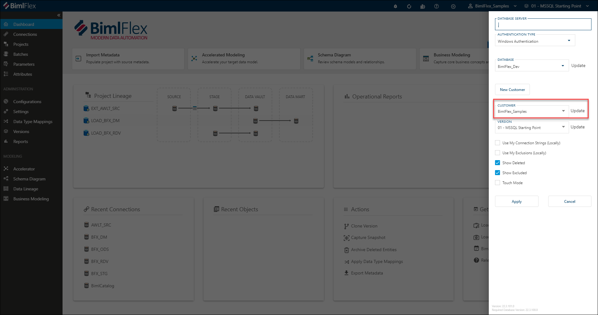

# Customer Selection

The Customer Selection is used to change the context of the metadata that can be managed in the BimlFlex App. A Customer allows the creation of multiple separate areas that can have their own designs. A Customer can have one or more [Versions](bimlflex-concepts-version).

Additional information on the Customer feature is available in the [Customer Concept Overview](bimlflex-concepts-customer).

## New Customer Creation

[!include[NewCustomer](_incl-header-new-customer.md)]
