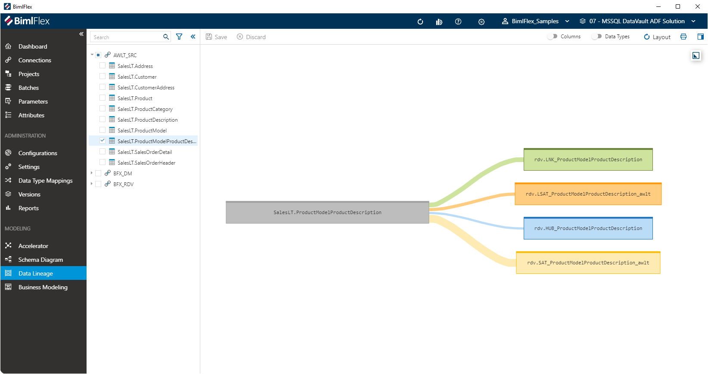
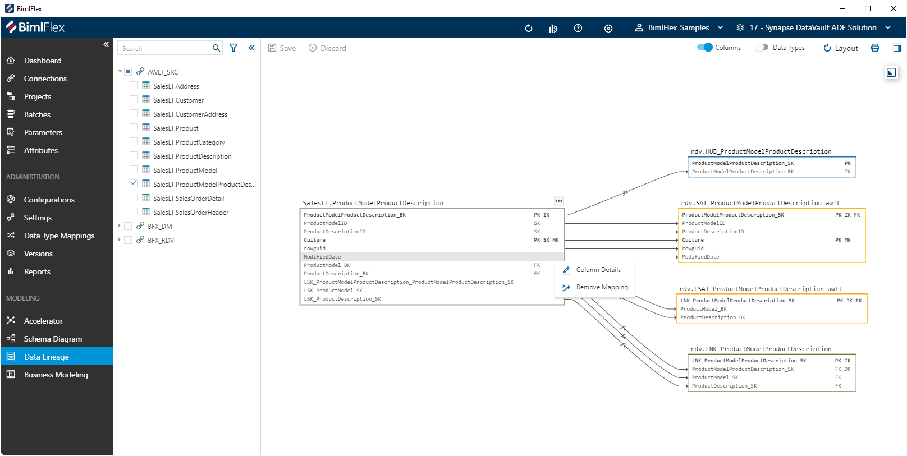

import InclSidePanelColumnEditor from './_incl-side-panel-column-editor.md';
import InclSidePanelObjectEditor from './_incl-side-panel-object-editor.md';
import InclSidePanelRelationshipEditor from './_incl-side-panel-relationship-editor.md';

# Data Lineage

The **Data Lineage Designer** can be used to review your **Column Mappings** in an easy graphical interface.

The designer provides an view of one or more relationships between **Columns**, referred to as source-target mappings or simply 'mappings'. This designer allows a modeler to get a quick view of mappings in a graphical interface.

The screenshot above shows the mapping from a source Object to the various target Data Vault objects.

## Action Bar

| Icon | Action | Description |
|----- |--------|-------------|
| 

 | Save | This will persist changed made to the **Objects** and **Columns** modified in the designer.|
| 

 | Discard | Pending changes made to the **Objects** and **Columns** will be discarded.|
| 

 | Columns | Toggle to show the **Columns** for all **Objects** on the canvas, and display the column-level mappings. Any mappings that have an expression or formula applied will display the `fx` label.|
| 

 | Data Types | Toggle to show the **Columns** for all **Objects** on the canvas.|
| 

 | Layout | Reset the way the diagram is rendered on the screen to its default.|
| 

 | Print | Creates printable image from the diagram, and opens the Windows print dialog.|
| 

 | Expand Side Panel | Opens the Side Panel that enables editing of selected **Objects**, **Columns** and **Relationships**. This is context-aware, visible fields will depend on the selected item on the canvas.

## Overview

It is possible to show a smaller **Overview** when working with large models. You can open this overview by clicking the **Expand Overview** icon ()in the top-right corner of the canvas. The **Overview** can be used to navigate the model quickly by dragging and zooming in the **Overview**.

On the canvas, you can zoom in and out using the mouse scroll button to get a higher level view as well. When the details become too small due to zooming out, BimlFlex will hide these and display the objects instead.

## Treeview Interaction

Selecting **Objects** in the **Treeview** will add these objects to the canvas, including the objects they are receiving data from or where they themselves act as a source for a data mapping.

* If you select **Objects** from a **Connection** with a `Source System` **Integration Stage** the upstream (outgoing) objects will be displayed on the canvas
* If you select **Objects**  where the associated **Connection** has the **Integration Stage** of `Data Vault` or `Data Mart`, then the downstream (incoming) objects will be made visible

The context-aware actions that the Data Lineage Designer allows will sometimes also check or un-check objects in the treeview to produce the right visual.

## Context Specific Actions

Depending on whether you select an **Object**, **Column** or **Relationship** there are various convenience actions that become available.

### Object Action Menu

By clicking on a ellipsis on the object, the designer will be presented with the object-level actions.

The following options are available:

| Icon | Action | Description |
|----- |--------|-------------|
| 

 | Object Details | This open the [Object Side Panel](xref:bimlflex-data-lineage#object-side-panel), which will allow modification of various **Object** details.|
| 

 | Show All Mappings | Add the **Objects** to the canvas that have a mapping to, or from, the selected **Object**. If incoming or outgoing related objects are added depends on the **Integration Stage** of the **Connection** that the selected object is associated with. Please refer to [Treeview Interaction](xref:bimlflex-data-lineage#treeview-interaction) for more details. |

### Object Side Panel

The side panel that contains **Object** details can be opened by double-clicking on the **Object** or by using the **Object Details** button in the [**Object Action Menu**](xref:bimlflex-data-lineage#object-action-menu).

<InclSidePanelObjectEditor />

### Column Action Menu

Clicking on the ellipsis for any column will show the column-level action options:

| Icon | Action | Description |
|----- |--------|-------------|
| 

 | Column Details | This open the [Column Side Panel](xref:bimlflex-data-lineage#column-side-panel), which will allow modification of various **Column** details.|

### Column Side Panel

The side panel that contains **Column** details can be opened by double-clicking on the **Column** or by using the **Column Details** button in the [**Column Action Menu**](xref:bimlflex-data-lineage#column-action-menu).

<InclSidePanelColumnEditor />

### Relationship Side Panel

**Relationships** between **Columns** can be viewed by double-clicking on the lines between the columns. These lines represent individual column mappings. The relationship editor allows for direct manipulation of the selected relationship.

>[!NOTE]
>Mappings that have an `fx` label have an **Expression** applied. The label provides a visual cue to highlight this.

<InclSidePanelRelationshipEditor />

## Drag and Drop Actions

**Objects** can be moved on the canvas to make the layout easier to view. This can be done by hovering over the object name until the Arrow Cross mouse pointer appears.

<!--
At **Column** level, drag-and-drop operations can be used to create new mapping relationships between columns.
-->
