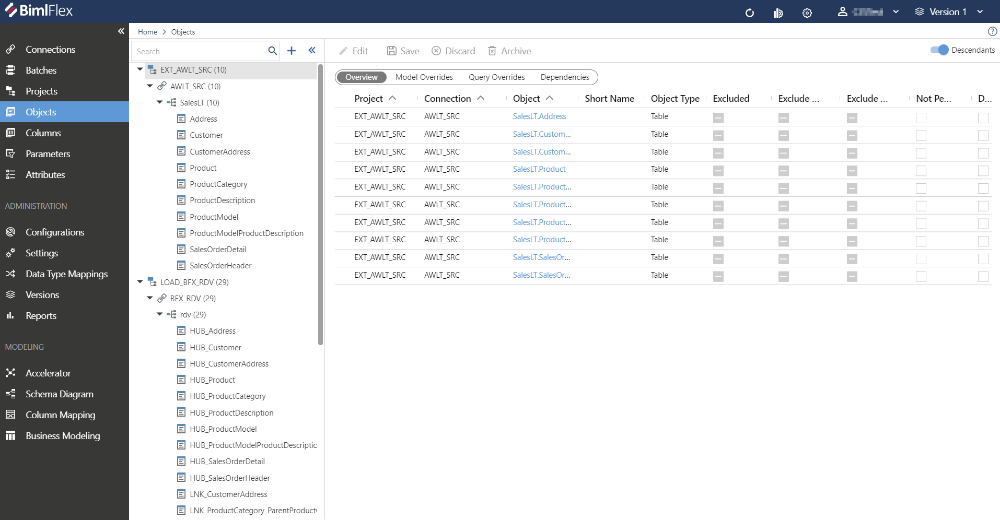
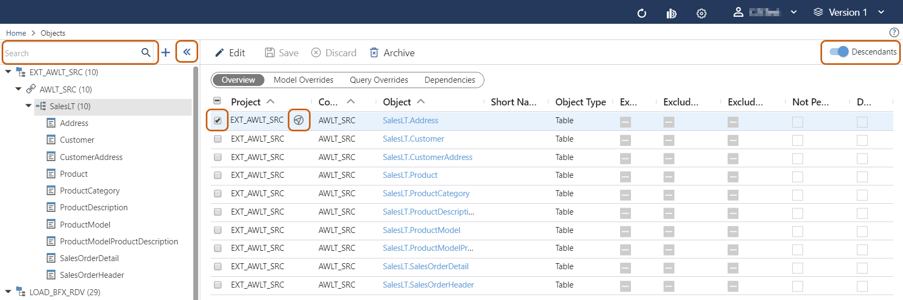
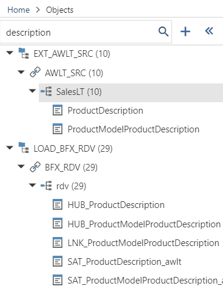
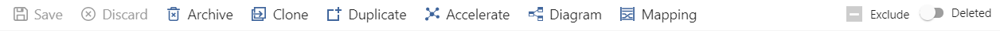
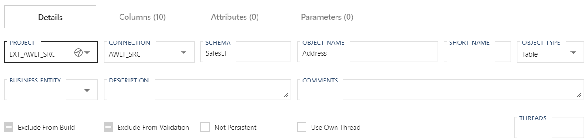
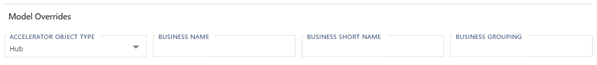
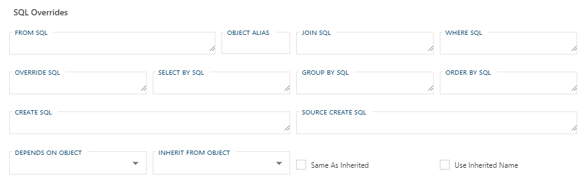

import DialogArchiveObjectSingle from './_dialog-archive-object-single.md';
import DialogCloneTable from './_dialog-clone-table.md';
import DialogDuplicateTable from './_dialog-duplicate-table.md';
import InclHeaderObject from './_incl-header-object.md';
import TabAttributes from './_tab-attributes.mdx';
import TabColumns from './_tab-columns.mdx';
import TabParameters from './_tab-parameters.md';
import EnumObjectType from '../reference-documentation/static-data/_enum-object-type.md';

# Object Editor

<InclHeaderObject />

## Overview

Objects are displayed in a hierarchical **Treeview** on the left Side Navigation menu. The treeview is organized by Project > Source Connection > Objects, with the number of tables within a given Object displayed in parenthesis.


:::note

> Detailed descriptions of all **Object Editor** fields and options are available in the [Reference Documentation](bimlflex-app-reference-documentation-Objects).

:::

Selecting an **Object** with multiple tables will display a secondary list of all editable options within. The user may navigate to the Object editor screen by selecting any **Object** from the displayed list.

Selecting an **Object** with a single table will immediately navigate the user to the Object editor screen.

The treeview for **Objects** is expandable/collapsible by clicking the  / icons.

Selecting the checkbox(es) icon will enable users to bulk archive multiple **Objects** at one time.

Any instance of the   icon will serve as a Global Navigation Transition.
Clicking this icon will navigate the user directly to the referenced **Connection, Object,** or **Column.**

Toggling `Descendants` will enable or disable all parameters for both the currently selected node and all of its descendant nodes.
This option is enabled by default.

The Search field is contained within the treeview menu, and will be hidden when collapsed.
The Search field will return results in real-time, only presenting **Objects** containing the term being searched.

## Details Tab

The **Details Tab** focuses on general **Object** information and configuration.  This tab is used to define and create the **Object** itself.

### Details Tab - Action Buttons

|Icon|Action|Description|
|-|-|-|
| 

 | Save | This will save the current set of staged changes.  The **Save** button is will only enable if the **Object** has changes staged and there are no major validation issues with the current **Object** properties. |
| 

 | Discard | This will **Discard** any unsaved changes and revert to last saved form. |
| 

 | Archive | This will hard delete the selected **Object**.  This will result in the physical removal of the selected record from the metadata database.  The data will no longer be accessible by the BimlFlex app and will require a Database Administrator to restore, if possible. Clicking **Archive** creates an [Archive Object Dialog](#archive-object-dialog). |
| 

 | Clone | This will bring up [Clone Table Dialog](#clone-table-dialog) that is used primarily in the creation and loading of a Data Mart. |
| 

 | Duplicate | This will create a duplicate of the selected **Object**.  A [Duplicate Table Dialog](#duplicate-table-dialog) will appear asking for a *Target Table Name* and a new **Object** will be created using all of the selected **Object**'s current properties. |
| 

 | Refresh | This will trigger a refresh of the metadata for the selected **Object**. |
| 

 | Accelerate | This will transition to the [Data Vault Accelerator](bimlflex-data-vault-accelerator) and select the current active **Object**.  See the annotated link for details on use and function.|
| 

 | Diagram | This will transition to the [Schema Diagram](schema-diagram.md) and select the current active **Object**.  See the annotated link for details on use and function.|
| 

 | Lineage | This will transition to the [Data Lineage](data-lineage.md) and select the current active **Object**.  **Data Lineage** provides and insight to the data linage of the **Object**.  See the annotated link for details on use and function. |
| 

 | Excluded | This will determine if the **Object** and its metadata will be exluded along with the rest of the BimlFlex solution. This is designed to be paired with the `Use My Exclusions (Locally)` global setting to allow for multiple developers to work on different functional areas without deleting or globally excluding entities. |
|

|Deleted|This will soft delete the currently selected **Object**. This will remove the **Object** and all associated entities from processing and validation. For information on how to add excluded or deleted items back to the scope, please read our [tips and tricks section](xref:bimlflex-tips-and-tricks-overview#restoring-an-excluded-or-deleted-entity).|

### Additional Dialogs

<DialogArchiveObjectSingle />

<DialogCloneTable />

<DialogDuplicateTable />

### Details Tab - Standard Fields

The standard fields hold the bulk of the metadata that will be used to integrate the Object. Additional fields to manage the modeling and the ability to toggle Object level persistence is provided.  

### Model Overrides - Standard Fields

  

### Allowed Values

#### Object Types

<EnumObjectType />

### Details Tab - SQL Overrides Fields

The majority of the SQL Overrides are provided to handle the various scenarios where overrides to the default SQL generated out of the box by BimlFlex.  These fields are to be consider more advanced than the standard use cases and should only be used by a DBA or Architect that is familiar with the SQL required should use the SQL properties.  The ability to inherit **Columns** or other properties are also provide along with the ability to annotate a dependant on another **Object**.

|Field|Description|
|-|-|
| From SQL | Optional alternative `FROM` clause to be used during generation of the SQL statement. |
| Object Alias | Defines an alias (short name) for the **Object**. This is relevant in conjunction with the `JOIN` and/or `Where` SQL properties. |
| Join SQL | Optional additional `JOIN` clause(s) to be used during generation of the SQL statement.  Commonly used when data needed to generate a complete **Integration Key** requires the use of a Foreign Key or additional relationship. |
| Where SQL | Optional additional `WHERE` clause to be used during generation of the SQL statement.  Used to generate an filter that otherwise could not be generated by the use of a standard parameter. |
| Override SQL | Optional alternative SQL statement to be used.  This needs to be an entire SQL statement and it will ignore any dynamically generated logic by BimlFlex.  This should only be used as a last resort and only if there is no way to dynamically generate the statement required. |
| Select By SQL | Optional `DISTINCT` or `TOP N` `SELECT` clause.  This field is limited to 1000 characters. |
| Group By SQL | Optional `GROUP BY` clause to be used during generation of the SQL statement.  Used when the source **Object** requires a condensing of grain.  Prior to using this clause, ensure that the generated SQL statement will not generate any unwanted results and that the grain can actually be condensed with the designed statement with issue. |
| Order By SQL | Optional `ORDER BY` clause to be used during generation of the SQL statement. |
| Create SQL | Optional alternative SQL statement to be used for the creation of the database artifact.  As with [Override SQL] this is should be the complete DDL statement and should only be used if the result can not be generated dynamically. |
| Source Create SQL | Optional alternative SQL statement to be used for the creation of the database artifact on it's source system.  As with *Override SQL* this is should be the complete DDL statement and should only be used if the result can not be generated dynamically. |
| Depends On Object | When an **Object** is selected, ensures that the linked **Object** must be processed prior to the processing of the current **Object**.  This is only used for **Objects** that can not have their dependencies generated dynamically.  BimlFlex maintains and enforces dependency trees for **Objects** generated through the tool. |
| Inherit From Object | When an **Object** is selected, uses the columns from the entered **Object**, similar to a Roleplaying Dimension.  Used when the same table is used to process multiple business concepts.  Only additional **Columns** unique to the current **Object** will show on the **Columns** list.  Inherited **Columns** will only show in the *Inherit From Object*. |
| Same As Inherited | Defines if the *Inherit From Object* is the same **Object**. When set to `true` this will instruct BimlFLex to reuse the inherited tables for loading. |
| Use Inherited Name | Defines if the *Inherit From Object* has the same **Object**. When set to `true` this will instruct BimlFlex to reuse the inherited tables *Object Name* for loading. |

[//]: # (TODO: Add an example column for the required/expected syntax for each field.)

## Columns Tab

The **Columns Tab** provides quick access to all **Columns** included in the **Object**.

<TabColumns />

## Attributes Tab

The **Attributes Tab** provides a view of any **Configurations** or **Settings** overrides that have been applied to the directly to the selected **Object**.  

:::note

> This is exclusive to the **Object** level.  Additional overrides may be present on any grains higher or lower than the **Object**.

:::

<TabAttributes />

## Parameters Tab

The **Parameters Tab** provides a view of any **Parameters** that have been applied to the directly to the selected **Object**.  

:::note

> This is exclusive to the **Object** level.  Additional overrides may be present on any grains higher or lower than the **Object**.

:::

<TabParameters />
