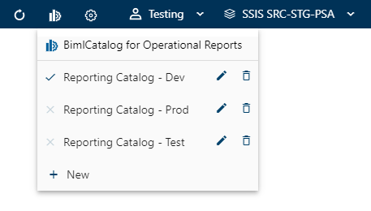
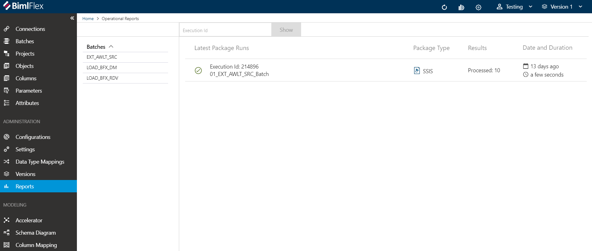
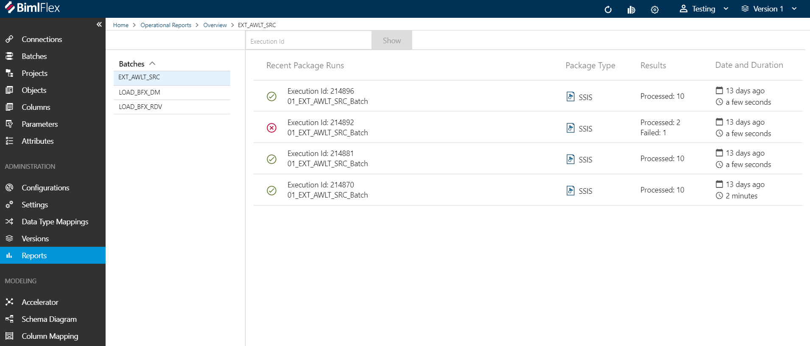
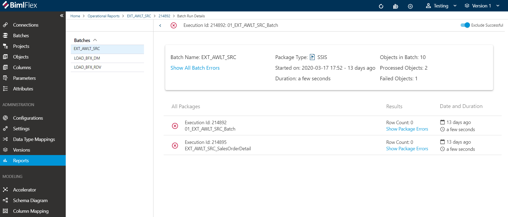

# Operational Reports

Operational Reports screens allow users to see the status of their package runs at a high level and to drill down into details and view errors in failing packages.

The reports screens leverage the execution logging which is built into BimlFlex package runs. The package execution details are logged to a BimlCatalog database and this data is aggregated for reports.

## Configuring Operational Reports

The Operational Reports BimlCatalog is set up on a per-customer basis and is only required once per customer.

Create BimlCatalog connections for each environment by providing the Name and Connection String.

## Reports Screens

If there is report data for the **Batches** and **Projects** in the currently selected version, the Dashboard will display a summary view.

The report screens are broken up into three views of the data:

* The top-level summary view will show the latest execution details for each batch.
* The second level shows the 5 most recent execution runs for a specific batch.
* The third level shows the package details and errors (if any) for a specific execution batch and its child packages.

Level 1 - Latest execution details for each batch:

Level 2 - 5 most recent execution runs for a specific batch:

Level 3 - details of specific execution batch and its child packages:

### Lookup Execution Id

The *Execution Id* lookup field is available in the First Level screen. It can be used to navigate to the package execution details if the execution id is known. Execution Id is also known as Audit Id in certain scenarios. If the *Execution Id* points to a batch, then all the batch and child information will be available. If it points to a child package, then only that package information will be available on the details screen.
