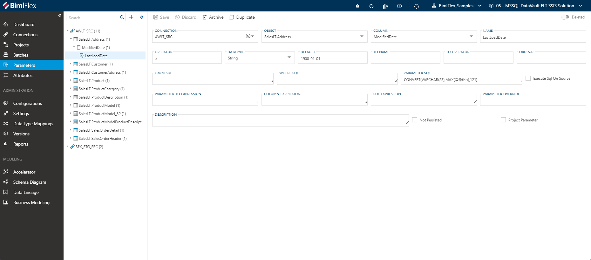
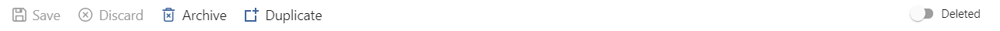

import DialogArchiveParameterSingle from './_dialog-archive-parameter-single.md';
import DialogDuplicateParameter from './_dialog-duplicate-parameter.md';
import InclHeaderParameter from './_incl-header-parameter.md';
import EnumDataType from '../reference-documentation/static-data/_enum-data-type.md';

# Parameter Editor

<InclHeaderParameter />

## Overview  

The following sections describe the User Interface elements of the Parameter Editor and how they are used to author and manage BimlFlex parameters.

Parameters in BimlFlex are displayed in the [**Treeview**](bimlflex-treeview). Selecting any parameter will open the editor.


:::note

> Detailed descriptions of all **Parameter Editor** fields and options are available in the [Reference Documentation](bimlflex-app-reference-documentation-Connections).

:::

## Action Buttons  

|Icon|Action|Description|
|-|-|-|
| 

 | Save | This will save the currently set of staged changes.  The **Save** button is will only enable if the **Parameter** has changes staged and there are no major validation issues with the current **Parameter** properties.|
| 

 | Discard | This will **Discard** any unsaved changes and revert to last saved form. |
|

 | Archive | This will hard delete the selected **Parameter**.  This will result in the physical removal of the selected record from the BimlFlex Database.  The data will no longer be accessible by the BimlFlex app and will require a Database Administrator to restore, if possible. Clicking **Archive** creates an [Archive Parameter Dialog](#archive-parameter-dialog). |
| 

 | Duplicate | This will create a duplicate of the selected **Parameter**.  A [Duplicate Parameter Dialog](#duplicate-parameter-dialog) will appear asking for a *Parameter Name* and a new **Parameter** will be created using all of the selected **Parameter**'s current properties. |
|  | Deleted | This will soft delete the currently selected **Parameter**.  This will remove the **Parameter** and all associated entities from processing and validation. |

## Additional Dialogs  

<DialogArchiveParameterSingle />

<DialogDuplicateParameter />

## Allowed Values  

### Data Types

<EnumDataType />
