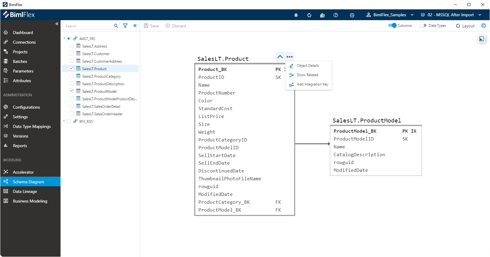
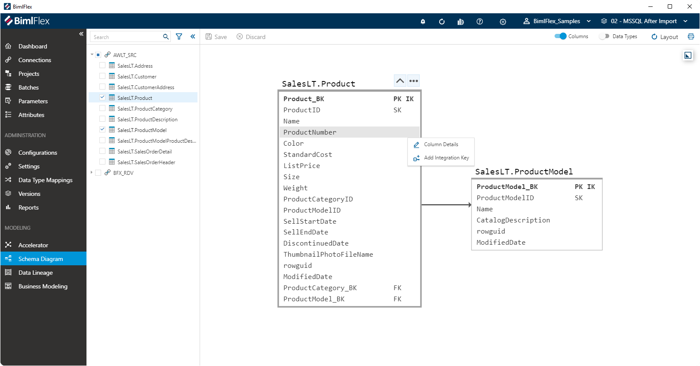
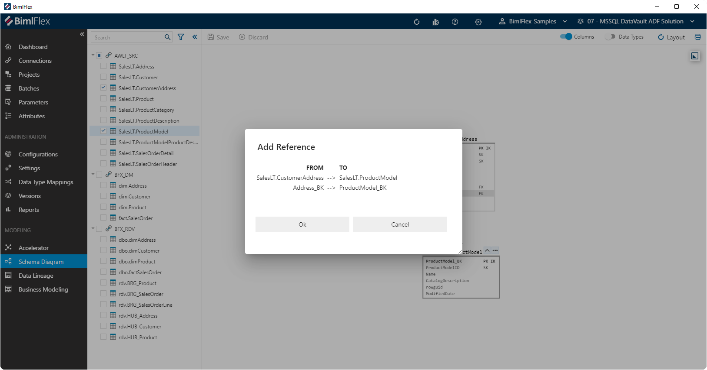

# Schema Diagram

[!include[SchemaDiagram](_incl-header-schema-diagram.md)]

## Action Bar

| Icon | Action | Description |
|----- |--------|-------------|
| 

 | Save | This will persist changed made to the **Objects** and **Columns** modified in the designer.|
| 

 | Discard | Pending changes made to the **Objects** and **Columns** will be discarded.|
| 
 | Columns | Toggle to show the **Columns** for all **Objects** on the canvas, and display the column-level mappings. Any mappings that have an expression or formula applied will display the `fx` label.|
| 
 | Data Types | Toggle to show the **Columns** for all **Objects** on the canvas.|
| 
 | Layout | Reset the way the diagram is rendered on the screen to its default.|
| 
 | Print | Creates printable image from the diagram, and opens the Windows print dialog.|

## Overview

It is possible to show a smaller **Overview** when working with large models. You can open this overview by clicking the **Expand Overview** icon ()in the top-right corner of the canvas. The **Overview** can be used to navigate the model quickly by dragging and zooming in the **Overview**.

On the canvas, you can zoom in and out using the mouse scroll button to get a higher level view as well. When the details become too small due to zooming out, BimlFlex will hide these and display the objects instead.

## Treeview Interaction

Selecting **Objects** in the **Treeview** will add these objects to the canvas. Conversely, un-checking **Objects** will remove them from the canvas.

The context-aware actions that the Schema Diagram Designer allows will sometimes also check or un-check objects in the Treeview to produce the right visual. For example when using the **Show Related** button for an object.

## Context Specific Actions

Depending on whether you select an **Object** or **Column** there are various convenience actions that become available.

### Object Action Menu

By clicking on a ellipsis on the object, the designer will be presented with the object-level actions.

The following options are available:

| Icon | Action | Description |
|----- |--------|-------------|
| 

 | Object Details | This open the [Object Side Panel](xref:bimlflex-schema-diagram#object-side-panel), which will allow modification of various **Object** details.|
| 

 | Show Related | Add the **Objects** to the canvas that have a relationship (reference) to, or from, the selected **Object**.|
| 

 | Add Integration Key | Opens the **Integration Key Editor** screen, so that a new integration key can be defined for the selected **Object**. This option is only available if the **Object** is part of a **Connection** that has an **Integration Stage** of `Source System`.|
| 

 | Create Bridge | Opens the **Bridge Editor** screen, so that a new Bridge table can be defined for the selected **Object**. This option is only available if the **Object** is part of a **Connection** that has an **Integration Stage** of `Data Vault` and the **Object Type** is `Hub`.|
| 

 | Create PIT | Opens the **Point-In-Time Editor** screen, so that a new Point-In-Time (PIT) table can be defined for the selected **Object**. This option is only available if the **Object** is part of a **Connection** that has an **Integration Stage** of `Data Vault` and the **Object Type** is `Hub`.|

If an **Object** is part of a **Connection** that has the `Data Vault` **Integration Stage** additional options Clicking on the ellipsis for any column will show the column-level action options:

### Object Side Panel

The side panel that contains **Object** details can be opened by double-clicking on the **Object** or by using the **Object Details** button in the [**Object Action Menu**](xref:bimlflex-schema-diagram#object-action-menu).

[!include[Object Editor Side Panel](_incl-side-panel-object-editor.md)]

### Column Action Menu

Clicking on the ellipsis for any column will show the column-level action options:

| Icon | Action | Description |
|----- |--------|-------------|
| 

 | Column Details | This open the [Column Side Panel](xref:bimlflex-schema-diagram#column-side-panel), which will allow modification of various **Column** details.|
| 

 | Add Integration Key | Opens the **Integration Key Editor** screen, so that a new integration key can be defined for the selected **Object**. This will apply to the **Object** the selected **Column** belongs to. This option is only available if the **Object** the **Column** belongs to is part of a **Connection** that has an **Integration Stage** of `Source System`. |

### Column Side Panel

The side panel that contains **Column** details can be opened by double-clicking on the **Column** or by using the **Column Details** button in the [**Column Action Menu**](xref:bimlflex-schema-diagram#column-action-menu).

[!include[Column Editor Side Panel](_incl-side-panel-column-editor.md)]

## Drag and Drop Actions

**Objects** can be moved on the canvas to make the layout easier to view. This can be done by hovering over the object name until the Arrow Cross mouse pointer appears.

You can also drag a **Column** to another **Integration Key** or **Primary Key** to create a reference.

