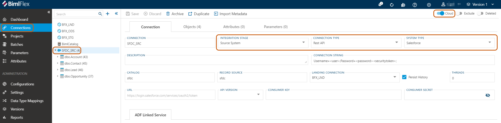
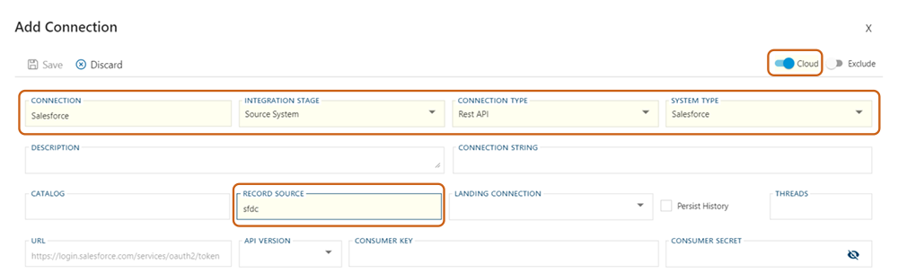
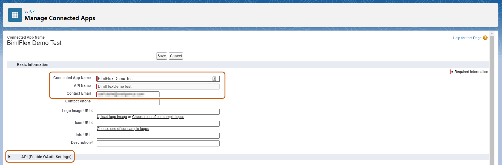
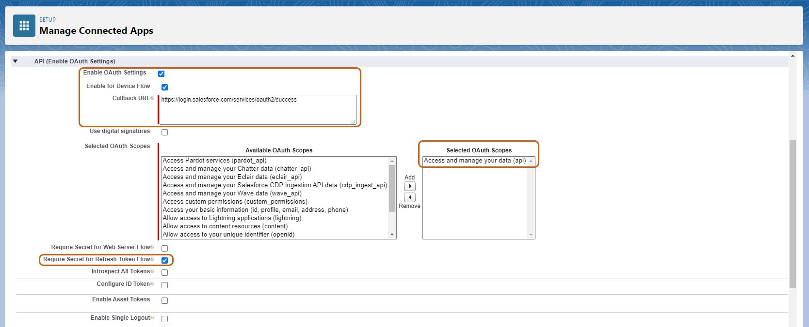
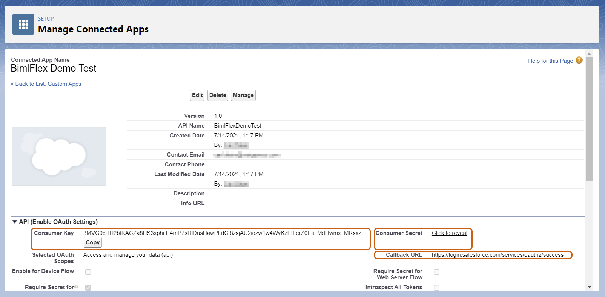
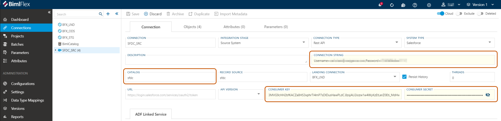
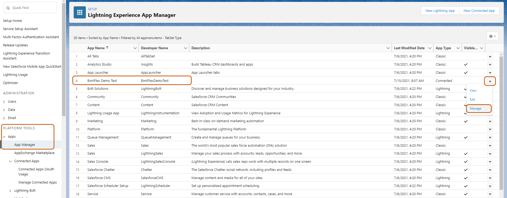
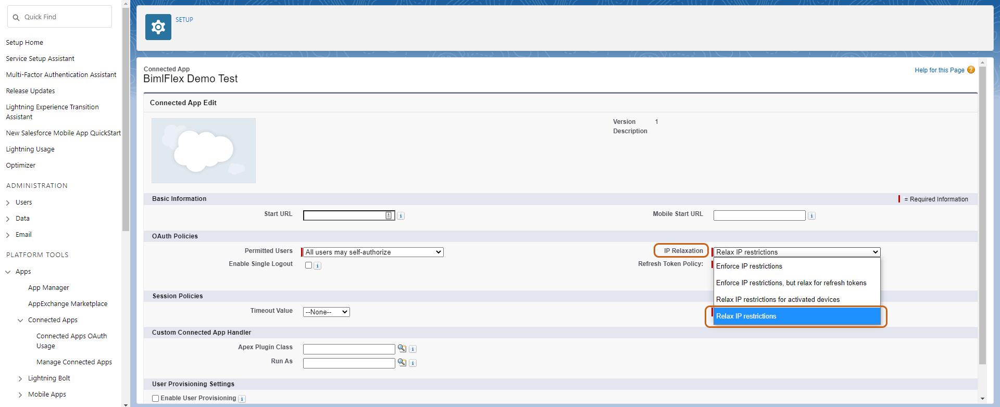
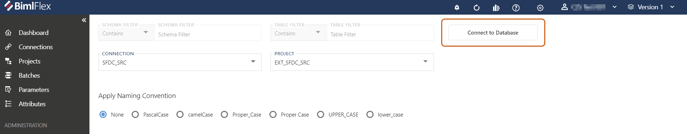
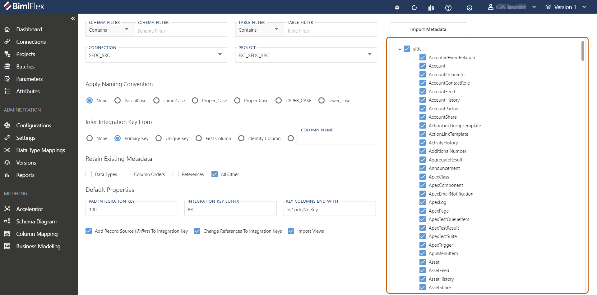

# Connecting to a Salesforce REST API

BimlFlex can access data from Salesforce into the data warehouse using the `REST API` Connection Type.

This document covers the metadata configuration and considerations for connecting to Salesforce as a Source Connection.

## Salesforce

Add the Source connection metadata through the BimlFlex App.

### Salesforce Connection Sample Metadata

From the BimlFlex dashboard, click **Load Sample Metadata** under the **Getting Started** section.
Within the **Load Sample Metadata** dialog, depending on your intended data solution, select either:

* Snapshot 42 - Synapse Salesforce ADF Solution, or
* Snapshot 43 - Synapse Salesforce SSIS Solution

Select your *Customer* and *Version Name* from their respective drop down menus.
Check the box under **Confirm to Replace** and click *OK*.

The sample metadata progress bar will complete with a notification advising that the sample metadata was imported successfully.

From the BimlFlex menu, click **Connections** and select "SFDC_SRC" from the navigation tree.

Under the **Connection** tab, ensure the following settings are set as indicated:

* *Integration Stage* is `Source System`
* *Connection Type* is `Rest API`
* *System Type* is `Salesforce`
* *Enable for Cloud* is `enabled`

By default, when using Snapshot 42 or 43 these settings will already be set.

### Creating a New Salesforce Connection

Alternatively, a new Salesforce REST API connection can be created in the **Connection** menu.

Click `+` from the navigation tree and in the **Add Connection** dialog, fill in the respective data fields with the information as indicated above.

Click *Save* and refresh for your new connection to appear within the navigation tree.

### Required Connection Settings

Additional **Connection** data fields that are required to connect to Salesforce are:

* *Username*
* *Password*
* *Consumer Key*
* *Consumer Secret*

The mechanism used to connect to Salesforce is OAuth 2.0. This only allows access through a connected APP, NOT a connected USER.
This distinction is why Consumer Key and Secret are required in addition to simply one's Username and Password.

### Obtaining Consumer Key and Consumer Secret

It is first required to log in to your [Salesforce Lightning Developer](https://login.salesforce.com) account.

Once logged in and on the Salesforce Lightning Developer homepage, in the sidebar menu, navigate to *Platform Tools* > *App* > *App Manager.*

Click *New Connected App* (top right).

The required fields in the **Basic Information** section of the **New Connected App** screen are:

* *Connected App Name*
* *API Name*
* *Contact Email*

Fill in these fields with your application and/or business information.

In the **API (Enable OAuth Settings)** menu ensure that the following required fields are set as follows:

* *Enable OAuth Settings* is `enabled`
* *Enable for Device Flow* is `enabled`
* *Callback URL* is `https://login.salesforce.com/services/oauth2/success`
* *Selected OAuth Scopes* is `Access and manage your data (api)`
* *Require Secret for Refresh Token Flow* is `enabled`

Click *Save* once completed.
Note that Salesforce advises that changes can take up to ten (10) minutes to take effect.

Users should then be redirected to the **Manage Connected Apps** menu for the newly created App.
The following information is populated in their respective fields:

* *Consumer Key*
* *Consumer Secret*
* *Callback URL*

The data above can be copied and pasted into the BimlFlex **Connections** tab.

>[!Note]
> Double-clicking on the *Connection String* field will bring up a dialog box that allows users to enter their Username and Password into individual fields, instead of editing the entire string.

>[!Note]
>The *Catalog* is where Users will define their schema. Salesforce itself does not have the concept of schema, but when imported, it does exist within the realm of relational databases.

Click *Save*.

### Additional Salesforce Application Settings

Navigate back to the **App Manager** menu within Salesforce.

Locate the newly created Connected App and click the `down chevron` in the far-right column.

Click *Manage*.

Click *Edit Policies* (top middle).

Change the *IP Relaxation* setting from the default `Enforce IP Restrictions` to `Relax IP Restrictions`, and click *Save*.

### Finalizing the Connection

Once all of the **Connection** settings have been entered into BimlFlex, and modified within the Salesforce application, click *Save* in the **Connections** editor.

Click *Import Metadata*. On the next screen, click *Connect to Database*.

If all information was entered accurately, the application will successfully connect to Salesforce. The screen will refresh with all of the imported Objects listed by schema (as named by the User in the *Catalog* data field above.)

Select the desired **Objects** to import and click *Import Metadata* one final time to complete the process.

## Notes, Considerations and Limitations

BimlFlex leverages the [Salesforce Bulk API 2.0](https://developer.salesforce.com/docs/atlas.en-us.api_asynch.meta/api_asynch/asynch_api_intro.htm) to import the metadata.

As such, [Bulk API 2.0 Limits](https://developer.salesforce.com/docs/atlas.en-us.api_asynch.meta/api_asynch/bulk_common_limits.htm), and by extension [Bulk API limits](https://developer.salesforce.com/docs/atlas.en-us.api_asynch.meta/api_asynch/asynch_api_concepts_limits.htm) are also imposed on the import of the metadata.

 Bulk API doesn’t support queries with any of the following:

* GROUP BY, OFFSET, or TYPEOF clauses
* Aggregate functions such as COUNT()
* Date functions in GROUP BY clauses (date functions in WHERE clauses are supported)
* Compound address fields or compound geolocations fields

>[!Note]
> Additional links:
>
> * [Salesforce: Address Compound Fields](https://developer.salesforce.com/docs/atlas.en-us.188.0.api.meta/api/compound_fields_address.htm)
> * [Salesforce: Geolocation Compound Field](https://developer.salesforce.com/docs/atlas.en-us.api.meta/api/compound_fields_geolocation.htm)
> * [Salesforce: Compound Field Considerations and Limitations](https://developer.salesforce.com/docs/atlas.en-us.api.meta/api/compound_fields_limitations.htm)

### Accessing Compound Fields with ADF

When using [Azure Data Factory Saleforce Linked Service](https://docs.microsoft.com/en-us/azure/data-factory/connector-salesforce), compound fields will not be available inside any select statement and will result in an error.

The compound field itself is not available via metadata but the same data can be generated using the underlining composite fields.

### Accessing Compound Fields in SSIS (COZYROC Salesforce Connector)

When using the COZYROC Saleforce Connector for SSSIS, the compound fields can be accessed if they are manually entered as part of the the SELECT statement against the API.

This can be achieved by manually entering a metadata **Column** with the name of the compound field.
Example `BillingAddress` in the `Account` entity.

>[!Important]
> ADF does not support any reference to a compound field.
> If a compound field is introduced into your solution, it will no longer be available for direct migration to ADF unless you configure a derived/calculated column to replace the original compound field reference.
