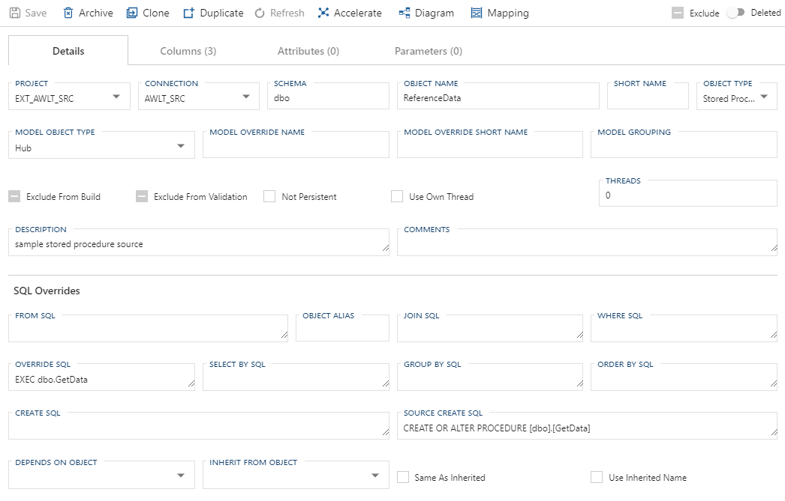

# BimlFlex Stored Procedure Source

BimlFlex can use source stored procedures as source objects to load data from a source where that is the preferred interface mechanism.

## Metadata

To control the load of Stored Procedure-based source data, use the following metadata settings

>[!TIP]
>BimlFlex can not import the metadata from the Stored Procedure, so add it manually.

The Stored Procedure to execute, and the formal call to the procedure, is added in the **Override SQL** metadata element.

The Object name that should be used for the Staging and Persistent Staging is added to the **Object Name** metadata element.

In the sample below, the Stored Procedure is called `dbo.GetData`, however the result from that procedure should be staged and persisted in the ReferenceData tables. This makes it easy to organize the data from the stored procedures as well as give the staging layer meaningful names. The easiest way to get a consistent name through the layers is to give the object the correct name to begin with. However, the source can use the Object Name for staging and the Model Override name for the Data Vault in the same way as source tables.

### Sample source Stored Procedure

```sql
USE [AdventureWorksLT2012]
GO

CREATE OR ALTER PROCEDURE [dbo].[GetData]
AS
BEGIN
    SET NOCOUNT ON;

    SELECT CAST('Code A' AS VARCHAR(10)) AS [Code],
    CAST('Value A' AS VARCHAR(10)) AS [Value]
UNION
    SELECT CAST('Code B' AS VARCHAR(10)) AS [Code],
    CAST('Value B' AS VARCHAR(10)) AS [Value]

END
```

### Sample Object Metadata



### Sample Column Metadata


