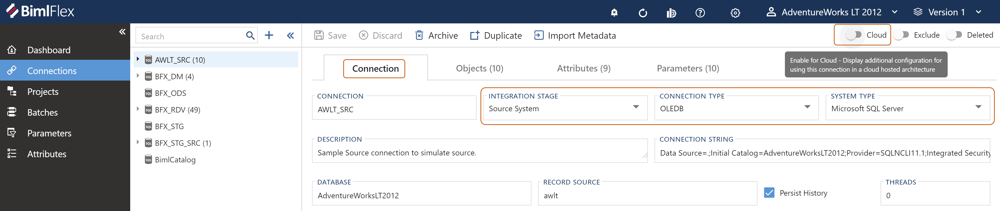
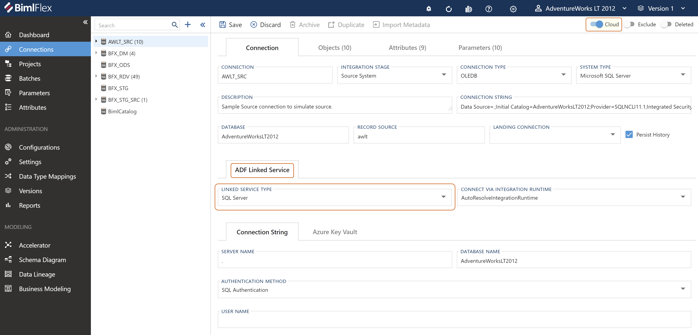

<head>
  <meta name="varigenceProduct" content="BimlFlex"></meta>
  <meta name="varigenceArticleType" content="Reference"></meta>
</head>

# Configuring a Linked Service

**Connections** can be enabled to be used as Linked Services in Azure Data Factory (ADF).

## Enable a Connection as a Linked Service

In the **Connection Tab** of the [**Connection Editor**](../metadata-editors/connection-editor), provide the *Integration Stage*, *Connection Type*, and *System Type* for the connection.

If the resulting configuration provided is compatible with a Linked Service, then a *Cloud* setting will appear in the action bar.

After toggling the *Cloud* setting, a tab for Linked Services will appear at the bottom of the form and any available linked services will appear in the *Linked Service Types dropdown*. Select a *Linked Service Type* to configure it.

## Configuring the Linked Service

Linked Services are used in Azure Data Factory (ADF) to define a data source. The Linked Service form allows for input of all required data points needed to allow BimlFlex to generate a corresponding Linked Service.

:::danger

To configure a **Linked Service**, select a **Connection** and enable the *Cloud selector* at the top.

:::

### ADF Linked Service Tab

There are two main components, the base Linked Service details and then the Connection details. These details will remain unchanged regardless of how the connection details are configured.

#### [Description](#tab/ls-description)

| Field                              | Description                                                         |
| ---------------------------------- | ------------------------------------------------------------------- |
| Linked Service Type                | The type of Linked Service being used                                |
| Connect Via Integration Runtime`*` | (If required) The name of the Integration Runtime to use to connect |

:::tip

`*`: This setting is generally only used for an On-Premises data source.

:::

#### [Example](#tab/ls-example)

| Field                              | Example                          |
| ---------------------------------- | -------------------------------- |
| Linked Service Type                | Azure Synapse Analytics (SQL DW) |
| Connect Via Integration Runtime`*` | AutoResolveIntegrationRuntime    |

:::tip

`*`: Use `AutoResolveIntegrationRuntime` if no specific Integration Runtime is needed.

:::

***

The linked services that are currently supported are listed below.
Select a linked service type for information on filling out the Linked Service form.

- [Azure Blob Storage](linked-service-adf-blob-storage.md)
- [Azure My SQL](./linked-service-adf-azure-mysql)
- [Azure PostgreSQL](linked-service-adf-azure-postgresql.md)
- [Azure SQL Database](linked-service-adf-sql-database.md)
- [Azure SQL Database Managed Instance (Azure SQL MI)](linked-service-adf-sqlmi.md)
- [Azure Synapse Analytics (Azure SQL Data Warehouse)](linked-service-adf-sql-data-warehouse.md)
- [Data Lake Gen 2](linked-service-adf-datalake-gen-2.md)
- [MySQL](./linked-service-adf-azure-mysql)
- [Oracle](linked-service-adf-sql-server.md)
- [PostgreSQL](linked-service-adf-sql-server.md)
- [Snowflake](linked-service-snowflake.md)
- [SQL Server](linked-service-adf-sql-server.md)
- [Teradata](linked-service-adf-teradata.md)

### Linked Service Connection Details

The Connection String can be entered via plain text or stored in an AKV Secret.

#### [Azure Key Vault](#tab/ls-connection-akv)

Showing configuration for storing a connection string in an Azure Key Vault Secret.

#### [Connection String](#tab/ls-connection-string)

Showing configuration for plain text connection string.

***

##### [Description](#tab/ls-connection-akv-description/ls-connection-akv)

| Field              | Description                                                       |
| ------------------ | ----------------------------------------------------------------- |
| AKV Linked Service | Name of the Linked Service pointing to the AKV                    |
| Secret Name        | Name of the secret                                                |
| Secret Version     | (Optional) Version of the secret to use.  Leave blank for latest. |

##### [Example](#tab/ls-connection-akv-example/ls-connection-akv)

| Field              | Example                 |
| ------------------ | ----------------------- |
| AKV Linked Service | bfx-kv                  |
| Secret Name        | BFX-DW-ConnectionString |
| Secret Version     | `{Blank}`                 |

##### [Description](#tab/ls-connection-string-description/ls-connection-string)

| Field                       | Description                 |
| --------------------------- | --------------------------- |
| Fully Qualified Domain Name | Fully qualified server name |
| Database Name               | Name of the database        |

##### [Example](#tab/ls-connection-string-example/ls-connection-string)

| Field                       | Example                             |
| --------------------------- | ----------------------------------- |
| Fully Qualified Domain Name | bfx-sql-server.database.windows.net |
| Database Name               | BFX_DW                              |

***

### Authentication Details

Depending on the *Authentication Method*, options to specify an AKV Secret for either a User's *Password* or *Service* can also be provided.

#### [SQL Authentication](#tab/ls-auth-sql-password/ls-connection-string)

| Field                 | Example            |
| --------------------- | ------------------ |
| Authentication Method | SQL Authentication |

#### [SQL Authentication](#tab/ls-auth-sql-akv/ls-connection-akv)

| Field                 | Example            |
| --------------------- | ------------------ |
| Authentication Method | SQL Authentication |

<!-- TODO: Outline Managed Identity -->

#### [Managed Identity](#tab/ls-auth-managed)

| Field                 | Example          |
| --------------------- | ---------------- |
| Authentication Method | Managed Identity |

#### [Service Principal](#tab/ls-auth-service)

| Field                 | Example           |
| --------------------- | ----------------- |
| Authentication Method | Service Principal |

***

#### [Authentication Details: N/A](#tab/ls-auth-na/ls-auth-sql-akv)

:::danger

Authentication handled with the value in the connection string Secret.

:::

#### [Authentication Details: N/A](#tab/ls-auth-na/ls-auth-managed)

:::danger

Authentication handled with the Managed Identity.

:::

#### [Azure Key Vault](#tab/ls-auth-password-akv/ls-auth-sql-password)

Showing configuration for storing a password in an Azure Key Vault Secret.

#### [Password](#tab/ls-auth-password-string/ls-auth-sql-password)

Showing configuration for plain text password.

:::warning

This method is not recommended.
The Password is being stored in plain text.

:::

#### [Azure Key Vault](#tab/ls-auth-service-akv/ls-auth-service)

Showing configuration for storing a Service Principal Key in an Azure Key Vault Secret.

#### [Service Principal Key](#tab/ls-auth-service-string/ls-auth-service)

Showing configuration for plain text Service Principal Key.

:::warning

This method is not recommended.
The Service Principal Key is being stored in plain text.

:::

***

##### [Description: N/A](#tab/ls-auth-password-akv-description/ls-auth-sql-akv)

*No description.*

##### [Description: N/A](#tab/ls-auth-password-akv-description/ls-auth-managed)

*No description.*

##### [Description](#tab/ls-auth-password-akv-description/ls-auth-password-akv)

| Field              | Description                                                       |
| ------------------ | ----------------------------------------------------------------- |
| AKV Linked Service | Name of the Linked Service pointing to the AKV                    |
| Secret Name        | Name of the secret                                                |
| Secret Version     | (Optional) Version of the secret to use.  Leave blank for latest. |

##### [Example](#tab/ls-auth-password-akv-example/ls-auth-password-akv)

| Field              | Example         |
| ------------------ | --------------- |
| AKV Linked Service | bfx-kv          |
| Secret Name        | BFX-DW-Password |
| Secret Version     | `{Blank}`         |

##### [Description](#tab/ls-auth-password-string-description/ls-auth-password-string)

| Field                                   | Description                                                                      |
| --------------------------------------- | -------------------------------------------------------------------------------- |
| Password                                | The value for the password                                                       |
| Additional Connection String Properties | Any additional properties entered here will be included in the Connection String |

##### [Example](#tab/ls-auth-password-string-example/ls-auth-password-string)

| Field                                   | Example                         |
| --------------------------------------- | ------------------------------- |
| Password                                | P@$$Word!                       |
| Additional Connection String Properties | key=value;secondKey=secondValue |

##### [Description](#tab/ls-auth-service-akv-description/ls-auth-service-akv)

| Field              | Description                                                       |
| ------------------ | ----------------------------------------------------------------- |
| AKV Linked Service | Name of the Linked Service pointing to the AKV                    |
| Secret Name        | Name of the secret                                                |
| Secret Version     | (Optional) Version of the secret to use.  Leave blank for latest. |

##### [Example](#tab/ls-auth-service-akv-example/ls-auth-service-akv)

| Field              | Example                    |
| ------------------ | -------------------------- |
| AKV Linked Service | bfx-kv                     |
| Secret Name        | BFX-DW-ServicePrincipalKey |
| Secret Version     | `{Blank}`                    |

##### [Description](#tab/ls-auth-service-string-description/ls-auth-service-string)

| Field                                   | Description                                                                      |
| --------------------------------------- | -------------------------------------------------------------------------------- |
| Service Principal Key                   | The value for the Service Principal Key.                                         |
| Additional Connection String Properties | Any additional properties entered here will be included in the Connection String |

##### [Example](#tab/ls-auth-service-string-example/ls-auth-service-string)

| Field                                   | Example                         |
| --------------------------------------- | ------------------------------- |
| Service Principal Key                   | `{Service Principal Key}`         |
| Additional Connection String Properties | key=value;secondKey=secondValue |

***

[connections-module-list]: images/bimlflex-ss-app-connections-menu-list.png "Connections Module Menu"
[connections-details-tab]: images/bimlflex-ss-app-connections-details-tab.png "Connection Details Tab"
[connections-linked-service-dropdown]: images/bimlflex-ss-app-connections-cloud-linked-service-select-blank-highlighted.png "Linked Service Type Dropdown"
[akv]: images/bimlflex-ss-app-connections-akv.png "Azure Key Vault"
[akv-dd]: images/bimlflex-ss-app-connections-akv-dd.png "Azure Key Vault Drop Down"