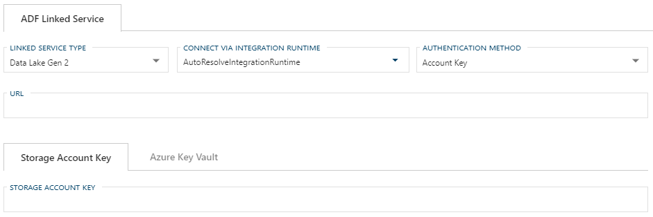
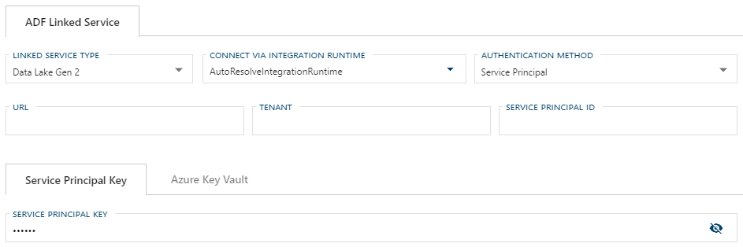
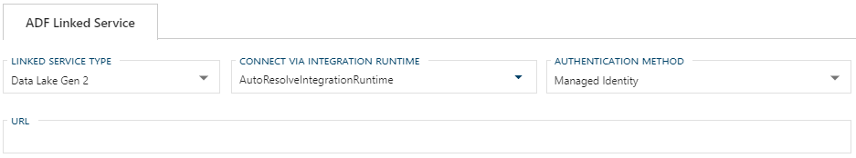

# Configuring an ADF Linked Service Connection for Data Lake Gen 2

:::note

> For information on how to enable a connection for use with linked services, see [Configuring a Linked Service Connection](create-linked-service-connection).

:::

[//]: # (TODO List of stages, connection types, and system types that can use Data Lake Gen 2)

After selecting `Data Lake Gen 2` from the Linked Service Type dropdown, the form required for creating a Data Lake Gen 2 Linked Service will appear.

## Required Fields

**Common Required Fields**

Most required fields for a Data Lake Gen 2 Linked Service connection depend on the Authentication Method used.
There are some fields that are required regardless of Authentication Method.

These common required fields are:

+ [Connect via Integration Runtime](#connect-via-integration-runtime)
+ [Authentication Method](#authentication-method)

Common optional fields are:

+ [Additional Connection String Properties](#additional-connection-string-properties)

**Authentication Method Dependent Required Fields**

The remaining field requirements are dependent on Authentication Method.

**Required fields for [Account Key Authentication](#account-key)**:

+ Storage Account Name (URL)
+ Storage Account Key (or [Azure Key Vault](create-linked-service-connection))

**Required fields for [Service Principal Authentication](#service-principal)**:

+ Tenant (Tenant ID)
+ Service Principal ID (Application ID)
+ Service Principal Key (Application Key) (or [Azure Key Vault](create-linked-service-connection))

**Required fields for [Managed Identity Authentication](#managed-identity)**:

+ Service Endpoint

### Connect via Integration Runtime

Connect via Integration Runtime is required for a Data Lake Gen 2 Linked Service connection.
The default value is `AutoResolveIntegrationRuntime`.
To use a custom runtime, type the name into the editable dropdown or select from the Azure Integration Runtimes saved in BimlFlex settings.
When a custom value is saved in the linked service form, it will be added to the custom integration runtimes.
The custom values that appear in this dropdown can be maintained in Settings under Azure - AzureIntegrationRuntime.

### Authentication Method

The Data Lake Gen 2 Linked Service connection can use Account Key, Service Principal, or Managed Identity for authentication.

When using [Account Key Authentication](#account-key), a Storage Account URL and Storage Account Key are required.

For [Service Principal Authentication](#service-principal), Service Principal ID, Tenant, and Service Principal Key are required.

If [Managed Identity](#managed-identity) is used, no authentication will be required in the BimlFlex Linked Service form, however a Service Endpoint is required.

### Account Key

Account Key authorization requires a Storage Account Name and a Storage Account Key or [Azure Key Vault](create-linked-service-connection).

:::note

> It is suggested that [Azure Key Vault](linked-service-azure-key-vault.md) be used in place of manually entering a Storage Account Key.

:::

### Service Principal

To use Service Principal authentication, an Azure Active Directory application must be set up in your Azure portal as described in the [Microsoft documentation for Data Lake Gen 2 Service Principal Authentication](https://docs.microsoft.com/en-us/azure/data-factory/connector-azure-blob-storage#service-principal-authentication).
The Service Principal (Application) ID, Service Principal (Application) Key, and Tenant ID will be required in the Data Lake Gen 2 Linked Service form.

:::note

> It is suggested that [Azure Key Vault](linked-service-azure-key-vault.md) be used in place of a Service Principal Key.

:::

#### Managed Identity

To use Managed Identity for authentication with Data Lake Gen 2, one must be set up in Azure as described in the [Microsoft documentation for Data Lake Gen 2 Managed Identities](https://docs.microsoft.com/en-us/azure/data-factory/connector-azure-blob-storage#managed-identity).
When using Managed Identity a Service Endpoint is required.

#### Additional Connection String Properties

Any additional properties entered here will be included in the Connection String.
These properties should be entered the same way you want them to appear in the connection string and separated by a semicolon, e.g. `key=value;secondKey=secondValue`.

Values entered in the Additional Connection String Properties textbox will be maintained when changing linked service types.
If a required property from one service type does not have a corresponding text box in the newly selected linked service type, it will appear as an additional property.

### Azure Data Factory Linked Service Additional Information

For additional information on ADF Data Lake Gen 2 Linked Service and its connection requirements see the [Azure Data Factory Data Lake Gen 2 Connector documentation](https://docs.microsoft.com/en-us/azure/data-factory/connector-azure-data-lake-storage).
