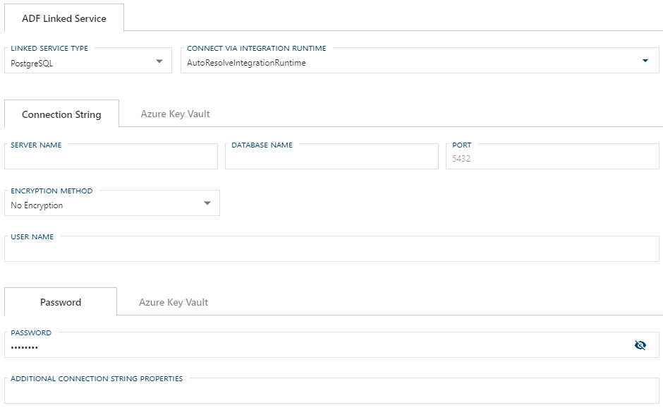
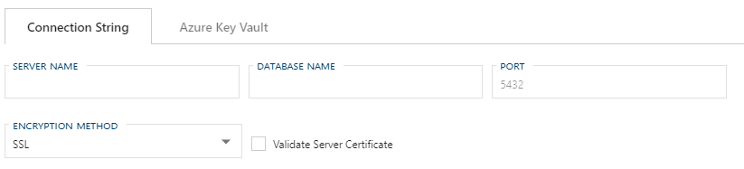

# Configuring an ADF Linked Service Connection for PostgreSQL

:::note

> For information on how to enable a connection for use with linked services, see [Configuring a Linked Service Connection](create-linked-service-connection).

:::

[//]: # (TODO List of stages, connection types, and system types that can use PostgreSQL)

After selecting `PostgreSQL` from the Linked Service Type dropdown, the form required for creating a PostgreSQL Linked Service will appear.

## Required Fields

The required fields are:

- [Configuring an ADF Linked Service Connection for PostgreSQL](#configuring-an-adf-linked-service-connection-for-postgresql)
  - [Required Fields](#required-fields)
    - [Connect via Integration Runtime](#connect-via-integration-runtime)
    - [Connection String](#connection-string)
    - [Encryption Method](#encryption-method)
    - [Validate Server Certificate](#validate-server-certificate)
    - [Password](#password)
    - [Additional Connection String Properties](#additional-connection-string-properties)
  - [Azure Data Factory Linked Services Additional Information](#azure-data-factory-linked-services-additional-information)

Optional fields are:

+ Port
+ [Additional Connection String Properties](#additional-connection-string-properties)

### Connect via Integration Runtime

Connect via Integration Runtime is required for a PostgreSQL Linked Service connection.
The default value is `AutoResolveIntegrationRuntime`.
To use a custom runtime, type the name into the editable dropdown or select from the Azure Integration Runtimes saved in BimlFlex settings.
The custom values that appear in this dropdown can be maintained in Settings under Azure - AzureIntegrationRuntime.

### Connection String

A connection to a PostgreSQL Linked Service requires a Connection String.
The required properties for the Connection String are Server Name, Database Name, Encryption Method, Validate Server Certificate, User Name, and Password.
The Linked Service connection form will provide text boxes for these values and will use them to construct the connections string.

:::note

> It is suggested that [Azure Key Vault](linked-service-azure-key-vault.md) be used in place of manually entering Connection String details.

:::

### Encryption Method

The PostgreSQL Linked Service connection can use `SSL Encryption`, `Request SSL` Encryption, or use `No Encryption`.
When `No Encryption` is used, Validate Server Certificate is not required.
No Encryption is the default.

When a key vault is used in place of a Connection String, Encryption Method details should be stored in the Connection String key vault and will not be required in the BimlFlex Linked Service form.

### Validate Server Certificate

The checkbox for Validate Server Certificate will only appear when `SSL` or `Request SSL` are selected in the Encryption Method dropdown.
The default value is unchecked, or false.

### Password

Password will be used by the Linked Service form for authentication with the PostgreSQL Linked Service.
Password is required - except when using Azure Key Vault in place of a manually entering a Connection String.

:::note

> It is suggested that [Azure Key Vault](linked-service-azure-key-vault.md) be used in place of manually entering the password.

:::

### Additional Connection String Properties

Any additional properties entered here will be included in the Connection String.
These properties should be entered the same way you want them to appear in the Connection String and separated by a semicolon, e.g. `key=value;secondKey=secondValue`.

Values entered in the Additional Connection String Properties textbox will be maintained when changing Linked Service types.
If a required property from one service type does not have a corresponding text box in the newly selected Linked Service type, it will appear as an additional property.

## Azure Data Factory Linked Services Additional Information

For additional information on ADF Linked Service types and their connection requirements see the [Azure Data Factory PostgreSQL Connector documentation](https://docs.microsoft.com/en-us/azure/data-factory/connector-postgresql).
