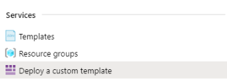
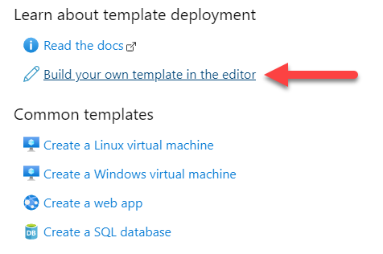
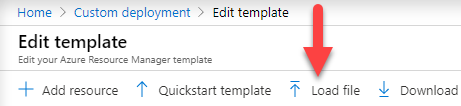
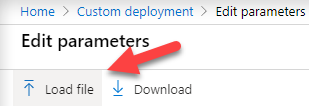

# Manual Deployment Using the Azure Portal

Once the Azure Data Factory (ADF) artifacts are generated, the next step in the process is to deploy them. The recommended practice is to use the automated deployment process outlined in the [PowerShell Deployment Guide](bimlflex-adf-using-powershell). However, all assets are provided for a manual deployment via the [Azure Portal](https://portal.azure.com).  

This document covers the manual deployment process of the ARM templates using the [Azure Portal](https://portal.azure.com).

:::danger


> PowerShell, along with the Azure cmdlets, is required in order to use the generated PowerShell script. BimlFlex will automatically generate the commands needed to both install the cmdlets and connect to specified environment. If further details on the generated commands are needed, or to create these commands manually, refer to the articles below.  
>
> * [Installing PowerShell](https://docs.microsoft.com/en-us/powershell/scripting/install/installing-powershell?view=powershell-7)  
> * [Get started with Azure PowerShell](https://docs.microsoft.com/en-us/powershell/azure/get-started-azureps)  
> * [Connect-AzAccount](https://docs.microsoft.com/en-us/powershell/module/az.accounts/connect-azaccount)  

:::


## Manual ARM Template Deployment

The first step is to go to the [Azure Portal](https://portal.azure.com), an navigate to '[Deploy a custom template](https://portal.azure.com/#create/Microsoft.Template)'.



From here, select 'build your own template in the editor'.



Click 'Load File'.



Navigate, within your output folder, to the following ARM template file:

    `...\output\DataFactories\<AzureDataFactoryName>\arm_template.json`

:::note


> If there is no value specified `BimlFlex` will be used for the folder name. It is important to note that the actual ADF Data Factory Name will named by Azure, something like `ADF-<RandomHashValue>`. It is recommended that you populate the configure your `Settings` and input an [AzureDataFactoryName] prior to building your ADF.

:::


Click 'Save', and then 'Edit parameters'.


Click 'Load File'.



:::note


> Remember the value for the **keyVaultName**.  We will need to update BimlFlex with this value after deployment.

:::


Navigate to:

     `...\output\DataFactories\<AzureDataFactoryName>\arm_template_parameters.json`

Click 'Save'. From here, select the resource group, review the terms and condition and complete the transaction (purchase). Wait for deployment to complete.

The deployment of the ADF assets using the `Azure Portal` should now be successful. Navigating to the Data Factory and opening the `ADF Authoring Tool` should now show the Pipeline(s) available to be tested and verified as needed.

>[!NOTE]
> Your Data Factory will be either be named `ADF-<HashKey>`, or it will use the `Azure Data Factory Name` setting value.

## Post Deployment

Pipeline(s) are now available for verification or running inside [ADF](https://docs.microsoft.com/en-us/azure/data-factory/author-visually). Pipelines can either be run manually, or by triggers. BimlFlex does not generate triggers by default, leaving the user with two options.

1. Create the Triggers manually, and deploy them to the Data Factory. This can be done either in the [Authoring Tool](https://docs.microsoft.com/en-us/azure/data-factory/author-visually), or via PowerShell.

2. Users can take advantage of BimlFlex [Extension Points](bimlflex-concepts-extension-points) and create triggers for each Batch. An example extension point that creates an ADF trigger is listed below. This trigger will now be created inside of the ARM template file and deployed with the rest of the ADF assets.

```Biml
`<#@ extension bundle="BimlFlex.bimlb" extensionpoint="AdfTrigger" #>`
`<#@ property name="batch" type="BimlFlexModelWrapper.BatchesWrapper" #>`
<Schedule Name="ScheduleTriggerName" Frequency="Hour" Interval="1" Start="2001-01-01" End="2020-12-31">
        <Pipelines>
            <Pipeline PipelineName="0_`<#=batch.Name #>`_Batch">
                <Parameters>
                    <Parameter Name="IsInitialLoad">false</Parameter>
                </Parameters>
            </Pipeline>
        </Pipelines>
    </Schedule>
```

>[!NOTE]
>This will create a trigger that will run the pipeline, once every hour from January 1st, 2001, to December 31st, 2020.

Once a trigger is deployed, it must be started. This can be done manually using the [Authoring Tool](https://docs.microsoft.com/en-us/azure/data-factory/author-visually), or by running the following command in PowerShell:

```powershell
Start-AzDataFactoryV2Trigger -ResourceGroupName $ResourceGroupName -DataFactoryName $DataFactoryName -Name "ScheduleTriggerName"
```
