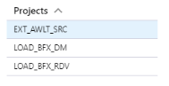

# Deployment Through PowerShell

<!-- TODO: Now walk-through yet for an SSIS Implementation.  
For a walk-through of creating a BimlFlex solution that targets SSIS, review the [Synapse Implementations](bimlflex-synapse-implementation).
-->

You have generated your SQL Server Integration Services (SSIS) assets, and are ready to deploy. This document will discuss deployment using PowerShell scripts that are generated by BimlFlex. For information on how to deploy using the Deployment Wizard, review our [Deployment Through the SSIS Deployment Wizard](bimlflex-ssis-deployment-wizard).

## Prerequisites

First, in order to proceed with PowerShell deployment, [install PowerShell](https://docs.microsoft.com/en-us/powershell/scripting/install/installing-powershell?view=powershell-7) on the workstation.

Ensure that the project's output folder has generated the deployment scripts. These will be located at `...\output\Deploy\` within your project file structure.

## Generated SSDT Deployment Files

Each time you build your solution, BimlFlex will also create a deployment file(s) titled `ssdt-deploy.[ASSET_NAME].ps1`, where `ASSET_NAME` corresponds to a data store. This is the case whether it is for persistent staging, data vault, or data mart. Any time that you make changes to the schema of these assets, these deployment files need to be run, otherwise your project may fail to build. These scripts are located at `...\output\Deploy\` in the solution file structure.  

## Generated SSIS Project Deployment Files

Once the user has deployed the `ssdt-deploy.ps1` file for each asset who's schema has changed, the user is ready to deploy their SSIS projects. Consider the following ELT solution, containing projects for a source system extract, named *EXT_AWLT_SRC*, a raw data vault load, named *LOAD_BF_DV*, and a data mart load, named *LOAD_BFX_DM*.



Once you build your BimlFlex solution, you will now have deployment files for each of these projects. Inside of the `...\outout\Deploy` folder, there will now be the following deployment files:

* `ssis-deploy.EXT_AWLT_SRC_Project.ps1`
* `ssis-deploy.LOAD_BF_DV_Project.ps1`
* `ssis-deploy.LOAD_BFX_DM_Project.ps1`

>[!IMPORTANT]
> If the PSA setting is enabled, then an additional ssis-deploy.RELOAD_EXT_AWLT_SRC_Project.ps1 file will be generated.

Simply run these files in the desired order, one at a time, and you will have successfully deployed your SSIS assets.

## Deployment File Contents

BimlFlex uses values from the BimlFlex settings to generate these deployment scripts. The user does not need to interact with these scripts manually however there is value in seeing what gets emitted.

This is the content of an example source extract with the property values stripped out.

```powershell
& "${env:ProgramFiles(x86)}\Microsoft SQL Server\{TargetVersion}\DTS\Binn\isdeploymentwizard.exe" /S /SP:"{ProjectOutputPath}\{ProjectName}\bin\{ProjectName}_Project.ispac" /DS:localhost /DP:"/{SSISFolder}/{ProjectName}/{ProjectName}_Project/"
```

| Property Name       | Project Setting | Description |
| ------------------- | --------------- | ----------- |
| {TargetVersion}     | SQL Server      | This is in BimlStudio project settings and specifies the target version of SQL Server to use |
| {ProjectOutputPath} | Output Path     | This is the BimlStudio project setting for output path |
| {ProjectName}       | Project Name    | This is the name of the project the user wishes to deploy |
| {SSISFolder}        | SSIS Folder     | This folder MUST exist in the SSIS Catalog prior to deployment. This is configured in your BimlFlex settings |
